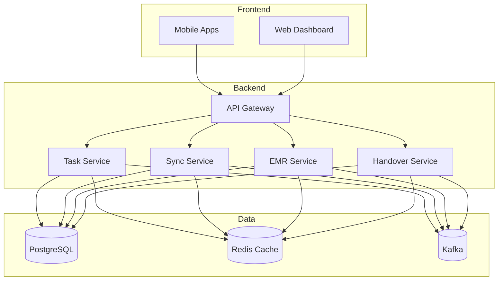

# EMR-Integrated Task Management Platform

[](github-actions-workflow)
[](codecov-report)
[](LICENSE)
[](SECURITY.md)

Version: 1.0.0 (2023) | [Changelog](CHANGELOG.md)

## Table of Contents
1. [Project Overview](#1-project-overview)
2. [Quick Start](#2-quick-start)
3. [Component Setup](#3-component-setup)
4. [Infrastructure](#4-infrastructure)
5. [Development](#5-development)
6. [Security and Compliance](#6-security-and-compliance)

## 1. Project Overview

The EMR-Integrated Task Management Platform is an enterprise-grade healthcare solution that bridges the gap between Electronic Medical Records (EMR) systems and daily clinical task execution. It features a Trello-style Kanban board with offline-first capabilities and seamless EMR integration.

### Key Features
- Real-time EMR data integration via FHIR R4/HL7 v2
- Offline-first mobile applications for iOS and Android
- Automated shift handover system with 40% error reduction
- Real-time task verification and tracking
- HIPAA-compliant data management
- Enterprise-grade security and audit logging

### Architecture Overview



### Technology Stack
- **Mobile**: Flutter 3.10+
- **Web**: Next.js 13+
- **Backend**: Node.js 18 LTS, Go 1.20+, Java 17 LTS
- **Database**: PostgreSQL 14+, Redis 7+
- **Message Queue**: Apache Kafka 3.4+
- **Infrastructure**: Kubernetes 1.26+, Istio 1.18+

## 2. Quick Start

### Prerequisites
- Docker 24+
- Kubernetes 1.26+
- Helm 3.11+
- kubectl 1.26+
- Flutter 3.10+
- Node.js 18 LTS

### Basic Setup
1. Clone the repository:
```bash
git clone https://github.com/org/emr-task-platform.git
cd emr-task-platform
```

2. Configure environment:
```bash
cp .env.example .env
# Edit .env with your configuration
```

3. Deploy infrastructure:
```bash
./scripts/deploy-infrastructure.sh
```

4. Verify deployment:
```bash
kubectl get pods -n emr-task-platform
```

## 3. Component Setup

### 3.1 Mobile Applications

1. Flutter setup:
```bash
flutter pub get
flutter run
```

2. Configure EMR integration:
```bash
cp mobile/config/emr.example.yaml mobile/config/emr.yaml
# Edit EMR configuration
```

### 3.2 Web Dashboard

1. Install dependencies:
```bash
cd web
npm install
```

2. Development server:
```bash
npm run dev
```

3. Production build:
```bash
npm run build
npm run start
```

### 3.3 Backend Services

1. Deploy microservices:
```bash
helm install emr-task-platform ./helm
```

2. Configure EMR adapters:
```bash
kubectl apply -f k8s/emr-adapters/
```

## 4. Infrastructure

### Kubernetes Deployment
```bash
kubectl apply -f k8s/
```

### Database Setup
```bash
helm install postgresql bitnami/postgresql
helm install redis bitnami/redis
```

### Monitoring Stack
```bash
helm install prometheus prometheus-community/kube-prometheus-stack
```

## 5. Development

### Development Environment
1. Install development tools:
```bash
./scripts/setup-dev-env.sh
```

2. Run development stack:
```bash
docker-compose up -d
```

### Testing
```bash
# Run unit tests
npm test

# Run integration tests
npm run test:integration

# Run E2E tests
npm run test:e2e
```

## 6. Security and Compliance

### HIPAA Compliance
- End-to-end encryption for PHI
- Role-based access control (RBAC)
- Comprehensive audit logging
- Automatic session termination

### Authentication
- OAuth 2.0 + JWT implementation
- Multi-factor authentication (MFA)
- Single sign-on (SSO) support
- Automatic token rotation

### Data Protection
- AES-256 encryption at rest
- TLS 1.3 for data in transit
- Regular security audits
- Automated vulnerability scanning

## Contributing
Please read our [Contributing Guidelines](CONTRIBUTING.md) for details on our code of conduct and development process.

## License
This project is licensed under the MIT License - see the [LICENSE](LICENSE) file for details.

## Security
For security-related information and reporting vulnerabilities, please refer to our [Security Policy](SECURITY.md).