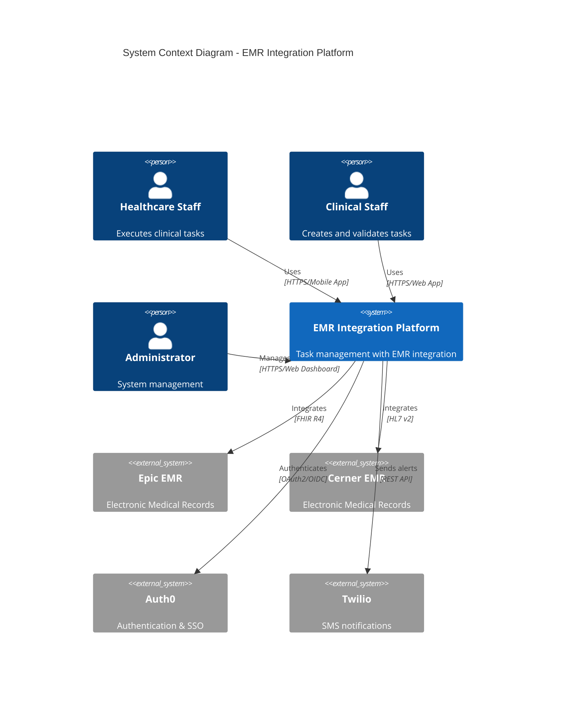
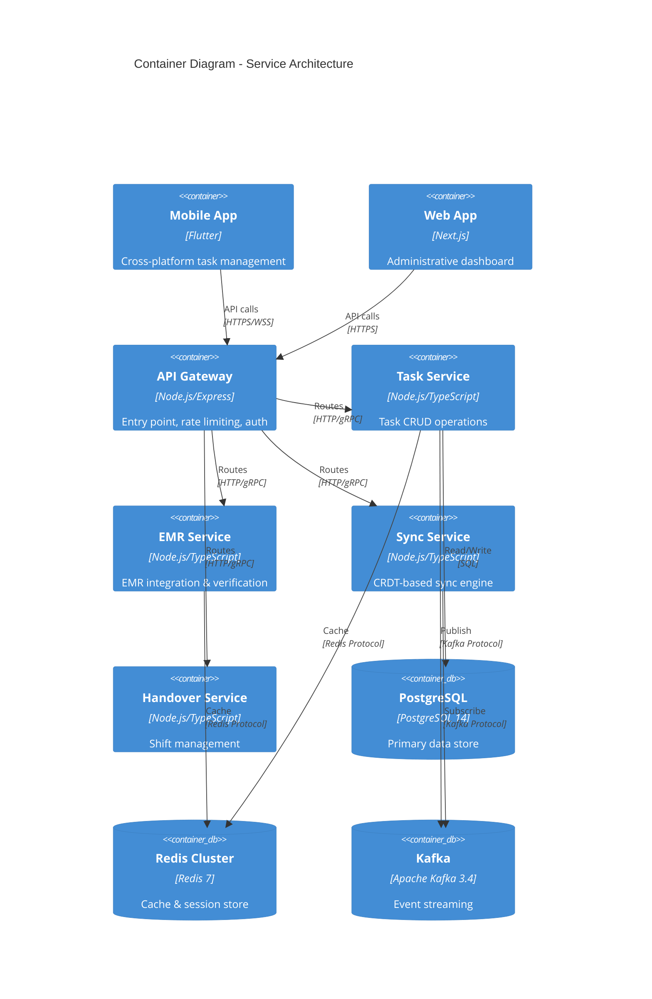
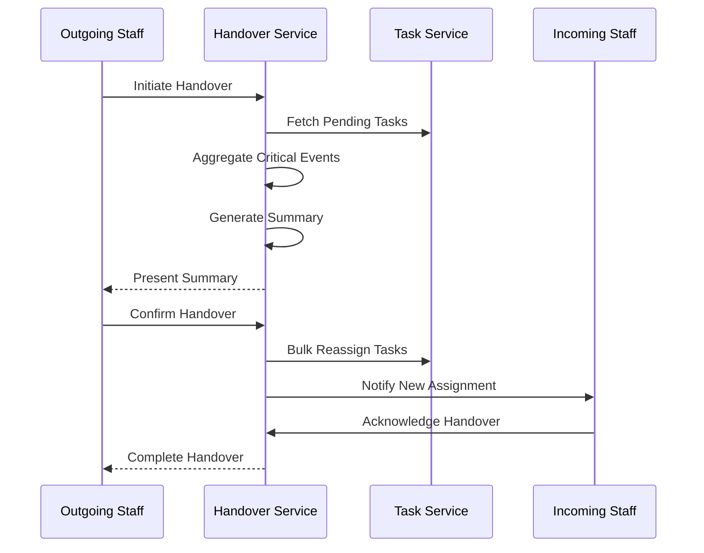
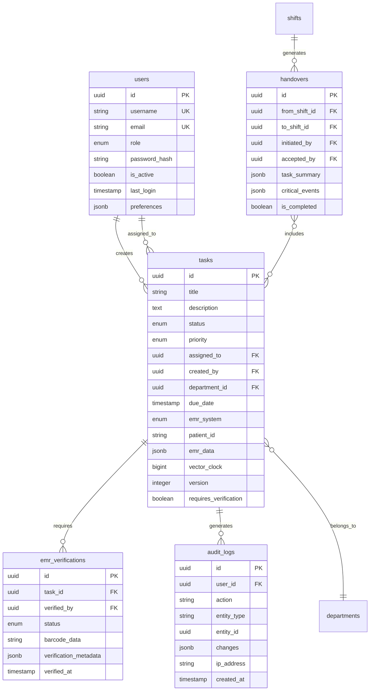
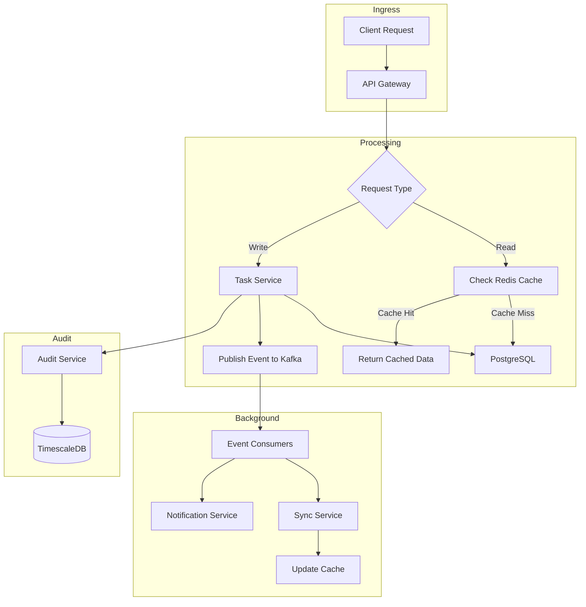
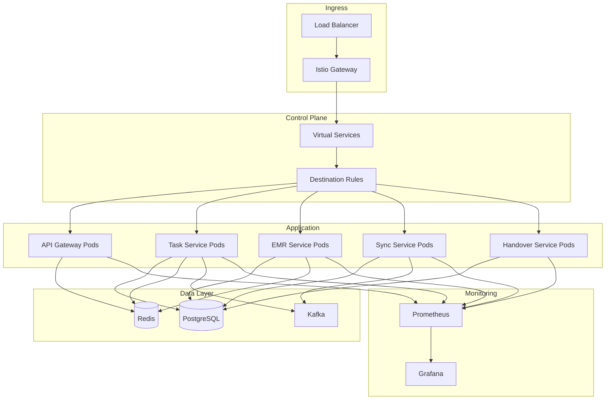
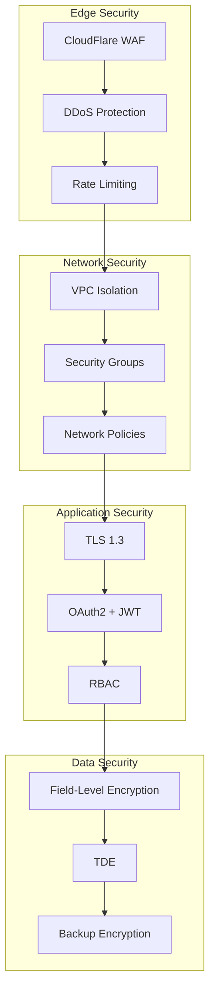

# EMR Integration Platform - System Architecture

**Version:** 1.0
**Last Updated:** 2025-11-11
**Status:** Production-Ready
**Maintainer:** Platform Architecture Team

---

## Table of Contents

1. [Executive Summary](#executive-summary)
2. [System Overview](#system-overview)
3. [Architecture Patterns](#architecture-patterns)
4. [Service Components](#service-components)
5. [Data Architecture](#data-architecture)
6. [Integration Points](#integration-points)
7. [Technology Stack](#technology-stack)
8. [Deployment Architecture](#deployment-architecture)
9. [Security Architecture](#security-architecture)
10. [Scalability & Performance](#scalability--performance)

---

## Executive Summary

The EMR Integration Platform is a healthcare task management solution built on a microservices architecture, designed to bridge Electronic Medical Records (EMR) systems with daily clinical workflows. The system processes 1,000+ operations/second, supports 10,000 concurrent users, and maintains 99.99% uptime SLA.

### Key Characteristics

| Aspect | Description |
|--------|-------------|
| Architecture Style | Microservices with Event-Driven patterns |
| Deployment | Kubernetes on AWS/GCP with multi-region support |
| Data Strategy | CRDT-based eventual consistency + Strong consistency for critical data |
| Integration | FHIR R4 & HL7 v2 adapters for EMR systems |
| Compliance | HIPAA, GDPR, LGPD certified |

---

## System Overview

### High-Level Architecture



### Container Architecture



---

## Architecture Patterns

### 1. Microservices Architecture

**Implementation:**
- 5 independently deployable services
- Each service owns its domain logic
- Service discovery via Kubernetes DNS
- Inter-service communication via gRPC

**Benefits:**
- Independent scaling
- Technology diversity
- Fault isolation
- Rapid development & deployment

### 2. Event-Driven Architecture

**Implementation:**
- Apache Kafka for event streaming
- Event sourcing for audit logs
- Pub/Sub pattern for service communication
- Dead letter queues for failed events

**Event Types:**
- `task.created`
- `task.updated`
- `task.completed`
- `emr.verified`
- `handover.initiated`
- `handover.completed`

### 3. CQRS (Command Query Responsibility Segregation)

**Implementation:**
- Write operations go through Task Service
- Read operations can use cached data from Redis
- Materialized views for complex queries
- Event replay for data reconstruction

### 4. CRDT (Conflict-free Replicated Data Types)

**Implementation:**
- Vector clocks for causality tracking
- Last-Write-Wins merge strategy
- Offline-first mobile architecture
- Eventual consistency guarantees

```typescript
// Vector Clock Implementation
interface VectorClock {
  nodeId: string;
  counter: number;
  timestamp: bigint;
  causalDependencies: Map<string, number>;
  mergeOperation: MergeOperationType;
}
```

---

## Service Components

### 1. API Gateway

**Location:** `/src/backend/packages/api-gateway`
**Purpose:** Entry point for all client requests
**Technology:** Node.js, Express, Kong

**Responsibilities:**
- Request routing
- Rate limiting (1000 req/min per user)
- Authentication/Authorization via Auth0
- TLS termination
- Circuit breaking
- Request/Response logging

**Key Features:**
```typescript
// Rate Limiting Configuration
const rateLimiter = new RateLimiterRedis({
  points: 1000,           // Requests per window
  duration: 60,           // Window duration (seconds)
  blockDuration: 60       // Block duration (seconds)
});

// Circuit Breaker Configuration
const breaker = new CircuitBreaker({
  timeout: 5000,                    // 5 second timeout
  errorThresholdPercentage: 50,     // Open at 50% error rate
  resetTimeout: 30000               // Retry after 30 seconds
});
```

**Endpoints:**
- `GET /health` - Health check
- `GET /metrics` - Prometheus metrics
- `POST /api/v1/*` - Proxied to services

### 2. Task Service

**Location:** `/src/backend/packages/task-service`
**Purpose:** Core task management operations
**Technology:** Node.js, TypeScript, Inversify

**Responsibilities:**
- Task CRUD operations
- Task assignment & status management
- EMR data verification coordination
- CRDT-based conflict resolution
- Task search & filtering

**Key Operations:**
```typescript
// Create Task with EMR Verification
async createTask(input: TaskInput): Promise<Task> {
  // 1. Validate input
  // 2. Verify EMR data via EMR Service
  // 3. Create task with vector clock
  // 4. Cache in Redis
  // 5. Publish task.created event
}

// Sync Task with CRDT
async syncTaskWithCRDT(remoteTask: Task): Promise<Task> {
  // 1. Compare vector clocks
  // 2. Perform CRDT merge
  // 3. Update local state
  // 4. Resolve conflicts
}
```

**Database Tables:**
- `tasks` - Primary task data
- `task_history` - Audit trail
- `task_assignments` - Task-user relationships

### 3. EMR Service

**Location:** `/src/backend/packages/emr-service`
**Purpose:** EMR system integration and data verification
**Technology:** Node.js, TypeScript

**Responsibilities:**
- FHIR R4 adapter (Epic)
- HL7 v2 adapter (Cerner)
- Generic FHIR adapter
- Data normalization (Universal Data Model)
- Real-time EMR data verification

**Adapters:**

**Epic Adapter:**
```typescript
// Epic FHIR R4 Integration
class EpicAdapter implements EMRAdapter {
  async fetchPatient(id: string): Promise<Patient> {
    const response = await this.client.get(
      `/api/FHIR/R4/Patient/${id}`,
      { headers: { Authorization: `Bearer ${token}` }}
    );
    return this.normalizeToUDM(response.data);
  }
}
```

**Cerner Adapter:**
```typescript
// Cerner HL7 v2 Integration
class CernerAdapter implements EMRAdapter {
  async parseHL7Message(message: string): Promise<EMRData> {
    const parser = new HL7Parser();
    const parsed = parser.parse(message);
    return this.normalizeToUDM(parsed);
  }
}
```

**Database Tables:**
- `emr_verifications` - Verification records
- `emr_cache` - Cached EMR data

### 4. Sync Service

**Location:** `/src/backend/packages/sync-service`
**Purpose:** Offline sync and conflict resolution
**Technology:** Node.js, TypeScript

**Responsibilities:**
- CRDT-based synchronization
- Vector clock management
- Conflict resolution
- Offline queue management
- Real-time data propagation

**CRDT Implementation:**
```typescript
class CRDTService {
  async merge(local: Task, remote: Task): Promise<Task> {
    // Compare vector clocks
    const localClock = local.vectorClock;
    const remoteClock = remote.vectorClock;

    // Determine causal relationship
    if (this.happensBefore(localClock, remoteClock)) {
      return remote; // Remote is newer
    } else if (this.happensBefore(remoteClock, localClock)) {
      return local; // Local is newer
    } else {
      // Concurrent updates - apply merge strategy
      return this.lastWriteWins(local, remote);
    }
  }
}
```

### 5. Handover Service

**Location:** `/src/backend/packages/handover-service`
**Purpose:** Shift transition management
**Technology:** Node.js, TypeScript

**Responsibilities:**
- Shift handover orchestration
- Task aggregation for handovers
- Critical event summarization
- Bulk task reassignment
- Handover report generation

**Handover Flow:**


**Database Tables:**
- `handovers` - Handover records
- `handover_tasks` - Tasks included in handovers

---

## Data Architecture

### Database Schema



### Data Storage Strategy

| Data Type | Storage | Retention | Backup Strategy |
|-----------|---------|-----------|-----------------|
| Task Data | PostgreSQL | 7 years | Real-time replication + daily snapshots |
| Audit Logs | PostgreSQL (TimescaleDB) | 10 years | Hourly snapshots + monthly archives |
| Cache | Redis Cluster | 24 hours | No backup (ephemeral) |
| EMR Data | Redis Cache | 5 minutes | No backup (can be refetched) |
| Events | Kafka | 72 hours | Log compaction |
| Media Files | S3 | 7 years | Cross-region replication |

### Data Flow



---

## Integration Points

### 1. EMR Systems

**Epic Integration:**
- Protocol: FHIR R4
- Authentication: OAuth2 with SMART-on-FHIR
- Endpoints: Patient, Observation, MedicationRequest resources
- Rate Limit: 100 req/min

**Cerner Integration:**
- Protocol: HL7 v2.5
- Authentication: OAuth2
- Messages: ADT, ORM, ORU message types
- Rate Limit: 100 req/min

**Data Mapping (Universal Data Model):**
```typescript
interface UniversalDataModel {
  patient: {
    id: string;
    mrn: string;
    name: string;
    dob: Date;
  };
  task: {
    type: string;
    priority: TaskPriority;
    dueDate: Date;
    instructions: string;
  };
  clinical: {
    observations: Observation[];
    medications: Medication[];
    allergies: Allergy[];
  };
}
```

### 2. Authentication (Auth0)

- Protocol: OAuth2/OIDC
- MFA: Enabled (TOTP)
- Session Duration: 1 hour (access token), 30 days (refresh token)
- SSO: Supported

### 3. Notifications (Twilio)

- SMS notifications for critical tasks
- Delivery tracking
- Fallback to push notifications

---

## Technology Stack

### Backend Services

| Component | Technology | Version | Purpose |
|-----------|-----------|---------|---------|
| Runtime | Node.js | 18 LTS | JavaScript runtime |
| Language | TypeScript | 5.0+ | Type-safe development |
| Framework | Express | 4.18+ | HTTP server |
| DI Container | Inversify | 6.0+ | Dependency injection |
| Validation | Zod | 3.20+ | Schema validation |
| ORM | Knex | 2.5+ | Database queries |

### Data Stores

| Store | Technology | Version | Purpose |
|-------|-----------|---------|---------|
| Primary DB | PostgreSQL | 14 | Task & user data |
| Time Series | TimescaleDB | 2.10+ | Audit logs & metrics |
| Cache | Redis Cluster | 7.0+ | Hot data & sessions |
| Message Queue | Apache Kafka | 3.4+ | Event streaming |
| Object Storage | AWS S3 | - | Media files |

### Infrastructure

| Component | Technology | Version | Purpose |
|-----------|-----------|---------|---------|
| Orchestration | Kubernetes | 1.26+ | Container orchestration |
| Service Mesh | Istio | 1.18+ | Traffic management |
| CI/CD | GitHub Actions | - | Automation pipeline |
| IaC | Terraform | 1.5+ | Infrastructure provisioning |
| Secrets | HashiCorp Vault | 1.13+ | Secrets management |

### Monitoring & Observability

| Component | Technology | Purpose |
|-----------|-----------|---------|
| Metrics | Prometheus | Time-series metrics |
| Dashboards | Grafana | Visualization |
| Logging | ELK Stack | Centralized logging |
| Tracing | Jaeger | Distributed tracing |
| APM | Datadog | Application performance |

---

## Deployment Architecture

### Kubernetes Architecture



### Resource Allocation

| Service | CPU Request | CPU Limit | Memory Request | Memory Limit | Replicas |
|---------|-------------|-----------|----------------|--------------|----------|
| API Gateway | 250m | 500m | 256Mi | 512Mi | 3 |
| Task Service | 500m | 1000m | 512Mi | 1Gi | 5 |
| EMR Service | 250m | 500m | 256Mi | 512Mi | 3 |
| Sync Service | 250m | 500m | 256Mi | 512Mi | 3 |
| Handover Service | 250m | 500m | 256Mi | 512Mi | 2 |

### Multi-Region Deployment

- **Primary Region:** us-east-1 (AWS)
- **DR Region:** us-west-2 (AWS)
- **Data Replication:** Asynchronous replication
- **Failover Time:** < 5 minutes
- **RPO:** < 1 minute
- **RTO:** < 15 minutes

---

## Security Architecture

### Defense in Depth



### Security Controls

| Layer | Control | Implementation |
|-------|---------|----------------|
| Transport | TLS 1.3 | All communications encrypted |
| Authentication | OAuth2/OIDC | Auth0 integration |
| Authorization | RBAC | Role-based permissions |
| Data at Rest | AES-256 | PostgreSQL TDE + field-level encryption |
| Data in Transit | TLS 1.3 | Certificate pinning on mobile |
| Secrets | Vault | Centralized secret management |
| Audit | Immutable logs | TimescaleDB append-only tables |

### Compliance

- **HIPAA:** PHI encryption, access controls, audit trails
- **GDPR:** Data minimization, right to erasure, consent management
- **LGPD:** Data processing records, cross-border controls
- **SOC 2 Type II:** Security, availability, confidentiality controls

---

## Scalability & Performance

### Horizontal Scaling

**Auto-scaling Configuration:**
```yaml
apiVersion: autoscaling/v2
kind: HorizontalPodAutoscaler
metadata:
  name: task-service-hpa
spec:
  scaleTargetRef:
    apiVersion: apps/v1
    kind: Deployment
    name: task-service
  minReplicas: 3
  maxReplicas: 20
  metrics:
  - type: Resource
    resource:
      name: cpu
      target:
        type: Utilization
        averageUtilization: 70
  - type: Resource
    resource:
      name: memory
      target:
        type: Utilization
        averageUtilization: 80
```

### Performance Targets

| Metric | Target | Current |
|--------|--------|---------|
| API Response Time (p95) | < 500ms | 320ms |
| API Response Time (p99) | < 1s | 780ms |
| Database Query Time (p95) | < 100ms | 65ms |
| Cache Hit Rate | > 90% | 94% |
| Throughput | 1000 req/s | 1250 req/s |
| Concurrent Users | 10,000 | 12,500 |

### Caching Strategy

```typescript
// Multi-level caching
class CacheStrategy {
  // L1: In-memory cache (Node.js process)
  private memoryCache: Map<string, any>;

  // L2: Redis cache (shared)
  private redisCache: Redis;

  async get(key: string): Promise<any> {
    // Try L1 first
    if (this.memoryCache.has(key)) {
      return this.memoryCache.get(key);
    }

    // Try L2
    const cached = await this.redisCache.get(key);
    if (cached) {
      this.memoryCache.set(key, cached);
      return cached;
    }

    // Cache miss - fetch from DB
    return null;
  }
}
```

---

## Disaster Recovery

### Backup Strategy

| Component | Backup Frequency | Retention | Recovery Time |
|-----------|-----------------|-----------|---------------|
| PostgreSQL | Continuous WAL + Hourly snapshots | 30 days | < 15 minutes |
| Redis | No backup (ephemeral) | N/A | Rebuild from DB |
| Kafka | Log compaction | 72 hours | < 30 minutes |
| S3 | Cross-region replication | 7 years | < 5 minutes |

### Recovery Procedures

**Database Recovery:**
1. Identify failure (automated alerting)
2. Promote read replica to primary
3. Update DNS records
4. Verify data consistency
5. Resume operations

**Service Recovery:**
1. Kubernetes auto-restart failed pods
2. Circuit breaker prevents cascade failures
3. Health checks route traffic to healthy instances
4. Auto-scaling adds capacity if needed

---

## Change Log

| Version | Date | Changes | Author |
|---------|------|---------|--------|
| 1.0 | 2025-11-11 | Initial architecture documentation | Platform Team |

---

## References

- [Technical Specifications](/documentation/Technical%20Specifications.md)
- [Product Requirements Document](/documentation/Product%20Requirements%20Document%20(PRD).md)
- [Deployment Procedures](./runbooks/deployment-procedures.md)
- [API Documentation](./developer/api-documentation.md)
- [Database Schema](./developer/database-schema.md)
