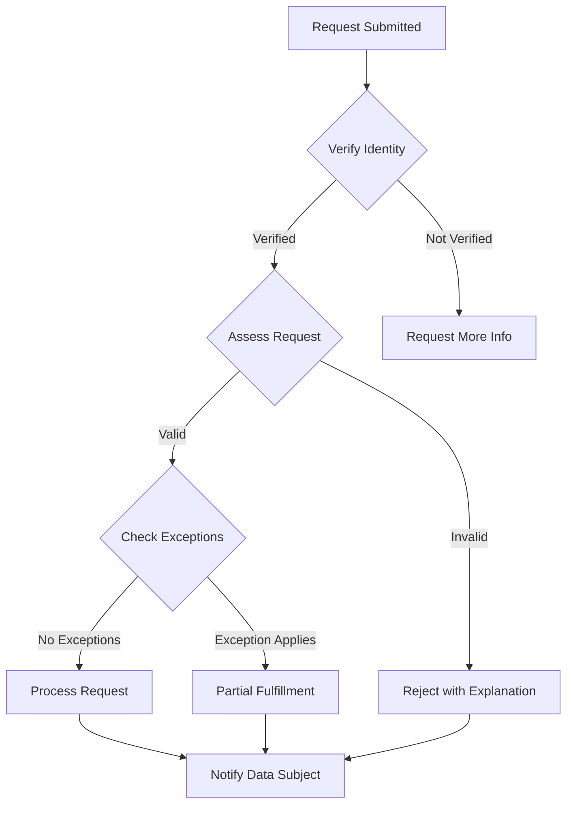

# GDPR & LGPD Compliance Documentation - EMR Integration Platform

**Version:** 1.0
**Last Updated:** 2025-11-15
**Maintained By:** Data Protection Team
**Review Frequency:** Annually

---

## Table of Contents

1. [Overview](#overview)
2. [GDPR Compliance](#gdpr-compliance)
3. [LGPD Compliance](#lgpd-compliance)
4. [Data Processing Records](#data-processing-records)
5. [Lawful Basis for Processing](#lawful-basis-for-processing)
6. [Data Subject Rights](#data-subject-rights)
7. [Consent Management](#consent-management)
8. [Cross-Border Transfers](#cross-border-transfers)
9. [Data Protection Officer](#data-protection-officer)
10. [Compliance Checklist](#compliance-checklist)

---

## Overview

### Scope

This document covers compliance with:

- **GDPR (General Data Protection Regulation):** EU Regulation 2016/679
- **LGPD (Lei Geral de Proteção de Dados):** Brazilian Law No. 13,709/2018

Both regulations protect personal data and provide rights to data subjects.

### Applicability

**GDPR applies if:**
- Organization is established in the EU
- Offering goods/services to EU residents
- Monitoring behavior of EU residents

**LGPD applies if:**
- Processing data in Brazil
- Processing data of Brazilian residents
- Processing aims to offer goods/services to Brazil

### Key Similarities

| Aspect | GDPR | LGPD |
|--------|------|------|
| **Territorial Scope** | EU + EU residents | Brazil + Brazilian residents |
| **Consent** | Required for certain processing | Required for certain processing |
| **Data Subject Rights** | Access, erasure, portability | Access, erasure, portability |
| **DPO Requirement** | Yes (certain cases) | Yes (certain cases) |
| **Fines** | Up to €20M or 4% revenue | Up to R$50M or 2% revenue |
| **Breach Notification** | 72 hours | Reasonable time |

---

## GDPR Compliance

### Legal Basis (Article 6)

**Lawful Bases for Processing:**

1. **Consent:** Data subject gave clear consent
2. **Contract:** Processing necessary for contract performance
3. **Legal Obligation:** Compliance with legal requirements
4. **Vital Interests:** Protect life of data subject
5. **Public Task:** Performance of public task
6. **Legitimate Interests:** Necessary for legitimate interests

**Our Processing Bases:**

| Processing Activity | Legal Basis | Article |
|---------------------|-------------|---------|
| Task management for healthcare | Contract + Vital Interests | Art. 6(1)(b), (d) |
| User authentication | Contract | Art. 6(1)(b) |
| Audit logging | Legal Obligation | Art. 6(1)(c) |
| Analytics (aggregated) | Legitimate Interest | Art. 6(1)(f) |
| Marketing emails | Consent | Art. 6(1)(a) |
| EMR integration | Vital Interests | Art. 6(1)(d) |

### Special Categories (Article 9)

**Health data is "special category" requiring additional safeguards.**

**Permitted Processing:**

- Explicit consent (Art. 9(2)(a))
- Necessary for healthcare purposes (Art. 9(2)(h))
- Public health interests (Art. 9(2)(i))

**Our Implementation:**

```typescript
// Explicit consent for health data processing
interface HealthDataConsent {
  patientId: string;
  consentType: 'EXPLICIT_HEALTH_DATA';
  purpose: string;
  consentedAt: Date;
  consentMethod: 'WRITTEN' | 'ELECTRONIC';
  withdrawable: true;
  signature?: string;
}

// Example
const consent: HealthDataConsent = {
  patientId: 'P12345',
  consentType: 'EXPLICIT_HEALTH_DATA',
  purpose: 'Task management and EMR integration for patient care',
  consentedAt: new Date('2025-11-15'),
  consentMethod: 'ELECTRONIC',
  withdrawable: true
};
```

### Data Protection Principles (Article 5)

#### 1. Lawfulness, Fairness, Transparency

**Implementation:**
- Privacy Policy published and accessible
- Clear consent forms
- Transparent data usage explanations
- Data processing register maintained

#### 2. Purpose Limitation

**Implementation:**

```sql
-- Purpose is documented with each data collection
CREATE TABLE data_processing_purposes (
  id UUID PRIMARY KEY,
  data_category VARCHAR(100),
  purpose TEXT NOT NULL,
  legal_basis VARCHAR(50),
  retention_period VARCHAR(100),
  documented_at TIMESTAMP
);

INSERT INTO data_processing_purposes VALUES (
  uuid_generate_v4(),
  'Patient Health Data',
  'Clinical task management and EMR integration',
  'VITAL_INTERESTS',
  '7 years (HIPAA requirement)',
  NOW()
);
```

#### 3. Data Minimization

**Implementation:**
- Collect only necessary patient data
- Column-level access restrictions
- Remove unnecessary data fields
- Regular data audits

**Example:**

```typescript
// Only collect necessary fields
interface PatientTaskData {
  patientId: string;        // Necessary
  medicalRecordNumber: string; // Necessary
  taskDescription: string;  // Necessary
  // NOT collected: full medical history, financial data
}
```

#### 4. Accuracy

**Implementation:**
- Real-time sync with authoritative EMR
- User-initiated data corrections
- Regular data quality audits
- Automated validation

#### 5. Storage Limitation

**Retention Periods:**

| Data Type | Retention Period | Legal Basis |
|-----------|------------------|-------------|
| Patient health data | 7 years | HIPAA requirement |
| Audit logs | 7 years | HIPAA + GDPR |
| User accounts | Active + 2 years | Legitimate interest |
| Consent records | Consent + 7 years | Legal obligation |
| Analytics (de-identified) | 5 years | Legitimate interest |

**Automated Deletion:**

```sql
-- Scheduled deletion function
CREATE OR REPLACE FUNCTION delete_expired_data()
RETURNS void AS $$
BEGIN
  -- Delete tasks older than 7 years
  DELETE FROM tasks
  WHERE created_at < NOW() - INTERVAL '7 years'
    AND deleted_at IS NULL;

  -- Delete inactive user accounts after 2 years
  DELETE FROM users
  WHERE is_active = false
    AND updated_at < NOW() - INTERVAL '2 years';

  -- Log deletions
  INSERT INTO audit_logs (action, details)
  VALUES ('DATA_RETENTION_DELETION', 'Automated deletion per retention policy');
END;
$$ LANGUAGE plpgsql;

-- Schedule monthly
SELECT cron.schedule('data-retention', '0 0 1 * *', 'SELECT delete_expired_data()');
```

#### 6. Integrity and Confidentiality

**Implementation:**
- Encryption at rest (AES-256)
- Encryption in transit (TLS 1.3)
- Access controls (RBAC)
- Audit logging
- Regular security assessments

---

### Data Subject Rights

#### Right of Access (Article 15)

**What:** Data subject can request copy of their personal data.

**Implementation:**

**Web UI:**
```
User Profile → Privacy → Request My Data
[Request Data Export]

Your request has been submitted.
You will receive an email with your data within 30 days.
```

**Data Export Format:**

```json
{
  "request_id": "a1b2c3d4-...",
  "requested_at": "2025-11-15T10:00:00Z",
  "data_subject": {
    "id": "550e8400-...",
    "email": "nurse@hospital.com",
    "name": "Jane Doe"
  },
  "personal_data": {
    "profile": {
      "username": "jdoe",
      "email": "nurse@hospital.com",
      "role": "NURSE",
      "department": "Emergency",
      "created_at": "2025-01-15T08:00:00Z"
    },
    "tasks": [
      {
        "id": "t123",
        "title": "Administer medication",
        "created_at": "2025-11-14T14:00:00Z",
        "status": "COMPLETED"
      }
    ],
    "audit_logs": [
      {
        "action": "LOGIN",
        "timestamp": "2025-11-15T08:00:00Z"
      }
    ]
  },
  "processing_purposes": [
    "Task management for clinical workflows",
    "User authentication and access control"
  ],
  "data_recipients": [
    "EMR System (Epic)",
    "Cloud Infrastructure (AWS)",
    "Authentication Provider (Auth0)"
  ],
  "retention_periods": {
    "task_data": "7 years",
    "audit_logs": "7 years",
    "user_profile": "Active + 2 years"
  }
}
```

**Timeline:** 1 month (extendable to 3 months if complex)

#### Right to Rectification (Article 16)

**What:** Data subject can correct inaccurate personal data.

**Implementation:**

```typescript
// User-initiated correction
async function updatePersonalData(
  userId: string,
  updates: Partial<UserProfile>
): Promise<void> {
  // Validate updates
  validateUpdates(updates);

  // Log original data
  await auditLog.record({
    action: 'DATA_RECTIFICATION',
    userId,
    before: await getUser(userId),
    after: updates,
    reason: 'User-requested correction per GDPR Art. 16'
  });

  // Apply updates
  await database.users.update(userId, updates);

  // Notify data subject
  await emailService.send(userId, {
    subject: 'Personal Data Updated',
    body: 'Your personal data has been updated as requested.'
  });
}
```

**Timeline:** 1 month

#### Right to Erasure (Article 17)

**What:** "Right to be forgotten" - delete personal data.

**Grounds for Erasure:**
- Data no longer necessary for purpose
- Consent withdrawn
- Object to processing (no overriding grounds)
- Unlawfully processed
- Legal obligation to erase

**Exceptions:**
- Legal obligations (e.g., HIPAA 7-year retention)
- Public health interests
- Legal claims

**Implementation:**

```typescript
async function processErasureRequest(
  userId: string,
  reason: ErasureReason
): Promise<ErasureResponse> {
  // Check if erasure is permitted
  const retentionCheck = await checkRetentionRequirements(userId);

  if (retentionCheck.mustRetain) {
    return {
      status: 'REJECTED',
      reason: `Data must be retained for ${retentionCheck.period} per ${retentionCheck.regulation}`,
      canEraseAfter: retentionCheck.retainUntil
    };
  }

  // Pseudonymize instead of delete (if retention required)
  if (retentionCheck.pseudonymizeInstead) {
    await pseudonymizeUser(userId);
    return {
      status: 'PSEUDONYMIZED',
      reason: 'Data pseudonymized per retention requirements'
    };
  }

  // Full erasure
  await erasePersonalData(userId);

  return {
    status: 'ERASED',
    erasedAt: new Date(),
    dataTypes: ['profile', 'tasks', 'preferences']
  };
}

async function erasePersonalData(userId: string): Promise<void> {
  // Audit log entry (must be retained)
  await auditLog.record({
    action: 'DATA_ERASURE',
    userId,
    reason: 'User exercise right to erasure (GDPR Art. 17)',
    timestamp: new Date()
  });

  // Delete personal data
  await Promise.all([
    database.users.delete(userId),
    database.tasks.update({ created_by: userId }, { created_by: 'DELETED_USER' }),
    database.preferences.delete({ user_id: userId }),
    redis.del(`session:${userId}`)
  ]);

  // Notify data subject
  await emailService.send(email, {
    subject: 'Personal Data Erased',
    body: 'Your personal data has been permanently deleted.'
  });
}
```

**Timeline:** 1 month

#### Right to Data Portability (Article 20)

**What:** Receive personal data in structured, machine-readable format.

**Implementation:**

**Export Formats:**
- JSON (machine-readable)
- CSV (spreadsheet compatible)
- XML (interoperable)

```typescript
async function exportPortableData(
  userId: string,
  format: 'JSON' | 'CSV' | 'XML'
): Promise<ExportFile> {
  const userData = await collectUserData(userId);

  let exportData: Buffer;

  switch (format) {
    case 'JSON':
      exportData = Buffer.from(JSON.stringify(userData, null, 2));
      break;
    case 'CSV':
      exportData = await convertToCSV(userData);
      break;
    case 'XML':
      exportData = await convertToXML(userData);
      break;
  }

  // Encrypt export
  const encrypted = await encrypt(exportData);

  // Upload to secure storage
  const downloadUrl = await storage.upload(encrypted, {
    expiresIn: '7 days'
  });

  // Send to data subject
  await emailService.send(userId, {
    subject: 'Your Data Export is Ready',
    body: `Download your data (expires in 7 days): ${downloadUrl}`
  });

  return {
    url: downloadUrl,
    format,
    expiresAt: addDays(new Date(), 7)
  };
}
```

**Timeline:** 1 month

#### Right to Object (Article 21)

**What:** Object to processing based on legitimate interests.

**Implementation:**

```typescript
// User can object to non-essential processing
interface ObjectionRequest {
  userId: string;
  processingActivity: string;
  reason: string;
  timestamp: Date;
}

async function processObjection(request: ObjectionRequest): Promise<void> {
  // Assess objection
  const assessment = await assessObjection(request);

  if (assessment.mustStop) {
    // Stop processing
    await stopProcessing(request.userId, request.processingActivity);

    // Update preferences
    await database.userPreferences.update(request.userId, {
      [`consent.${request.processingActivity}`]: false
    });
  }

  // Notify data subject
  await emailService.send(request.userId, {
    subject: 'Objection Processed',
    body: assessment.mustStop
      ? `Processing of ${request.processingActivity} has been stopped.`
      : `Your objection was reviewed. Processing continues based on ${assessment.overridingReason}.`
  });
}
```

#### Right to Restrict Processing (Article 18)

**What:** Temporarily halt processing under certain conditions.

**Implementation:**

```sql
-- Processing restriction flag
ALTER TABLE users ADD COLUMN processing_restricted BOOLEAN DEFAULT false;
ALTER TABLE users ADD COLUMN restriction_reason TEXT;
ALTER TABLE users ADD COLUMN restriction_until TIMESTAMP;

-- Check before processing
CREATE FUNCTION check_processing_restriction(p_user_id UUID) RETURNS BOOLEAN AS $$
DECLARE
  is_restricted BOOLEAN;
BEGIN
  SELECT processing_restricted INTO is_restricted
  FROM users
  WHERE id = p_user_id
    AND (restriction_until IS NULL OR restriction_until > NOW());

  RETURN COALESCE(is_restricted, false);
END;
$$ LANGUAGE plpgsql;
```

---

## LGPD Compliance

### Legal Bases (Article 7)

**LGPD Legal Bases:**

1. **Consent:** By data subject
2. **Legal Obligation:** Compliance with law
3. **Public Administration:** Government execution
4. **Research:** By research entity
5. **Contract:** Contract execution
6. **Judicial Process:** Exercise of rights
7. **Life Protection:** Protect life/physical safety
8. **Health Protection:** Health procedures
9. **Legitimate Interest:** Legitimate controller interest
10. **Credit Protection:** Credit protection

**Our Mapping:**

| Processing | LGPD Basis | Article |
|------------|------------|---------|
| Patient care tasks | Health Protection | Art. 7, VIII |
| User authentication | Contract | Art. 7, V |
| Audit logging | Legal Obligation | Art. 7, II |
| Analytics | Legitimate Interest | Art. 7, IX |
| Marketing | Consent | Art. 7, I |

### Data Subject Rights (Chapter III)

**LGPD Rights (Similar to GDPR):**

- Confirmation of processing (Art. 18, I)
- Access to data (Art. 18, II)
- Correction (Art. 18, III)
- Anonymization/blocking/deletion (Art. 18, IV)
- Portability (Art. 18, V)
- Information on sharing (Art. 18, VII)
- Revocation of consent (Art. 18, IX)

**Implementation:** Same as GDPR rights above

### Data Protection Officer (Article 41)

**Requirements:**

LGPD requires DPO for:
- Public authorities
- Large-scale processing
- Processing of sensitive data

**Our DPO:**

```
Name: [DPO Name]
Email: dpo@emrtask.com
Phone: +55 11 XXXX-XXXX
Address: [Brazilian Office Address]
Registration: ANPD-DPO-XXXXX

Responsibilities:
- Accept complaints and communications from data subjects
- Provide clarifications and adopt measures
- Receive communications from ANPD (National Data Protection Authority)
- Guide employees on data protection practices
```

### International Data Transfers (Article 33)

**Permitted Mechanisms:**

1. Country with adequate protection level
2. Standard contractual clauses
3. Global corporate rules
4. Specific consent
5. Legal obligation
6. Contract execution

**Our Transfers:**

| Destination | Mechanism | Details |
|-------------|-----------|---------|
| USA (AWS) | Standard Contractual Clauses | AWS Data Processing Agreement |
| USA (Auth0) | Standard Contractual Clauses | Auth0 DPA |
| EU | Adequacy Decision | EU-Brazil cooperation |

---

## Data Processing Records

### Record of Processing Activities

**GDPR Article 30 / LGPD Article 37**

```json
{
  "controller": {
    "name": "EMR Task Platform Inc.",
    "contact": "privacy@emrtask.com",
    "dpo": "dpo@emrtask.com"
  },
  "processing_activities": [
    {
      "id": "PA-001",
      "name": "Clinical Task Management",
      "purpose": "Enable healthcare staff to manage and track patient care tasks",
      "legal_basis_gdpr": "Vital Interests (Art. 6(1)(d))",
      "legal_basis_lgpd": "Health Protection (Art. 7, VIII)",
      "data_categories": [
        "Patient health data",
        "Treatment information",
        "Medication orders",
        "Staff assignments"
      ],
      "data_subjects": [
        "Patients",
        "Healthcare staff"
      ],
      "recipients": [
        "Epic EMR System",
        "Cerner EMR System",
        "AWS (Infrastructure)",
        "Auth0 (Authentication)"
      ],
      "international_transfers": {
        "destinations": ["USA"],
        "safeguards": "Standard Contractual Clauses"
      },
      "retention_period": "7 years (HIPAA requirement)",
      "security_measures": [
        "AES-256 encryption at rest",
        "TLS 1.3 encryption in transit",
        "Multi-factor authentication",
        "Role-based access control",
        "Audit logging"
      ]
    }
  ]
}
```

---

## Lawful Basis for Processing

### Legitimate Interest Assessment (LIA)

**GDPR Article 6(1)(f) / LGPD Article 7(IX)**

**Test:**

1. **Purpose Test:** Is there a legitimate interest?
2. **Necessity Test:** Is processing necessary?
3. **Balancing Test:** Does legitimate interest override data subject rights?

**Example: Analytics Processing**

```
1. Legitimate Interest:
   - Improve platform performance
   - Identify usability issues
   - Optimize clinical workflows

2. Necessity:
   - Cannot achieve purpose without processing
   - No less intrusive alternative
   - De-identified data where possible

3. Balancing:
   - Impact on data subjects: Low (de-identified data)
   - Benefits: High (improved patient care)
   - Additional safeguards: Aggregation, anonymization

Conclusion: Legitimate interest justified
```

---

## Data Subject Rights

### Rights Request Portal

**Web UI:**

```
User Profile → Privacy & Data Rights

Your Data Rights:
● Access My Data - Request copy of your personal data
● Correct My Data - Update inaccurate information
● Delete My Data - Request erasure (right to be forgotten)
● Export My Data - Download in machine-readable format
● Restrict Processing - Temporarily halt certain processing
● Object to Processing - Object to specific processing activities

[Submit Request]

Processing Time: Up to 30 days
```

### Request Processing Workflow



### Response Templates

**Access Request Response:**

```
Subject: Your Data Access Request

Dear [Name],

Thank you for your data access request submitted on [Date].

Your personal data is attached in [Format] format.

This export includes:
- Profile information
- Task history
- Audit logs
- Consent records

If you have questions about this data, please contact our Data Protection Officer at dpo@emrtask.com.

Best regards,
Data Protection Team
```

---

## Consent Management

### Consent Requirements

**GDPR Article 7 / LGPD Article 8**

**Valid Consent Must Be:**
- Freely given
- Specific
- Informed
- Unambiguous
- Affirmative action (no pre-ticked boxes)
- Withdrawable

### Consent Record

```typescript
interface ConsentRecord {
  id: string;
  dataSubjectId: string;
  purpose: string;
  legalBasis: 'CONSENT';
  consentedAt: Date;
  consentMethod: 'CHECKBOX' | 'BUTTON' | 'SIGNATURE';
  consentText: string; // Exact text presented
  withdrawable: true;
  withdrawnAt?: Date;
  version: string; // Consent form version
}

// Example
const consent: ConsentRecord = {
  id: 'c1b2c3d4-...',
  dataSubjectId: 'P12345',
  purpose: 'Marketing communications',
  legalBasis: 'CONSENT',
  consentedAt: new Date('2025-11-15T10:00:00Z'),
  consentMethod: 'CHECKBOX',
  consentText: 'I consent to receive marketing emails about new features and updates.',
  withdrawable: true,
  version: '2.0'
};
```

### Consent Withdrawal

```typescript
async function withdrawConsent(
  userId: string,
  consentId: string
): Promise<void> {
  // Update consent record
  await database.consents.update(consentId, {
    withdrawnAt: new Date(),
    status: 'WITHDRAWN'
  });

  // Stop related processing
  await stopProcessingForConsent(consentId);

  // Audit log
  await auditLog.record({
    action: 'CONSENT_WITHDRAWN',
    userId,
    consentId,
    timestamp: new Date()
  });

  // Notify data subject
  await emailService.send(userId, {
    subject: 'Consent Withdrawn',
    body: 'Your consent has been withdrawn. We will no longer process your data for this purpose.'
  });
}
```

---

## Cross-Border Transfers

### GDPR Chapter V - Transfers to Third Countries

**Mechanisms:**

1. **Adequacy Decision (Art. 45)**
   - EU Commission determines adequate protection
   - Example: UK, Switzerland, Japan

2. **Standard Contractual Clauses (Art. 46)**
   - EU-approved contract terms
   - Most common mechanism

3. **Binding Corporate Rules (Art. 47)**
   - Internal data protection rules
   - For multinational corporations

4. **Specific Consent (Art. 49)**
   - Data subject explicitly consents to transfer
   - After being informed of risks

### Our Implementation

**USA Transfers (AWS, Auth0, Twilio):**

```
Mechanism: Standard Contractual Clauses (SCCs)
Date Signed: 2025-01-15
SCC Version: 2021 SCCs (C2C)
Additional Safeguards:
- Encryption in transit and at rest
- Limited access to EU/Brazil data
- Data Processing Agreements
- Regular audits
```

**Transfer Impact Assessment:**

```
1. Country: USA
2. Data Categories: Patient health data, user authentication data
3. Recipient: AWS (cloud infrastructure)
4. Legal Framework in USA:
   - CLOUD Act may allow government access
   - No general adequacy decision
5. Safeguards:
   - Standard Contractual Clauses
   - Encryption (data unintelligible to government)
   - Data minimization
   - Regular audits
6. Risk Assessment: Medium
7. Additional Measures: Encryption, access controls, monitoring
8. Conclusion: Transfer permitted with safeguards
```

---

## Data Protection Officer

### DPO Responsibilities

**GDPR Article 39 / LGPD Article 41:**

1. Inform and advise on data protection obligations
2. Monitor compliance with regulations
3. Provide advice on Data Protection Impact Assessments
4. Cooperate with supervisory authorities
5. Act as contact point for supervisory authorities
6. Act as contact point for data subjects

### DPO Contact

```
EU Data Protection Officer:
Name: [EU DPO Name]
Email: dpo-eu@emrtask.com
Address: [EU Office Address]

Brazil Data Protection Officer:
Name: [Brazil DPO Name]
Email: dpo-br@emrtask.com
Phone: +55 11 XXXX-XXXX
Address: [Brazil Office Address]
ANPD Registration: [Registration Number]
```

---

## Compliance Checklist

### GDPR Compliance ✓

- [x] Lawful basis identified for all processing
- [x] Privacy Policy published
- [x] Cookie consent banner (if applicable)
- [x] Data subject rights process documented
- [x] Access request procedure (30 days)
- [x] Erasure request procedure
- [x] Data portability mechanism
- [x] Consent management system
- [x] Data Processing Records maintained
- [x] DPO appointed
- [x] Standard Contractual Clauses for USA transfers
- [x] Data breach notification procedure (<72 hours)
- [x] Privacy by Design implemented
- [x] Data Protection Impact Assessment completed

### LGPD Compliance ✓

- [x] Legal basis identified (LGPD Article 7)
- [x] Privacy Policy in Portuguese
- [x] Data subject rights process (Brazilian residents)
- [x] DPO appointed in Brazil
- [x] ANPD registration completed
- [x] Consent records maintained
- [x] International transfer safeguards (SCCs)
- [x] Data breach notification to ANPD
- [x] Processing Records maintained

---

## Change Log

| Version | Date | Changes | Author |
|---------|------|---------|--------|
| 1.0 | 2025-11-15 | Initial GDPR/LGPD compliance documentation | Data Protection Team |

---

## Related Documentation

- [HIPAA Compliance](./hipaa-compliance.md)
- [Security Policies](./security-policies.md)
- [Audit Procedures](./audit-procedures.md)

---

## Contact

**EU Data Protection Officer:** dpo-eu@emrtask.com
**Brazil Data Protection Officer:** dpo-br@emrtask.com
**Privacy Team:** privacy@emrtask.com

---

*This document is reviewed annually and updated as regulations evolve.*
