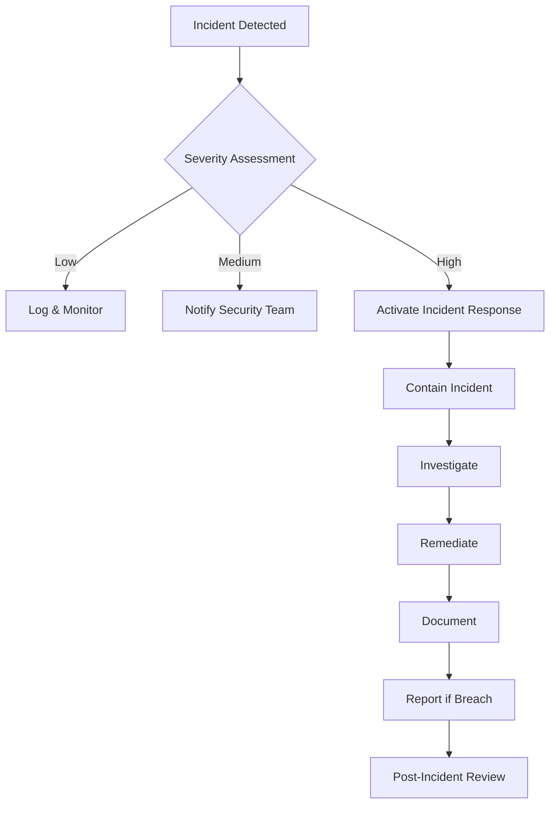

# HIPAA Compliance Documentation - EMR Integration Platform

**Version:** 1.0
**Last Updated:** 2025-11-15
**Maintained By:** Compliance Team
**Review Frequency:** Annually

---

## Table of Contents

1. [HIPAA Overview](#hipaa-overview)
2. [Regulatory Framework](#regulatory-framework)
3. [Technical Safeguards](#technical-safeguards)
4. [Administrative Safeguards](#administrative-safeguards)
5. [Physical Safeguards](#physical-safeguards)
6. [PHI Protection Measures](#phi-protection-measures)
7. [Audit Controls](#audit-controls)
8. [Business Associate Agreements](#business-associate-agreements)
9. [Breach Notification](#breach-notification)
10. [Compliance Checklist](#compliance-checklist)

---

## HIPAA Overview

### What is HIPAA?

**HIPAA (Health Insurance Portability and Accountability Act of 1996)** is a federal law that protects sensitive patient health information from being disclosed without the patient's consent or knowledge.

**Key Components:**
- **Privacy Rule:** Protects PHI from unauthorized disclosure
- **Security Rule:** Requires safeguards for electronic PHI (ePHI)
- **Breach Notification Rule:** Requires notification of PHI breaches
- **Enforcement Rule:** Establishes penalties for violations

### Protected Health Information (PHI)

**PHI includes any individually identifiable health information:**

- Patient names
- Medical record numbers (MRN)
- Dates (birth, admission, discharge, death)
- Contact information (address, phone, email)
- Social Security numbers
- Health plan beneficiary numbers
- Medical device identifiers
- Biometric identifiers
- IP addresses (if linked to individual)
- Any other unique identifying numbers or codes

### Our Commitment

The EMR Integration Platform is designed and operated in full compliance with HIPAA requirements. This document details our compliance measures and controls.

---

## Regulatory Framework

### Applicable Regulations

| Regulation | Citation | Requirement |
|------------|----------|-------------|
| **Privacy Rule** | 45 CFR Part 160, 164 Subparts A & E | PHI use and disclosure |
| **Security Rule** | 45 CFR Part 164 Subpart C | ePHI safeguards |
| **Breach Notification** | 45 CFR §§ 164.400-414 | Breach reporting |
| **Enforcement** | 45 CFR Parts 160 & 162 | Penalties and procedures |

### Security Rule Standards

**Technical Safeguards (§164.312):**
- Access Control (§164.312(a))
- Audit Controls (§164.312(b))
- Integrity Controls (§164.312(c))
- Transmission Security (§164.312(e))

**Administrative Safeguards (§164.308):**
- Security Management Process
- Assigned Security Responsibility
- Workforce Security
- Information Access Management
- Security Awareness and Training
- Security Incident Procedures
- Contingency Plan
- Evaluation

**Physical Safeguards (§164.310):**
- Facility Access Controls
- Workstation Use
- Workstation Security
- Device and Media Controls

---

## Technical Safeguards

### §164.312(a) Access Control

**Implementation:**

#### Unique User Identification (Required)

```
Each user has unique credentials:
- Email-based username
- UUID-based user ID
- Unique session tokens
- Individual audit trail

Example:
User ID: 550e8400-e29b-41d4-a716-446655440000
Username: nurse@hospital.com
Session: jwt_eyJhbGciOiJSUzI1NiIsInR5cCI6IkpXVCJ9...
```

**Technical Implementation:**
- No shared accounts
- Service accounts use API keys
- Session tokens unique per login
- User IDs stored with all PHI access

#### Emergency Access Procedure (Required)

**Break-Glass Access:**

```sql
-- Emergency access requires:
1. Valid reason code
2. Supervisor approval
3. Time-limited access (max 4 hours)
4. Enhanced audit logging
5. Post-access review

CREATE TABLE emergency_access_log (
  id UUID PRIMARY KEY,
  user_id UUID NOT NULL,
  reason TEXT NOT NULL,
  approved_by UUID NOT NULL,
  expires_at TIMESTAMP NOT NULL,
  accessed_phi JSONB,
  created_at TIMESTAMP DEFAULT NOW()
);
```

**Process:**
1. User requests emergency access
2. System requires reason code
3. Supervisor approves (or auto-approved if supervisor unavailable)
4. Access granted for 4 hours
5. All actions logged
6. Post-incident review within 24 hours

#### Automatic Logoff (Addressable)

**Implementation:**

| Platform | Timeout | Action |
|----------|---------|--------|
| Web Application | 60 minutes inactivity | Automatic logout |
| Mobile App | 8 hours (biometric enabled) | Require re-authentication |
| API Sessions | 60 minutes | Token expiration |
| Admin Dashboard | 30 minutes inactivity | Automatic logout |

**Technical Details:**
```typescript
// Session timeout configuration
const SESSION_TIMEOUT = {
  web: 60 * 60 * 1000,      // 60 minutes
  mobile: 8 * 60 * 60 * 1000, // 8 hours (with biometric)
  api: 60 * 60 * 1000,       // 60 minutes
  admin: 30 * 60 * 1000      // 30 minutes
};
```

#### Encryption and Decryption (Addressable)

**Data at Rest (AES-256):**

```sql
-- Encrypted columns for PHI
CREATE TABLE patients (
  id UUID PRIMARY KEY,
  patient_mrn VARCHAR(255) NOT NULL,
  demographics JSONB, -- Encrypted using pgcrypto
  encrypted_ssn BYTEA, -- AES-256 encryption
  created_at TIMESTAMP
);

-- Encryption function
CREATE FUNCTION encrypt_phi(data TEXT) RETURNS BYTEA AS $$
BEGIN
  RETURN pgp_sym_encrypt(data, current_setting('app.encryption_key'));
END;
$$ LANGUAGE plpgsql;
```

**Data in Transit (TLS 1.3):**

```nginx
# TLS Configuration
ssl_protocols TLSv1.3;
ssl_ciphers 'ECDHE-ECDSA-AES256-GCM-SHA384:ECDHE-RSA-AES256-GCM-SHA384';
ssl_prefer_server_ciphers on;
ssl_session_cache shared:SSL:10m;
ssl_session_timeout 10m;
```

**Key Management:**
- Encryption keys stored in AWS KMS
- Automatic key rotation every 90 days
- Keys never stored in source code
- Separate keys for dev/staging/production

---

### §164.312(b) Audit Controls

**Implementation:**

#### Comprehensive Audit Logging

```sql
-- Audit logs table (partitioned by month)
CREATE TABLE audit_logs (
  id UUID PRIMARY KEY,
  action VARCHAR(50) NOT NULL,
  entity_type VARCHAR(100) NOT NULL,
  entity_id UUID NOT NULL,
  user_id UUID NOT NULL,
  changes JSONB NOT NULL,
  created_at TIMESTAMP WITH TIME ZONE NOT NULL,
  ip_address VARCHAR(45),
  user_agent VARCHAR(500),
  session_id UUID,
  emr_system VARCHAR(50),
  emr_patient_id VARCHAR(255),
  request_id UUID NOT NULL,
  metadata JSONB
) PARTITION BY RANGE (created_at);
```

**Events Logged:**

| Event | Details Captured |
|-------|------------------|
| **PHI Access** | User, patient ID, timestamp, IP, action |
| **User Authentication** | Login/logout, MFA, IP address |
| **Data Modifications** | Before/after state, user, timestamp |
| **EMR Queries** | Patient lookup, order verification |
| **Administrative Actions** | User creation, role changes, config changes |
| **System Events** | Errors, security events, performance issues |

**Retention:** 7 years (2,555 days) - HIPAA minimum requirement

**Sample Audit Log:**

```json
{
  "id": "a1b2c3d4-e5f6-7890-abcd-ef1234567890",
  "action": "VIEW",
  "entity_type": "Task",
  "entity_id": "550e8400-e29b-41d4-a716-446655440000",
  "user_id": "650e8400-e29b-41d4-a716-446655440001",
  "changes": {
    "patient_id": "P12345",
    "task_title": "Administer medication"
  },
  "created_at": "2025-11-15T14:30:00Z",
  "ip_address": "192.168.1.10",
  "user_agent": "Mozilla/5.0...",
  "session_id": "750e8400-e29b-41d4-a716-446655440002",
  "emr_patient_id": "P12345",
  "request_id": "850e8400-e29b-41d4-a716-446655440003"
}
```

---

### §164.312(c) Integrity Controls

**Mechanism to Authenticate ePHI (Addressable):**

#### Digital Signatures

```typescript
// Sign PHI data to detect tampering
interface SignedPHI {
  data: EncryptedData;
  signature: string;
  algorithm: 'RS256';
  timestamp: string;
}

function signPHI(data: PHIData): SignedPHI {
  const signature = crypto.sign(
    'sha256',
    Buffer.from(JSON.stringify(data)),
    privateKey
  );

  return {
    data: encrypt(data),
    signature: signature.toString('base64'),
    algorithm: 'RS256',
    timestamp: new Date().toISOString()
  };
}
```

#### Checksums and Hashing

```sql
-- Task integrity verification
CREATE TABLE task_integrity (
  task_id UUID PRIMARY KEY,
  content_hash VARCHAR(64) NOT NULL, -- SHA-256
  version INTEGER NOT NULL,
  created_at TIMESTAMP NOT NULL,
  verified_at TIMESTAMP
);

-- Calculate hash on insert/update
CREATE TRIGGER task_integrity_trigger
BEFORE INSERT OR UPDATE ON tasks
FOR EACH ROW
EXECUTE FUNCTION calculate_task_hash();
```

#### Database Constraints

```sql
-- Prevent data corruption
ALTER TABLE tasks ADD CONSTRAINT chk_vector_clock
  CHECK (vector_clock > 0);

ALTER TABLE audit_logs ADD CONSTRAINT chk_created_at
  CHECK (created_at <= NOW());

-- Foreign key constraints
ALTER TABLE tasks ADD CONSTRAINT fk_tasks_patient
  FOREIGN KEY (patient_id) REFERENCES patients(id)
  ON DELETE RESTRICT;
```

---

### §164.312(e) Transmission Security

**Integrity Controls (Addressable):**

#### TLS Encryption

```yaml
# TLS 1.3 Configuration
Protocols:
  - TLSv1.3

Cipher Suites:
  - TLS_AES_256_GCM_SHA384
  - TLS_CHACHA20_POLY1305_SHA256

Certificate:
  Type: EV SSL
  Issuer: DigiCert
  Validity: 1 year
  Key Size: 2048-bit RSA

HSTS:
  Enabled: true
  MaxAge: 31536000
  IncludeSubDomains: true
  Preload: true
```

#### VPN Requirements

```
For remote access:
- IPSec VPN required
- AES-256 encryption
- Multi-factor authentication
- Split tunneling disabled
```

**Encryption (Addressable):**

All PHI transmitted:
- Over TLS 1.3
- Between microservices: mTLS (mutual TLS)
- To EMR systems: HTTPS with client certificates
- Mobile apps: Certificate pinning

```typescript
// Certificate pinning (mobile)
const certificatePins = {
  'api.emrtask.com': [
    'sha256/AAAAAAAAAAAAAAAAAAAAAAAAAAAAAAAAAAAAAAAAAAA=',
    'sha256/BBBBBBBBBBBBBBBBBBBBBBBBBBBBBBBBBBBBBBBBBBB=' // Backup
  ]
};
```

---

## Administrative Safeguards

### §164.308(a)(1) Security Management Process

#### Risk Analysis (Required)

**Annual Risk Assessment:**

| Asset | Threats | Likelihood | Impact | Controls |
|-------|---------|------------|--------|----------|
| Patient Database | Unauthorized access | Medium | High | Encryption, access controls, MFA |
| API Gateway | DDoS attack | High | Medium | Rate limiting, WAF, monitoring |
| Mobile App | Device theft | High | Medium | Encryption, remote wipe, biometric |
| Backup Storage | Data breach | Low | High | Encryption, access logs, monitoring |

**Assessment Process:**
1. Identify ePHI assets
2. Identify threats and vulnerabilities
3. Assess current security measures
4. Determine likelihood of threat occurrence
5. Determine potential impact
6. Determine level of risk
7. Document findings
8. Implement mitigation strategies

#### Risk Management (Required)

**Risk Mitigation Plan:**

```
High Risk: Unauthorized database access
Mitigation:
- Implement database encryption
- Enable row-level security
- Require VPN for remote access
- Implement MFA for all users
- Monitor access logs daily

Medium Risk: Mobile device loss
Mitigation:
- Enable remote wipe capability
- Require device encryption
- Implement biometric authentication
- Session timeout after 8 hours
```

#### Sanction Policy (Required)

**Violation Response:**

| Violation | First Offense | Second Offense | Third Offense |
|-----------|---------------|----------------|---------------|
| Weak Password | Warning + training | 1-day suspension | Termination |
| Shared Credentials | Written warning | 3-day suspension | Termination |
| Unauthorized PHI Access | Suspension + investigation | Termination | Criminal referral |
| PHI Breach | Immediate termination | Criminal referral | N/A |

#### Information System Activity Review (Required)

**Regular Reviews:**

| Review Type | Frequency | Reviewer |
|-------------|-----------|----------|
| Audit Logs | Daily | Security Team |
| Access Reports | Weekly | Compliance Officer |
| Failed Login Attempts | Daily | Security Team |
| PHI Access Patterns | Monthly | Compliance Officer |
| Security Alerts | Real-time | SOC Team |

---

### §164.308(a)(3) Workforce Security

#### Authorization/Supervision (Addressable)

**Role-Based Access Control (RBAC):**

```typescript
// Permission matrix
const PERMISSIONS = {
  NURSE: [
    'task:create',
    'task:read',
    'task:update:own',
    'task:complete',
    'patient:read:limited',
    'emr:verify'
  ],
  DOCTOR: [
    'task:create',
    'task:read:all',
    'task:update:all',
    'patient:read:full',
    'order:create',
    'emr:verify'
  ],
  SUPERVISOR: [
    'task:*',
    'user:read',
    'handover:manage',
    'report:view',
    'department:manage'
  ],
  ADMIN: ['*'] // All permissions
};
```

#### Workforce Clearance (Addressable)

**Background Checks:**
- Criminal background check
- Professional license verification
- Reference checks
- HIPAA training certification

#### Termination Procedures (Addressable)

**Employee Termination Checklist:**

```
Within 1 hour of termination:
☐ Disable user account
☐ Revoke all access credentials
☐ Deactivate MFA
☐ Remote wipe mobile devices
☐ Revoke VPN access
☐ Disable email access

Within 24 hours:
☐ Retrieve company devices
☐ Review audit logs for last 90 days
☐ Reassign pending tasks
☐ Archive user data
☐ Document termination in HR system

Within 7 days:
☐ Complete exit interview
☐ Conduct access audit
☐ Update documentation
```

---

### §164.308(a)(4) Information Access Management

#### Access Authorization (Addressable)

**Minimum Necessary Principle:**

Users only see PHI necessary for their role:

```sql
-- Row-level security
CREATE POLICY task_access_policy ON tasks
USING (
  -- Users can only access tasks in their department
  department_id IN (
    SELECT department_id
    FROM users
    WHERE id = current_user_id()
  )
);

-- Column-level restrictions
GRANT SELECT (id, title, status, due_date) ON tasks TO role_nurse;
GRANT SELECT (id, patient_mrn) ON patients TO role_nurse;
-- SSN, financial data restricted
```

---

### §164.308(a)(5) Security Awareness Training

**Training Program:**

| Topic | Frequency | Format | Duration |
|-------|-----------|--------|----------|
| HIPAA Basics | Annual | E-learning | 1 hour |
| PHI Protection | Annual | E-learning | 30 min |
| Password Security | Semi-annual | E-learning | 15 min |
| Phishing Awareness | Quarterly | Email + quiz | 10 min |
| Incident Response | Annual | Webinar | 1 hour |
| Mobile Device Security | Annual | E-learning | 20 min |

**New Employee Training:**
- Complete within first week
- Must pass quiz (80% minimum)
- Certificate of completion required
- Re-training annually

---

### §164.308(a)(6) Security Incident Procedures

**Incident Response Plan:**



**Response Times:**

| Severity | Example | Response Time |
|----------|---------|---------------|
| **Critical** | Active data breach | <15 minutes |
| **High** | Suspected PHI access | <1 hour |
| **Medium** | Security alert | <4 hours |
| **Low** | Failed login attempts | <24 hours |

---

## Physical Safeguards

### §164.310(a) Facility Access Controls

**Data Center Security:**

- 24/7 security guards
- Biometric access control
- Video surveillance (90-day retention)
- Access logs reviewed daily
- Visitor escort required
- Multi-factor authentication for entry

**Office Security:**
- Badge access required
- Visitor sign-in/out
- Screen privacy filters
- Locked server rooms
- Secure disposal (shredding)

---

### §164.310(b) Workstation Use

**Acceptable Use Policy:**

✓ **Allowed:**
- Accessing PHI for job duties
- Using approved devices
- Locking screen when away
- Reporting security incidents

✗ **Prohibited:**
- Sharing credentials
- Storing PHI on personal devices
- Taking screenshots of PHI
- Accessing PHI from public WiFi
- Using personal email for PHI

---

### §164.310(c) Workstation Security

**Security Controls:**

- Automatic screen lock (5 minutes)
- Full disk encryption
- Anti-malware software
- Automatic updates enabled
- VPN required for remote access
- USB ports disabled (workstations)

---

### §164.310(d) Device and Media Controls

#### Disposal (Required)

**Secure Disposal Process:**

```
Electronic Media:
1. Decommission device
2. Wipe using DOD 5220.22-M standard (7-pass)
3. Physical destruction if wiping fails
4. Certificate of destruction issued
5. Document in asset management system

Paper Records:
1. Collect in locked bins
2. Shred using cross-cut shredder
3. Use certified shredding service
4. Obtain certificate of destruction
```

#### Media Re-use (Required)

**Before Re-use:**
- Verify complete data erasure
- Test to confirm no data recovery possible
- Document sanitization process
- Obtain supervisor approval

#### Accountability (Addressable)

**Asset Tracking:**

```sql
CREATE TABLE device_inventory (
  device_id UUID PRIMARY KEY,
  device_type VARCHAR(50),
  serial_number VARCHAR(100) UNIQUE,
  assigned_to UUID REFERENCES users(id),
  assigned_date TIMESTAMP,
  location VARCHAR(200),
  encryption_enabled BOOLEAN,
  last_audit_date TIMESTAMP,
  status VARCHAR(20) -- active, decommissioned, lost
);
```

---

## PHI Protection Measures

### Data Classification

| Classification | Examples | Controls |
|----------------|----------|----------|
| **Public** | Marketing materials, public notices | None |
| **Internal** | Policies, procedures, non-PHI data | Access control |
| **Confidential** | Employee data, business plans | Encryption, access logs |
| **PHI** | Patient records, medical data, MRNs | All HIPAA controls |

### Encryption Standards

**At Rest:**
- Database: AES-256
- File storage: AES-256
- Backups: AES-256
- Mobile: iOS/Android native encryption

**In Transit:**
- API: TLS 1.3
- Database: TLS 1.3 + client certificates
- Inter-service: mTLS
- Mobile: TLS 1.3 + certificate pinning

### De-Identification

**Safe Harbor Method:**

Remove all 18 identifiers:
1. Names
2. Geographic subdivisions smaller than state
3. Dates (except year)
4. Telephone numbers
5. Fax numbers
6. Email addresses
7. Social Security numbers
8. Medical record numbers
9. Health plan beneficiary numbers
10. Account numbers
11. Certificate/license numbers
12. Vehicle identifiers
13. Device identifiers
14. URLs
15. IP addresses
16. Biometric identifiers
17. Full-face photos
18. Any other unique identifying number

**Used for:**
- Analytics and reporting
- Research
- Performance metrics
- Training data

---

## Audit Controls

### Audit Log Requirements

**Retention:** 7 years (2,555 days)

**Contents:**

```json
{
  "timestamp": "2025-11-15T14:30:00Z",
  "event_type": "PHI_ACCESS",
  "user": {
    "id": "550e8400-e29b-41d4-a716-446655440000",
    "username": "nurse@hospital.com",
    "role": "NURSE",
    "department": "Emergency"
  },
  "action": "VIEW",
  "resource": {
    "type": "Task",
    "id": "650e8400-e29b-41d4-a716-446655440001",
    "patient_id": "P12345"
  },
  "context": {
    "ip_address": "192.168.1.10",
    "user_agent": "Mozilla/5.0...",
    "session_id": "750e8400-e29b-41d4-a716-446655440002",
    "request_id": "850e8400-e29b-41d4-a716-446655440003"
  },
  "result": "SUCCESS"
}
```

### Audit Review Process

**Daily:**
- Failed login attempts (>5 from same IP)
- After-hours PHI access
- Administrative actions
- Security alerts

**Weekly:**
- Access pattern analysis
- Unusual PHI access volumes
- Geographic anomalies
- Terminated employee access attempts

**Monthly:**
- Compliance reports
- Access rights review
- Audit log completeness
- System health

### Audit Reports

**Available Reports:**

1. **PHI Access Report**
   - Who accessed which patient records
   - When and from where
   - Purpose of access

2. **User Activity Report**
   - Login/logout times
   - Actions performed
   - Resources accessed

3. **Security Events Report**
   - Failed authentications
   - Security alerts
   - Policy violations

4. **Compliance Report**
   - HIPAA control status
   - Violations and remediation
   - Training completion

---

## Business Associate Agreements

### BAA Requirements

All vendors with PHI access must sign BAA.

**BAA Must Include:**

☐ Definition of PHI
☐ Permitted uses and disclosures
☐ Prohibition on unauthorized use/disclosure
☐ Safeguards requirements
☐ Subcontractor requirements
☐ Access rights
☐ Breach notification obligations
☐ Return or destruction of PHI
☐ Audit rights
☐ Termination provisions

### Current Business Associates

| Vendor | Service | BAA Status | Last Review |
|--------|---------|------------|-------------|
| AWS | Cloud infrastructure | ✓ Signed | 2025-01-15 |
| Auth0 | Authentication | ✓ Signed | 2025-02-01 |
| Twilio | SMS notifications | ✓ Signed | 2025-03-10 |
| Sentry | Error monitoring | ✓ Signed | 2025-01-20 |
| Datadog | Application monitoring | ✓ Signed | 2025-02-15 |

---

## Breach Notification

### Breach Definition

**Breach:** Unauthorized acquisition, access, use, or disclosure of PHI that compromises security or privacy.

**Exceptions (Not a Breach):**
- Unintentional access by workforce member acting in good faith
- Inadvertent disclosure between authorized persons
- PHI not retained and couldn't be accessed

### Notification Requirements

#### Timeline

```
Discovery → Assessment → Notification

Day 0: Breach discovered
Day 1: Contain and assess
Day 2-60: Notify affected individuals
Day 60: Report to HHS (if >500 individuals)
Within 60 days: Report to HHS (if <500 individuals, annual)
Without delay: Notify media (if >500 in same state/jurisdiction)
```

#### Notification Content

**Individual Notification Must Include:**

1. Description of breach
2. Types of PHI involved
3. Steps individuals should take
4. What we're doing to investigate
5. Contact information

**Sample Notification:**

```
Subject: Important Notice About Your Health Information

Dear [Patient Name],

We are writing to notify you of a data security incident that may
have involved your protected health information.

What Happened:
On November 1, 2025, we discovered unauthorized access to our task
management system between October 15-31, 2025.

What Information Was Involved:
- Name
- Medical record number
- Medication information
- Treatment dates

What We Are Doing:
- Contained the breach immediately
- Engaged cybersecurity firm for investigation
- Implemented additional security measures
- Notified law enforcement

What You Can Do:
- Monitor your medical records
- Report any suspicious activity
- Contact us with questions: 1-800-XXX-XXXX

For More Information:
Visit www.emrtask.com/breach-response or call our dedicated hotline.

Sincerely,
[Organization Name]
```

### Breach Response Plan

**Incident Response Team:**
- Chief Information Security Officer (Lead)
- Privacy Officer
- Legal Counsel
- IT Director
- Public Relations
- Compliance Officer

**Response Steps:**

1. **Containment (0-4 hours)**
   - Stop breach
   - Secure systems
   - Preserve evidence

2. **Assessment (4-24 hours)**
   - Determine scope
   - Identify affected individuals
   - Assess risk to individuals

3. **Notification (1-60 days)**
   - Notify individuals
   - Report to HHS
   - Notify media (if required)

4. **Remediation (Ongoing)**
   - Fix vulnerabilities
   - Implement additional controls
   - Update policies

5. **Post-Incident Review (30 days after)**
   - Lessons learned
   - Update incident response plan
   - Additional training if needed

---

## Compliance Checklist

### Technical Safeguards ✓

- [x] Unique user IDs for all users
- [x] Emergency access procedures documented
- [x] Automatic logoff after inactivity
- [x] Encryption at rest (AES-256)
- [x] Encryption in transit (TLS 1.3)
- [x] Comprehensive audit logging
- [x] 7-year audit log retention
- [x] Data integrity controls (checksums, signatures)
- [x] Transmission security (TLS, mTLS)

### Administrative Safeguards ✓

- [x] Annual risk analysis completed
- [x] Risk management plan documented
- [x] Sanction policy in place
- [x] Regular audit log reviews
- [x] RBAC implemented
- [x] Minimum necessary access enforced
- [x] Annual HIPAA training program
- [x] Incident response plan documented
- [x] Breach notification procedures

### Physical Safeguards ✓

- [x] Data center access controls
- [x] Badge access for offices
- [x] Workstation use policy
- [x] Screen lock requirements
- [x] Secure disposal procedures
- [x] Device inventory maintained

### Documentation ✓

- [x] Policies and procedures documented
- [x] BAAs signed with all vendors
- [x] Training records maintained
- [x] Audit logs retained 7 years
- [x] Risk assessments documented
- [x] Incident reports filed

---

## Change Log

| Version | Date | Changes | Author |
|---------|------|---------|--------|
| 1.0 | 2025-11-15 | Initial HIPAA compliance documentation | Compliance Team |

---

## Related Documentation

- [Security Policies](./security-policies.md)
- [Audit Procedures](./audit-procedures.md)
- [GDPR/LGPD Compliance](./gdpr-lgpd.md)
- [System Architecture](/home/user/emr-integration-platform--4v4v54/docs/phase5/SYSTEM_ARCHITECTURE.md)

---

## Contact

**Privacy Officer:** privacy@emrtask.com
**Security Officer:** security@emrtask.com
**Compliance Hotline:** 1-800-HIPAA-HELP

---

*This document is reviewed and updated annually or when significant changes occur.*
