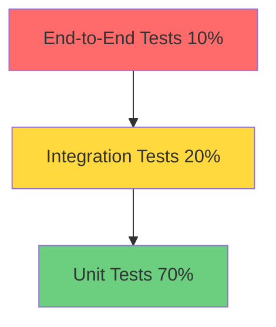

# Testing Guide - EMR Integration Platform

**Version:** 1.0
**Last Updated:** 2025-11-15
**Maintained By:** QA Team
**Review Frequency:** Per Sprint

---

## Table of Contents

1. [Testing Strategy](#testing-strategy)
2. [Test Pyramid](#test-pyramid)
3. [Unit Testing](#unit-testing)
4. [Integration Testing](#integration-testing)
5. [End-to-End Testing](#end-to-end-testing)
6. [Running Tests](#running-tests)
7. [CI/CD Testing](#cicd-testing)
8. [Coverage Requirements](#coverage-requirements)
9. [Mocking Strategies](#mocking-strategies)
10. [Test Data Management](#test-data-management)

---

## Testing Strategy

### Testing Philosophy

Our testing approach follows these principles:

1. **Test Pyramid:** 70% unit, 20% integration, 10% E2E
2. **Test-Driven Development (TDD):** Write tests before implementation
3. **Behavior-Driven:** Tests describe business requirements
4. **Fast Feedback:** Unit tests run in <5 seconds
5. **Isolated Tests:** No dependencies between tests
6. **Deterministic:** Same input = same output always

### Quality Gates

| Gate | Requirement | Enforced By |
|------|-------------|-------------|
| Unit Test Coverage | ≥85% | Jest |
| Integration Test Coverage | ≥75% | Jest |
| E2E Test Coverage | 100% critical paths | Cypress |
| Security Scan | 0 high/critical vulnerabilities | Snyk |
| Performance | p95 latency <500ms | k6 |
| Code Quality | Grade A | SonarQube |

---

## Test Pyramid



### Test Distribution

| Test Type | Percentage | Count | Execution Time |
|-----------|-----------|-------|----------------|
| Unit Tests | 70% | ~500 | <5s |
| Integration Tests | 20% | ~150 | <30s |
| E2E Tests | 10% | ~50 | <5min |
| **Total** | **100%** | **~700** | **<6min** |

---

## Unit Testing

### Framework: Jest

**Location:** `/src/backend/packages/*/test/unit/`, `/src/web/__tests__/`

**Configuration:** `jest.config.ts`

### Writing Unit Tests

#### Backend Example (Task Service)

```typescript
// src/backend/packages/task-service/test/unit/task.service.test.ts
import { TaskService } from '../../src/services/task.service';
import { mockDatabase } from '../helpers/mockDatabase';
import { mockRedis } from '../helpers/mockRedis';
import { mockKafka } from '../helpers/mockKafka';

describe('TaskService', () => {
  let taskService: TaskService;
  let db: any;
  let redis: any;
  let kafka: any;

  beforeEach(() => {
    db = mockDatabase();
    redis = mockRedis();
    kafka = mockKafka();
    taskService = new TaskService(db, redis, kafka);
  });

  afterEach(() => {
    jest.clearAllMocks();
  });

  describe('createTask', () => {
    it('should create a task with valid data', async () => {
      // Arrange
      const taskInput = {
        title: 'Administer medication',
        status: 'TO_DO',
        priority: 'HIGH',
        assigned_to: 'user-123',
        department_id: 'dept-456',
        patient_id: 'P12345',
        emr_system: 'EPIC',
        emr_data: { order_id: 'MO-789' }
      };

      db.tasks.insert.mockResolvedValue({
        id: 'task-789',
        ...taskInput,
        created_at: new Date()
      });

      // Act
      const result = await taskService.createTask(taskInput);

      // Assert
      expect(result).toBeDefined();
      expect(result.id).toBe('task-789');
      expect(result.title).toBe('Administer medication');
      expect(db.tasks.insert).toHaveBeenCalledWith(
        expect.objectContaining(taskInput)
      );
      expect(kafka.publish).toHaveBeenCalledWith(
        'task.created',
        expect.any(Object)
      );
    });

    it('should throw error with invalid task data', async () => {
      // Arrange
      const invalidTask = {
        title: '', // Invalid: empty title
        status: 'INVALID_STATUS' // Invalid status
      };

      // Act & Assert
      await expect(taskService.createTask(invalidTask))
        .rejects
        .toThrow('Validation error');
    });

    it('should increment vector clock on create', async () => {
      // Arrange
      const taskInput = { /* valid task data */ };

      // Act
      const result = await taskService.createTask(taskInput);

      // Assert
      expect(result.vector_clock).toBeGreaterThan(0);
    });
  });

  describe('getTaskById', () => {
    it('should return task from cache if available', async () => {
      // Arrange
      const cachedTask = { id: 'task-123', title: 'Cached task' };
      redis.get.mockResolvedValue(JSON.stringify(cachedTask));

      // Act
      const result = await taskService.getTaskById('task-123');

      // Assert
      expect(result).toEqual(cachedTask);
      expect(redis.get).toHaveBeenCalledWith('task:task-123');
      expect(db.tasks.findById).not.toHaveBeenCalled();
    });

    it('should fetch from database if not in cache', async () => {
      // Arrange
      redis.get.mockResolvedValue(null);
      const dbTask = { id: 'task-123', title: 'DB task' };
      db.tasks.findById.mockResolvedValue(dbTask);

      // Act
      const result = await taskService.getTaskById('task-123');

      // Assert
      expect(result).toEqual(dbTask);
      expect(db.tasks.findById).toHaveBeenCalledWith('task-123');
      expect(redis.set).toHaveBeenCalledWith(
        'task:task-123',
        JSON.stringify(dbTask),
        'EX',
        300
      );
    });
  });
});
```

#### Frontend Example (React Hook)

```typescript
// src/web/__tests__/hooks/useTasks.test.ts
import { renderHook, waitFor } from '@testing-library/react';
import { useTasks } from '../../src/hooks/useTasks';
import { mockApiResponse } from '../helpers/mockApiResponses';

jest.mock('../../src/lib/api');

describe('useTasks', () => {
  it('should fetch tasks on mount', async () => {
    // Arrange
    const mockTasks = [
      { id: '1', title: 'Task 1', status: 'TO_DO' },
      { id: '2', title: 'Task 2', status: 'IN_PROGRESS' }
    ];
    mockApiResponse('/tasks', { data: mockTasks });

    // Act
    const { result } = renderHook(() => useTasks());

    // Assert
    await waitFor(() => {
      expect(result.current.tasks).toEqual(mockTasks);
      expect(result.current.loading).toBe(false);
    });
  });

  it('should handle error state', async () => {
    // Arrange
    mockApiResponse('/tasks', null, { status: 500 });

    // Act
    const { result } = renderHook(() => useTasks());

    // Assert
    await waitFor(() => {
      expect(result.current.error).toBeDefined();
      expect(result.current.tasks).toEqual([]);
    });
  });
});
```

### Best Practices

1. **AAA Pattern:** Arrange, Act, Assert
2. **Descriptive Names:** `should [expected behavior] when [condition]`
3. **Single Assertion:** One logical assertion per test
4. **Mock External Dependencies:** Database, APIs, time
5. **Test Edge Cases:** Null, undefined, empty, boundary values

---

## Integration Testing

### Framework: Jest + Supertest

**Location:** `/src/backend/packages/*/test/integration/`

### Writing Integration Tests

#### API Endpoint Integration Test

```typescript
// src/backend/packages/api-gateway/test/integration/tasks.test.ts
import request from 'supertest';
import { app } from '../../src/app';
import { setupTestDatabase, teardownTestDatabase } from '../helpers/database';
import { createTestUser, getAuthToken } from '../helpers/auth';

describe('Tasks API Integration', () => {
  let authToken: string;
  let userId: string;
  let departmentId: string;

  beforeAll(async () => {
    await setupTestDatabase();
    const user = await createTestUser({ role: 'NURSE' });
    userId = user.id;
    departmentId = user.department_id;
    authToken = await getAuthToken(user);
  });

  afterAll(async () => {
    await teardownTestDatabase();
  });

  describe('POST /api/v1/tasks', () => {
    it('should create task with valid data', async () => {
      // Arrange
      const taskData = {
        title: 'Integration test task',
        status: 'TO_DO',
        priority: 'HIGH',
        assigned_to: userId,
        department_id: departmentId,
        patient_id: 'P12345',
        emr_system: 'EPIC',
        emr_data: { order_id: 'MO-123' }
      };

      // Act
      const response = await request(app)
        .post('/api/v1/tasks')
        .set('Authorization', `Bearer ${authToken}`)
        .send(taskData)
        .expect(201);

      // Assert
      expect(response.body.success).toBe(true);
      expect(response.body.data).toMatchObject({
        title: taskData.title,
        status: taskData.status,
        priority: taskData.priority
      });
      expect(response.body.data.id).toBeDefined();
      expect(response.body.data.vector_clock).toBeGreaterThan(0);
    });

    it('should return 401 without authentication', async () => {
      await request(app)
        .post('/api/v1/tasks')
        .send({ title: 'Test' })
        .expect(401);
    });

    it('should validate required fields', async () => {
      const response = await request(app)
        .post('/api/v1/tasks')
        .set('Authorization', `Bearer ${authToken}`)
        .send({ title: '' }) // Invalid: empty title
        .expect(422);

      expect(response.body.success).toBe(false);
      expect(response.body.error.code).toBe('VALIDATION_ERROR');
    });
  });

  describe('GET /api/v1/tasks/:id', () => {
    it('should retrieve task by id', async () => {
      // Arrange: Create task first
      const createResponse = await request(app)
        .post('/api/v1/tasks')
        .set('Authorization', `Bearer ${authToken}`)
        .send({ /* task data */ });

      const taskId = createResponse.body.data.id;

      // Act
      const response = await request(app)
        .get(`/api/v1/tasks/${taskId}`)
        .set('Authorization', `Bearer ${authToken}`)
        .expect(200);

      // Assert
      expect(response.body.data.id).toBe(taskId);
    });

    it('should return 404 for non-existent task', async () => {
      await request(app)
        .get('/api/v1/tasks/00000000-0000-0000-0000-000000000000')
        .set('Authorization', `Bearer ${authToken}`)
        .expect(404);
    });
  });
});
```

#### Database Integration Test

```typescript
// src/backend/packages/shared/test/integration/database.test.ts
import { knex } from '../../src/database/connection';
import { Task } from '../../src/types/task.types';

describe('Database Operations', () => {
  beforeEach(async () => {
    await knex.migrate.latest();
    await knex.seed.run();
  });

  afterEach(async () => {
    await knex.migrate.rollback();
  });

  describe('Task CRUD', () => {
    it('should insert and retrieve task', async () => {
      // Arrange
      const taskData = {
        title: 'Test task',
        status: 'TO_DO',
        // ... other fields
      };

      // Act
      const [insertedTask] = await knex('tasks')
        .insert(taskData)
        .returning('*');

      const retrievedTask = await knex('tasks')
        .where({ id: insertedTask.id })
        .first();

      // Assert
      expect(retrievedTask).toMatchObject(taskData);
    });

    it('should enforce foreign key constraints', async () => {
      // Act & Assert
      await expect(
        knex('tasks').insert({
          title: 'Test',
          assigned_to: 'non-existent-user-id' // Invalid FK
        })
      ).rejects.toThrow('foreign key constraint');
    });
  });
});
```

---

## End-to-End Testing

### Framework: Cypress

**Location:** `/src/web/cypress/e2e/`

**Configuration:** `cypress.config.ts`

### Writing E2E Tests

```typescript
// src/web/cypress/e2e/task-workflow.cy.ts
describe('Task Management Workflow', () => {
  beforeEach(() => {
    // Login before each test
    cy.login('nurse@hospital.com', 'password');
    cy.visit('/dashboard');
  });

  it('should complete full task lifecycle', () => {
    // Create task
    cy.get('[data-cy=create-task-btn]').click();
    cy.get('[data-cy=task-title]').type('E2E Test Task');
    cy.get('[data-cy=task-priority]').select('HIGH');
    cy.get('[data-cy=task-patient-id]').type('P12345');
    cy.get('[data-cy=submit-task]').click();

    // Verify task appears in list
    cy.contains('E2E Test Task').should('be.visible');
    cy.get('[data-cy=task-status]').should('contain', 'TO_DO');

    // Update task status
    cy.contains('E2E Test Task').click();
    cy.get('[data-cy=status-dropdown]').select('IN_PROGRESS');
    cy.get('[data-cy=save-task]').click();

    // Verify status updated
    cy.get('[data-cy=task-status]').should('contain', 'IN_PROGRESS');

    // Verify EMR integration
    cy.get('[data-cy=verify-task-btn]').click();
    cy.get('[data-cy=barcode-input]').type('MRN:12345678|ORDER:MO-789');
    cy.get('[data-cy=submit-verification]').click();
    cy.contains('Verification successful').should('be.visible');

    // Complete task
    cy.get('[data-cy=complete-task-btn]').click();
    cy.get('[data-cy=task-status]').should('contain', 'COMPLETED');
  });

  it('should handle offline mode', () => {
    // Go offline
    cy.goOffline();

    // Create task offline
    cy.get('[data-cy=create-task-btn]').click();
    cy.get('[data-cy=task-title]').type('Offline Task');
    cy.get('[data-cy=submit-task]').click();

    // Verify offline indicator
    cy.get('[data-cy=offline-badge]').should('be.visible');
    cy.contains('Offline Task').should('be.visible');

    // Go online
    cy.goOnline();

    // Verify sync
    cy.wait('@syncTasks');
    cy.get('[data-cy=offline-badge]').should('not.exist');
  });
});
```

### Custom Cypress Commands

```typescript
// src/web/cypress/support/commands.ts
Cypress.Commands.add('login', (email: string, password: string) => {
  cy.request('POST', '/api/v1/auth/login', { email, password })
    .then((response) => {
      window.localStorage.setItem('access_token', response.body.access_token);
    });
});

Cypress.Commands.add('goOffline', () => {
  cy.log('Going offline');
  cy.window().then((win) => {
    win.dispatchEvent(new Event('offline'));
  });
});

Cypress.Commands.add('goOnline', () => {
  cy.log('Going online');
  cy.window().then((win) => {
    win.dispatchEvent(new Event('online'));
  });
});
```

---

## Running Tests

### Local Development

```bash
# Run all tests
npm run test

# Run tests in watch mode
npm run test:watch

# Run specific test file
npm run test -- path/to/test.test.ts

# Run tests with coverage
npm run test:coverage

# Run only unit tests
npm run test:unit

# Run only integration tests
npm run test:integration

# Run E2E tests
npm run test:e2e

# Run E2E tests in headless mode
npm run cypress:headless
```

### Backend Tests

```bash
cd src/backend

# Run all backend tests
npm run test

# Run tests for specific package
npm run test -- packages/task-service

# Run with coverage
npm run test:coverage

# Generate coverage report
npm run test:coverage:report
open coverage/lcov-report/index.html
```

### Frontend Tests

```bash
cd src/web

# Run Jest tests
npm run test

# Run Cypress E2E tests (interactive)
npm run cypress

# Run Cypress E2E tests (headless)
npm run cypress:headless

# Run specific Cypress spec
npx cypress run --spec "cypress/e2e/tasks.cy.ts"
```

---

## CI/CD Testing

### GitHub Actions Workflow

```yaml
# .github/workflows/test.yml
name: Test Suite

on:
  push:
    branches: [main, develop]
  pull_request:
    branches: [main, develop]

jobs:
  unit-tests:
    runs-on: ubuntu-latest
    steps:
      - uses: actions/checkout@v3
      - uses: actions/setup-node@v3
        with:
          node-version: 18
      - run: npm ci
      - run: npm run test:unit
      - run: npm run test:coverage
      - uses: codecov/codecov-action@v3

  integration-tests:
    runs-on: ubuntu-latest
    services:
      postgres:
        image: postgres:14
        env:
          POSTGRES_PASSWORD: test
        options: >-
          --health-cmd pg_isready
          --health-interval 10s
      redis:
        image: redis:7
        options: >-
          --health-cmd "redis-cli ping"
          --health-interval 10s
    steps:
      - uses: actions/checkout@v3
      - uses: actions/setup-node@v3
      - run: npm ci
      - run: npm run test:integration

  e2e-tests:
    runs-on: ubuntu-latest
    steps:
      - uses: actions/checkout@v3
      - uses: cypress-io/github-action@v5
        with:
          start: npm run dev
          wait-on: 'http://localhost:3000'
          wait-on-timeout: 120
```

---

## Coverage Requirements

### Minimum Coverage Thresholds

```json
{
  "jest": {
    "coverageThreshold": {
      "global": {
        "branches": 85,
        "functions": 85,
        "lines": 85,
        "statements": 85
      },
      "./src/backend/packages/task-service/": {
        "branches": 90,
        "functions": 90,
        "lines": 90,
        "statements": 90
      },
      "./src/backend/packages/emr-service/": {
        "branches": 90,
        "functions": 90,
        "lines": 90,
        "statements": 90
      }
    }
  }
}
```

### Coverage Reports

- **Terminal:** Real-time coverage during test runs
- **HTML Report:** `coverage/lcov-report/index.html`
- **CI/CD:** Uploaded to Codecov
- **SonarQube:** Integrated quality gates

---

## Mocking Strategies

### Database Mocking

```typescript
// tests/helpers/mockDatabase.ts
export const mockDatabase = () => ({
  tasks: {
    insert: jest.fn(),
    findById: jest.fn(),
    update: jest.fn(),
    delete: jest.fn(),
    query: jest.fn()
  },
  users: {
    findByEmail: jest.fn(),
    insert: jest.fn()
  }
});
```

### API Mocking (MSW)

```typescript
// tests/helpers/mockApi.ts
import { rest } from 'msw';
import { setupServer } from 'msw/node';

export const handlers = [
  rest.get('/api/v1/tasks', (req, res, ctx) => {
    return res(
      ctx.json({
        success: true,
        data: [
          { id: '1', title: 'Mock Task 1' },
          { id: '2', title: 'Mock Task 2' }
        ]
      })
    );
  }),

  rest.post('/api/v1/tasks', (req, res, ctx) => {
    return res(
      ctx.status(201),
      ctx.json({
        success: true,
        data: { id: '3', ...req.body }
      })
    );
  })
];

export const server = setupServer(...handlers);
```

### Time Mocking

```typescript
// Mock Date.now()
jest.useFakeTimers();
jest.setSystemTime(new Date('2025-11-15T10:00:00Z'));

// Test code
const task = await taskService.createTask(taskData);
expect(task.created_at).toBe('2025-11-15T10:00:00Z');

// Restore real timers
jest.useRealTimers();
```

---

## Test Data Management

### Test Fixtures

```typescript
// tests/fixtures/tasks.ts
export const testTasks = {
  validTask: {
    title: 'Test Task',
    status: 'TO_DO',
    priority: 'MEDIUM',
    patient_id: 'P12345',
    emr_system: 'EPIC',
    emr_data: { order_id: 'MO-123' }
  },

  urgentTask: {
    title: 'Urgent Medication',
    status: 'TO_DO',
    priority: 'CRITICAL',
    patient_id: 'P67890',
    emr_system: 'EPIC',
    due_date: new Date(Date.now() + 3600000) // 1 hour from now
  }
};
```

### Database Seeding

```bash
# Seed test database
npm run db:seed:test

# Reset test database
npm run db:reset:test
```

---

## Change Log

| Version | Date | Changes | Author |
|---------|------|---------|--------|
| 1.0 | 2025-11-15 | Initial testing guide | QA Team |

---

## Related Documentation

- [Development Setup](./development-setup.md)
- [API Documentation](./api-documentation.md)
- [Contribution Guide](./contribution-guide.md)
- [CI/CD Pipeline](/home/user/emr-integration-platform--4v4v54/docs/phase5/runbooks/deployment-procedures.md)

---

*For testing support, contact qa-team@emrtask.com*
