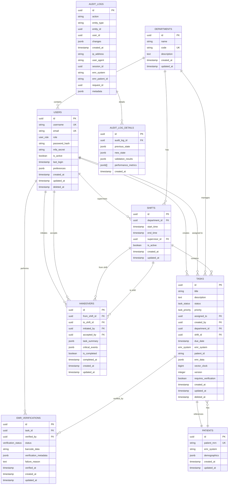

# Database Schema Documentation - EMR Integration Platform

**Version:** 1.0
**Last Updated:** 2025-11-15
**Maintained By:** Database Team
**Review Frequency:** Quarterly

---

## Table of Contents

1. [Schema Overview](#schema-overview)
2. [Entity Relationship Diagram](#entity-relationship-diagram)
3. [Core Tables](#core-tables)
4. [Audit Tables](#audit-tables)
5. [Indexes](#indexes)
6. [Constraints](#constraints)
7. [Migrations](#migrations)
8. [Data Types & Enums](#data-types--enums)
9. [Query Patterns](#query-patterns)
10. [Performance Optimization](#performance-optimization)

---

## Schema Overview

### Database Information

- **Database:** PostgreSQL 14+
- **Extensions:** uuid-ossp, pgcrypto, pg_cron, TimescaleDB
- **Schema Version:** 1.0.0
- **Total Tables:** 10 core tables + 2 audit tables
- **Partitioning:** Time-based partitioning for audit logs
- **Retention:** 7 years for HIPAA compliance

### Design Principles

1. **HIPAA Compliance:** Full audit logging, encryption at rest
2. **CRDT Support:** Vector clocks for offline sync
3. **Performance:** Optimized indexes, partitioned audit logs
4. **Scalability:** Horizontal partitioning ready
5. **Data Integrity:** Foreign key constraints, check constraints

---

## Entity Relationship Diagram



---

## Core Tables

### 1. users

Stores user accounts with role-based access control.

```sql
CREATE TABLE users (
  id                UUID PRIMARY KEY DEFAULT uuid_generate_v4(),
  username          VARCHAR(255) NOT NULL UNIQUE,
  email             VARCHAR(255) NOT NULL UNIQUE,
  role              user_role NOT NULL,
  password_hash     VARCHAR(255) NOT NULL,
  mfa_secret        VARCHAR(255),
  is_active         BOOLEAN NOT NULL DEFAULT true,
  last_login        TIMESTAMP,
  preferences       JSONB DEFAULT '{}',
  created_at        TIMESTAMP NOT NULL DEFAULT NOW(),
  updated_at        TIMESTAMP NOT NULL DEFAULT NOW(),
  deleted_at        TIMESTAMP
);
```

**Columns:**

| Column | Type | Nullable | Description |
|--------|------|----------|-------------|
| id | UUID | No | Primary key |
| username | VARCHAR(255) | No | Unique username |
| email | VARCHAR(255) | No | Unique email address |
| role | user_role | No | User role (NURSE, DOCTOR, ADMIN, SUPERVISOR) |
| password_hash | VARCHAR(255) | No | Bcrypt hashed password |
| mfa_secret | VARCHAR(255) | Yes | TOTP secret for MFA |
| is_active | BOOLEAN | No | Account active status |
| last_login | TIMESTAMP | Yes | Last login timestamp |
| preferences | JSONB | No | User preferences (theme, notifications) |
| created_at | TIMESTAMP | No | Record creation timestamp |
| updated_at | TIMESTAMP | No | Last update timestamp |
| deleted_at | TIMESTAMP | Yes | Soft delete timestamp |

**Indexes:**
- PRIMARY KEY on `id`
- UNIQUE INDEX on `username`
- UNIQUE INDEX on `email`
- INDEX on `role`
- INDEX on `is_active`

---

### 2. departments

Organizational units (e.g., Emergency, ICU, Pediatrics).

```sql
CREATE TABLE departments (
  id            UUID PRIMARY KEY DEFAULT uuid_generate_v4(),
  name          VARCHAR(255) NOT NULL,
  code          VARCHAR(50) NOT NULL UNIQUE,
  description   TEXT,
  created_at    TIMESTAMP NOT NULL DEFAULT NOW(),
  updated_at    TIMESTAMP NOT NULL DEFAULT NOW()
);
```

**Columns:**

| Column | Type | Nullable | Description |
|--------|------|----------|-------------|
| id | UUID | No | Primary key |
| name | VARCHAR(255) | No | Department name |
| code | VARCHAR(50) | No | Unique department code |
| description | TEXT | Yes | Department description |
| created_at | TIMESTAMP | No | Record creation timestamp |
| updated_at | TIMESTAMP | No | Last update timestamp |

---

### 3. shifts

Work shifts for staff scheduling.

```sql
CREATE TABLE shifts (
  id              UUID PRIMARY KEY DEFAULT uuid_generate_v4(),
  department_id   UUID NOT NULL REFERENCES departments(id),
  start_time      TIMESTAMP NOT NULL,
  end_time        TIMESTAMP NOT NULL,
  supervisor_id   UUID NOT NULL REFERENCES users(id),
  is_active       BOOLEAN NOT NULL DEFAULT true,
  created_at      TIMESTAMP NOT NULL DEFAULT NOW(),
  updated_at      TIMESTAMP NOT NULL DEFAULT NOW()
);
```

**Columns:**

| Column | Type | Nullable | Description |
|--------|------|----------|-------------|
| id | UUID | No | Primary key |
| department_id | UUID | No | Foreign key to departments |
| start_time | TIMESTAMP | No | Shift start time |
| end_time | TIMESTAMP | No | Shift end time |
| supervisor_id | UUID | No | Foreign key to users (supervisor) |
| is_active | BOOLEAN | No | Shift active status |

**Constraints:**
- CHECK: `end_time > start_time`

---

### 4. tasks

Core table for clinical task management.

```sql
CREATE TABLE tasks (
  id                      UUID PRIMARY KEY DEFAULT uuid_generate_v4(),
  title                   VARCHAR(500) NOT NULL,
  description             TEXT,
  status                  task_status NOT NULL DEFAULT 'TO_DO',
  priority                task_priority NOT NULL DEFAULT 'MEDIUM',
  assigned_to             UUID REFERENCES users(id),
  created_by              UUID NOT NULL REFERENCES users(id),
  department_id           UUID NOT NULL REFERENCES departments(id),
  shift_id                UUID REFERENCES shifts(id),
  due_date                TIMESTAMP,
  emr_system              emr_system NOT NULL,
  patient_id              VARCHAR(255) NOT NULL,
  emr_data                JSONB NOT NULL,
  vector_clock            BIGINT NOT NULL,
  version                 INTEGER NOT NULL DEFAULT 1,
  requires_verification   BOOLEAN NOT NULL DEFAULT false,
  created_at              TIMESTAMP NOT NULL DEFAULT NOW(),
  updated_at              TIMESTAMP NOT NULL DEFAULT NOW(),
  deleted_at              TIMESTAMP
);
```

**Columns:**

| Column | Type | Nullable | Description |
|--------|------|----------|-------------|
| id | UUID | No | Primary key |
| title | VARCHAR(500) | No | Task title |
| description | TEXT | Yes | Detailed description |
| status | task_status | No | Current status |
| priority | task_priority | No | Task priority |
| assigned_to | UUID | Yes | Assigned user ID |
| created_by | UUID | No | Creator user ID |
| department_id | UUID | No | Department ID |
| shift_id | UUID | Yes | Associated shift ID |
| due_date | TIMESTAMP | Yes | Task due date/time |
| emr_system | emr_system | No | EMR system type |
| patient_id | VARCHAR(255) | No | Patient identifier in EMR |
| emr_data | JSONB | No | EMR-specific data |
| vector_clock | BIGINT | No | CRDT vector clock |
| version | INTEGER | No | Optimistic locking version |
| requires_verification | BOOLEAN | No | Requires EMR verification |

**Composite Indexes:**
- `(department_id, status, due_date)`
- `(assigned_to, status)`
- `(patient_id, emr_system)`
- `(vector_clock)`

---

### 5. emr_verifications

EMR verification records for task validation.

```sql
CREATE TABLE emr_verifications (
  id                      UUID PRIMARY KEY DEFAULT uuid_generate_v4(),
  task_id                 UUID NOT NULL REFERENCES tasks(id),
  verified_by             UUID NOT NULL REFERENCES users(id),
  status                  verification_status NOT NULL,
  barcode_data            VARCHAR(500),
  verification_metadata   JSONB NOT NULL,
  failure_reason          TEXT,
  verified_at             TIMESTAMP NOT NULL,
  created_at              TIMESTAMP NOT NULL DEFAULT NOW(),
  updated_at              TIMESTAMP NOT NULL DEFAULT NOW()
);
```

**Columns:**

| Column | Type | Nullable | Description |
|--------|------|----------|-------------|
| id | UUID | No | Primary key |
| task_id | UUID | No | Associated task ID |
| verified_by | UUID | No | User who performed verification |
| status | verification_status | No | Verification result |
| barcode_data | VARCHAR(500) | Yes | Scanned barcode data |
| verification_metadata | JSONB | No | EMR response data |
| failure_reason | TEXT | Yes | Reason if verification failed |
| verified_at | TIMESTAMP | No | Verification timestamp |

---

### 6. handovers

Shift handover records.

```sql
CREATE TABLE handovers (
  id                UUID PRIMARY KEY DEFAULT uuid_generate_v4(),
  from_shift_id     UUID NOT NULL REFERENCES shifts(id),
  to_shift_id       UUID NOT NULL REFERENCES shifts(id),
  initiated_by      UUID NOT NULL REFERENCES users(id),
  accepted_by       UUID REFERENCES users(id),
  task_summary      JSONB NOT NULL,
  critical_events   JSONB NOT NULL,
  is_completed      BOOLEAN NOT NULL DEFAULT false,
  completed_at      TIMESTAMP,
  created_at        TIMESTAMP NOT NULL DEFAULT NOW(),
  updated_at        TIMESTAMP NOT NULL DEFAULT NOW()
);
```

**Columns:**

| Column | Type | Nullable | Description |
|--------|------|----------|-------------|
| id | UUID | No | Primary key |
| from_shift_id | UUID | No | Outgoing shift |
| to_shift_id | UUID | No | Incoming shift |
| initiated_by | UUID | No | User who initiated handover |
| accepted_by | UUID | Yes | User who accepted handover |
| task_summary | JSONB | No | Summary of tasks |
| critical_events | JSONB | No | Critical events to communicate |
| is_completed | BOOLEAN | No | Handover completion status |
| completed_at | TIMESTAMP | Yes | Completion timestamp |

---

### 7. patients

Patient records (PHI - Protected Health Information).

```sql
CREATE TABLE patients (
  id              UUID PRIMARY KEY DEFAULT uuid_generate_v4(),
  patient_mrn     VARCHAR(255) NOT NULL UNIQUE,
  emr_system      VARCHAR(50) NOT NULL,
  demographics    JSONB,
  created_at      TIMESTAMP NOT NULL DEFAULT NOW(),
  updated_at      TIMESTAMP NOT NULL DEFAULT NOW()
);
```

**Columns:**

| Column | Type | Nullable | Description |
|--------|------|----------|-------------|
| id | UUID | No | Primary key |
| patient_mrn | VARCHAR(255) | No | Medical Record Number (unique) |
| emr_system | VARCHAR(50) | No | Source EMR system |
| demographics | JSONB | Yes | Encrypted patient demographics |

**Security:**
- Data encrypted at rest using pgcrypto
- Row-level security policies enforced
- Audit logging for all access

---

## Audit Tables

### 8. audit_logs

Comprehensive audit trail for HIPAA compliance.

```sql
CREATE TABLE audit_logs (
  id                UUID PRIMARY KEY DEFAULT gen_random_uuid(),
  action            VARCHAR(50) NOT NULL,
  entity_type       VARCHAR(100) NOT NULL,
  entity_id         UUID NOT NULL,
  user_id           UUID NOT NULL,
  changes           JSONB NOT NULL,
  created_at        TIMESTAMP WITH TIME ZONE NOT NULL DEFAULT NOW(),
  ip_address        VARCHAR(45),
  user_agent        VARCHAR(500),
  session_id        UUID,
  emr_system        VARCHAR(50),
  emr_patient_id    VARCHAR(255),
  request_id        UUID NOT NULL,
  metadata          JSONB
) PARTITION BY RANGE (created_at);
```

**Partitioning Strategy:**
- Monthly partitions
- Automatic partition creation via trigger
- 7-year retention (2,555 days)

**Actions:**
- INSERT, UPDATE, DELETE
- LOGIN, LOGOUT
- EMR_VERIFY, EPIC_VERIFY, CERNER_VERIFY

---

### 9. audit_log_details

Extended audit information.

```sql
CREATE TABLE audit_log_details (
  id                    UUID PRIMARY KEY DEFAULT gen_random_uuid(),
  audit_log_id          UUID NOT NULL REFERENCES audit_logs(id) ON DELETE CASCADE,
  previous_state        JSONB,
  new_state             JSONB,
  validation_results    JSONB,
  performance_metrics   JSONB[],
  created_at            TIMESTAMP WITH TIME ZONE NOT NULL DEFAULT NOW()
);
```

---

## Indexes

### Performance Indexes

```sql
-- Users
CREATE INDEX idx_users_role ON users(role);
CREATE INDEX idx_users_is_active ON users(is_active);

-- Tasks (compound indexes for common queries)
CREATE INDEX idx_tasks_dept_status_due ON tasks(department_id, status, due_date);
CREATE INDEX idx_tasks_assigned_status ON tasks(assigned_to, status);
CREATE INDEX idx_tasks_patient_emr ON tasks(patient_id, emr_system);
CREATE INDEX idx_tasks_vector_clock ON tasks(vector_clock);
CREATE INDEX idx_tasks_created_at ON tasks(created_at);

-- Shifts
CREATE INDEX idx_shifts_department ON shifts(department_id);
CREATE INDEX idx_shifts_supervisor ON shifts(supervisor_id);
CREATE INDEX idx_shifts_active ON shifts(is_active);

-- EMR Verifications
CREATE INDEX idx_emr_verif_task ON emr_verifications(task_id);
CREATE INDEX idx_emr_verif_verified_by ON emr_verifications(verified_by);
CREATE INDEX idx_emr_verif_status ON emr_verifications(status);

-- Handovers
CREATE INDEX idx_handovers_from_shift ON handovers(from_shift_id);
CREATE INDEX idx_handovers_to_shift ON handovers(to_shift_id);
CREATE INDEX idx_handovers_completed ON handovers(is_completed);

-- Audit Logs (BRIN indexes for time-series data)
CREATE INDEX idx_audit_logs_created_at ON audit_logs USING BRIN(created_at);
CREATE INDEX idx_audit_logs_entity ON audit_logs(entity_type, entity_id);
CREATE INDEX idx_audit_logs_user ON audit_logs(user_id);
CREATE INDEX idx_audit_logs_emr_patient ON audit_logs(emr_system, emr_patient_id);
```

---

## Constraints

### Foreign Key Constraints

```sql
-- Tasks
ALTER TABLE tasks ADD CONSTRAINT fk_tasks_assigned_to
  FOREIGN KEY (assigned_to) REFERENCES users(id);
ALTER TABLE tasks ADD CONSTRAINT fk_tasks_created_by
  FOREIGN KEY (created_by) REFERENCES users(id);
ALTER TABLE tasks ADD CONSTRAINT fk_tasks_department
  FOREIGN KEY (department_id) REFERENCES departments(id);
ALTER TABLE tasks ADD CONSTRAINT fk_tasks_shift
  FOREIGN KEY (shift_id) REFERENCES shifts(id);

-- EMR Verifications
ALTER TABLE emr_verifications ADD CONSTRAINT fk_emr_verif_task
  FOREIGN KEY (task_id) REFERENCES tasks(id);
ALTER TABLE emr_verifications ADD CONSTRAINT fk_emr_verif_user
  FOREIGN KEY (verified_by) REFERENCES users(id);

-- Handovers
ALTER TABLE handovers ADD CONSTRAINT fk_handovers_from_shift
  FOREIGN KEY (from_shift_id) REFERENCES shifts(id);
ALTER TABLE handovers ADD CONSTRAINT fk_handovers_to_shift
  FOREIGN KEY (to_shift_id) REFERENCES shifts(id);
```

### Check Constraints

```sql
-- Shifts: end_time must be after start_time
ALTER TABLE shifts ADD CONSTRAINT chk_shift_times
  CHECK (end_time > start_time);

-- Tasks: vector_clock must be positive
ALTER TABLE tasks ADD CONSTRAINT chk_task_vector_clock
  CHECK (vector_clock > 0);

-- Tasks: version must be positive
ALTER TABLE tasks ADD CONSTRAINT chk_task_version
  CHECK (version > 0);
```

---

## Migrations

### Migration Files

Migrations are located in: `/src/backend/packages/shared/src/database/migrations/`

| Migration | File | Description |
|-----------|------|-------------|
| 001 | 001_initial_schema.ts | Core tables and enums |
| 002 | 002_add_audit_logs.ts | Audit logging with partitioning |
| 003 | 003_add_vector_clocks.ts | CRDT support |
| 004 | 004_add_patients_table.ts | Patient demographics |
| 005 | 005_add_timescaledb.ts | Time-series optimization |

### Running Migrations

```bash
# Run all pending migrations
npm run migrate:latest

# Check migration status
npm run migrate:status

# Rollback last migration
npm run migrate:rollback

# Create new migration
npm run migrate:make migration_name
```

---

## Data Types & Enums

### Custom Enum Types

```sql
-- Task Status
CREATE TYPE task_status AS ENUM (
  'TO_DO',
  'IN_PROGRESS',
  'COMPLETED',
  'BLOCKED',
  'PENDING_VERIFICATION'
);

-- Task Priority
CREATE TYPE task_priority AS ENUM (
  'LOW',
  'MEDIUM',
  'HIGH',
  'CRITICAL'
);

-- User Role
CREATE TYPE user_role AS ENUM (
  'NURSE',
  'DOCTOR',
  'ADMIN',
  'SUPERVISOR'
);

-- EMR System
CREATE TYPE emr_system AS ENUM (
  'EPIC',
  'CERNER',
  'GENERIC_FHIR'
);

-- Verification Status
CREATE TYPE verification_status AS ENUM (
  'PENDING',
  'VERIFIED',
  'FAILED',
  'EXPIRED'
);
```

---

## Query Patterns

### Common Queries

#### Get Active Tasks for User

```sql
SELECT
  t.*,
  u.username as assigned_user,
  d.name as department_name
FROM tasks t
LEFT JOIN users u ON t.assigned_to = u.id
JOIN departments d ON t.department_id = d.id
WHERE t.assigned_to = $1
  AND t.status IN ('TO_DO', 'IN_PROGRESS')
  AND t.deleted_at IS NULL
ORDER BY t.priority DESC, t.due_date ASC;
```

#### Get Tasks with EMR Verification Status

```sql
SELECT
  t.*,
  ev.status as verification_status,
  ev.verified_at,
  ev.verified_by
FROM tasks t
LEFT JOIN emr_verifications ev ON t.id = ev.task_id
WHERE t.department_id = $1
  AND t.requires_verification = true
ORDER BY t.created_at DESC;
```

#### Audit Report for Patient Access

```sql
SELECT
  al.action,
  al.created_at,
  u.username,
  al.ip_address,
  al.changes
FROM audit_logs al
JOIN users u ON al.user_id = u.id
WHERE al.emr_patient_id = $1
  AND al.created_at >= NOW() - INTERVAL '30 days'
ORDER BY al.created_at DESC;
```

---

## Performance Optimization

### Query Optimization Tips

1. **Use Indexes:** Ensure queries use appropriate indexes
2. **Limit Results:** Always use LIMIT for large result sets
3. **Avoid N+1:** Use JOINs instead of multiple queries
4. **Partition Tables:** Use time-based partitioning for audit logs
5. **Analyze Queries:** Use EXPLAIN ANALYZE to optimize slow queries

### Example EXPLAIN

```sql
EXPLAIN ANALYZE
SELECT * FROM tasks
WHERE department_id = '650e8400-e29b-41d4-a716-446655440001'
  AND status = 'TO_DO'
ORDER BY due_date;
```

---

## Change Log

| Version | Date | Changes | Author |
|---------|------|---------|--------|
| 1.0 | 2025-11-15 | Initial database schema documentation | Database Team |

---

## Related Documentation

- [Development Setup](./development-setup.md)
- [API Documentation](./api-documentation.md)
- [System Architecture](/home/user/emr-integration-platform--4v4v54/docs/phase5/SYSTEM_ARCHITECTURE.md)
- [HIPAA Compliance](/home/user/emr-integration-platform--4v4v54/docs/phase5/compliance/hipaa-compliance.md)

---

*For database questions, contact database-team@emrtask.com*
