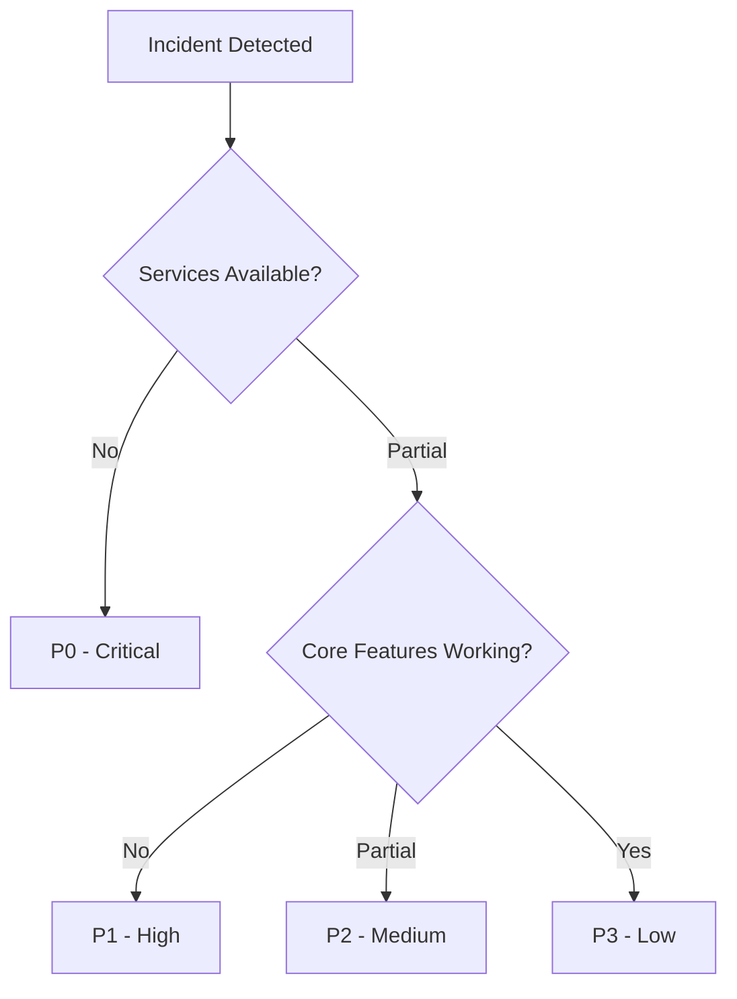
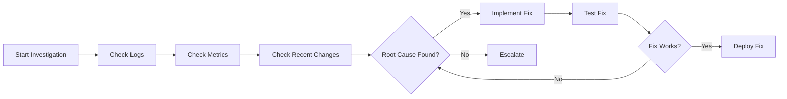
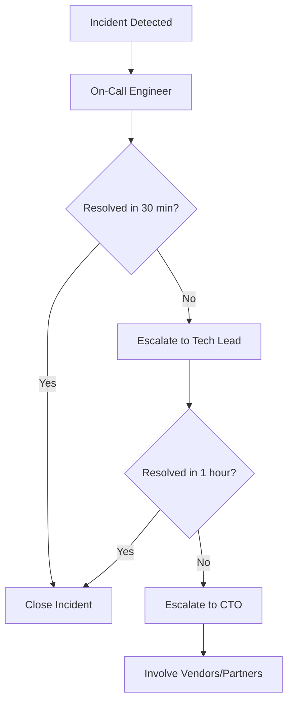

# Incident Response Runbook - EMR Integration Platform

**Version:** 1.0
**Last Updated:** 2025-11-11
**Maintained By:** SRE Team
**Review Frequency:** Monthly

---

## Table of Contents

1. [Overview](#overview)
2. [Incident Classification](#incident-classification)
3. [Response Procedures](#response-procedures)
4. [Critical Incidents](#critical-incidents)
5. [Communication Protocols](#communication-protocols)
6. [Post-Incident Review](#post-incident-review)

---

## Overview

This runbook defines procedures for responding to production incidents affecting the EMR Integration Platform.

### Incident Definition

An **incident** is any event that causes or may cause:
- Service disruption or degradation
- Data loss or corruption
- Security breach or vulnerability exploitation
- Compliance violation

### Response Objectives

1. **Restore service** as quickly as possible
2. **Communicate** status to stakeholders
3. **Document** incident details and resolution
4. **Learn** from the incident to prevent recurrence

---

## Incident Classification

### Severity Levels

| Severity | Impact | Response Time | Examples |
|----------|--------|---------------|----------|
| **P0 - Critical** | Complete service outage or data loss | < 15 minutes | - Database down<br>- All services unavailable<br>- Data breach<br>- PHI exposure |
| **P1 - High** | Major feature unavailable | < 1 hour | - EMR integration failing<br>- Task creation broken<br>- Authentication failures |
| **P2 - Medium** | Minor feature degraded | < 4 hours | - Slow response times<br>- Intermittent errors<br>- Non-critical feature broken |
| **P3 - Low** | Minimal impact | < 24 hours | - UI glitches<br>- Minor bugs<br>- Documentation issues |

### Impact Assessment



---

## Response Procedures

### 1. Detect & Alert

**Detection Methods:**
- Automated monitoring alerts (Prometheus, Datadog)
- User reports (support tickets, Slack)
- Health check failures
- Performance degradation

**Initial Actions:**
```bash
# Acknowledge alert in PagerDuty
pagerduty acknowledge <incident_id>

# Join incident Slack channel
# Channel automatically created: #incident-<timestamp>

# Check system status
kubectl get pods -n emrtask-prod
kubectl get nodes
kubectl top nodes
```

### 2. Assess & Classify

**Assessment Checklist:**
- [ ] Confirm incident is real (not false alarm)
- [ ] Determine severity (P0/P1/P2/P3)
- [ ] Identify affected services/features
- [ ] Estimate number of affected users
- [ ] Check for data loss risk
- [ ] Assess security implications

**Classification Commands:**
```bash
# Check service health
for svc in api-gateway task-service emr-service sync-service handover-service; do
  kubectl exec -n emrtask-prod deployment/$svc -- curl -f http://localhost:3000/health
done

# Check error rates
kubectl exec -n emrtask-prod deployment/api-gateway -- \
  curl localhost:9090/metrics | grep http_request_errors_total

# Check database
kubectl exec -n emrtask-prod deployment/task-service -- \
  psql -h postgres -U postgres -c "SELECT 1;"
```

### 3. Communicate

**Internal Communication:**
```
# Post to #incident-<timestamp> Slack channel
Incident: [P0] API Gateway Down
Status: Investigating
Impact: All API requests failing (100%)
Started: 2025-11-11 14:23 UTC
Responders: @engineer1, @engineer2
Updates: Every 15 minutes
```

**External Communication (for P0/P1):**
```
# Post to status page (status.emrtask.com)
Subject: Service Disruption
Message: We are currently experiencing issues with our API service.
Our team is actively working on a resolution.
Updates will be provided every 15 minutes.
```

### 4. Investigate

**Investigation Framework:**



**Investigation Commands:**
```bash
# Check recent deployments
helm history emrtask-prod -n emrtask-prod

# Check pod logs
kubectl logs -n emrtask-prod deployment/api-gateway --tail=500

# Check pod events
kubectl describe pod -n emrtask-prod <pod-name>

# Check resource usage
kubectl top pods -n emrtask-prod

# Check network connectivity
kubectl exec -n emrtask-prod deployment/api-gateway -- \
  curl task-service:3001/health

# Check database connections
kubectl exec -n emrtask-prod deployment/task-service -- \
  netstat -an | grep 5432
```

### 5. Resolve

**Resolution Strategies:**

**Quick Fixes:**
- Restart failed pods
- Scale up resources
- Rollback recent deployment
- Flush cache
- Restart services

**Database Issues:**
```bash
# Check PostgreSQL status
kubectl exec -n emrtask-prod statefulset/postgres -- \
  pg_isready

# Check active connections
kubectl exec -n emrtask-prod statefulset/postgres -- \
  psql -c "SELECT count(*) FROM pg_stat_activity;"

# Kill long-running queries
kubectl exec -n emrtask-prod statefulset/postgres -- \
  psql -c "SELECT pg_terminate_backend(pid) FROM pg_stat_activity WHERE state = 'active' AND query_start < now() - interval '5 minutes';"
```

**Service Restart:**
```bash
# Restart specific service
kubectl rollout restart deployment/api-gateway -n emrtask-prod

# Force pod deletion
kubectl delete pod <pod-name> -n emrtask-prod --force --grace-period=0
```

**Rollback:**
```bash
# Rollback to previous version
helm rollback emrtask-prod -n emrtask-prod

# Verify rollback
kubectl rollout status deployment/api-gateway -n emrtask-prod
```

### 6. Verify Resolution

**Verification Checklist:**
- [ ] All services healthy
- [ ] Error rates returned to normal
- [ ] Response times within SLA
- [ ] No data loss
- [ ] User reports confirmed resolved
- [ ] Monitoring alerts cleared

**Verification Commands:**
```bash
# Run smoke tests
/home/user/emr-integration-platform--4v4v54/scripts/smoke-tests.sh production

# Check metrics
curl https://api.emrtask.com/metrics | grep -E '(http_request_duration|error_rate)'

# Verify data integrity
kubectl exec -n emrtask-prod deployment/task-service -- \
  npm run verify:data
```

### 7. Close Incident

**Closure Checklist:**
- [ ] Service fully restored
- [ ] All stakeholders notified
- [ ] Incident timeline documented
- [ ] Root cause identified
- [ ] Jira ticket created for follow-up
- [ ] Post-incident review scheduled

**Close PagerDuty Incident:**
```bash
pagerduty resolve <incident_id> \
  --message "Service restored. RCA scheduled for <date>."
```

---

## Critical Incidents

### P0: Complete Service Outage

**Symptoms:**
- All API requests returning 5xx errors
- Health checks failing across all services
- User reports of complete unavailability

**Response:**

```bash
# 1. Immediate Actions (< 5 minutes)
# Check Kubernetes cluster
kubectl get nodes
kubectl get pods -A | grep -v Running

# Check control plane
kubectl get componentstatuses

# 2. Quick Diagnostics (< 10 minutes)
# Check recent changes
git log --oneline --since="1 hour ago"
helm history emrtask-prod -n emrtask-prod

# Check resource exhaustion
kubectl top nodes
kubectl describe nodes | grep -A 5 "Allocated resources"

# 3. Emergency Actions
# Option A: Rollback
helm rollback emrtask-prod -n emrtask-prod

# Option B: Restart all services
kubectl rollout restart deployment -n emrtask-prod

# Option C: Failover to DR region
./scripts/failover-to-dr.sh

# 4. Monitor recovery
watch kubectl get pods -n emrtask-prod
```

### P0: Database Failure

**Symptoms:**
- Database connection errors
- Read/write operations failing
- PostgreSQL pod not running

**Response:**

```bash
# 1. Check PostgreSQL status
kubectl get statefulset postgres -n emrtask-prod
kubectl logs statefulset/postgres -n emrtask-prod --tail=100

# 2. Check for corruption
kubectl exec -n emrtask-prod statefulset/postgres -- \
  pg_controldata /var/lib/postgresql/data

# 3. Attempt restart
kubectl delete pod postgres-0 -n emrtask-prod

# 4. If restart fails, promote replica
kubectl exec -n emrtask-prod statefulset/postgres-replica -- \
  pg_ctl promote

# 5. Update connection strings
kubectl edit configmap postgres-config -n emrtask-prod

# 6. If all else fails, restore from backup
./scripts/restore-database.sh latest
```

### P0: Security Breach

**Symptoms:**
- Unauthorized access detected
- Data exfiltration alerts
- Suspicious API activity
- PHI exposure

**Response:**

```bash
# 1. IMMEDIATE: Isolate affected systems
kubectl scale deployment --replicas=0 -n emrtask-prod <compromised-service>

# 2. Revoke credentials
vault token revoke -self
kubectl delete secret -n emrtask-prod <compromised-secret>

# 3. Enable enhanced logging
kubectl patch deployment -n emrtask-prod <service> \
  -p '{"spec":{"template":{"spec":{"containers":[{"name":"<container>","env":[{"name":"LOG_LEVEL","value":"debug"}]}]}}}}'

# 4. Collect forensics
kubectl logs -n emrtask-prod deployment/<service> --all-containers > /tmp/incident-logs.txt
kubectl get events -n emrtask-prod > /tmp/incident-events.txt

# 5. Notify security team
# Send to security@emrtask.com with:
# - Incident description
# - Affected systems
# - Forensic data
# - Current containment actions

# 6. Follow security incident runbook
# See: /docs/phase5/compliance/security-incident-response.md
```

### P1: EMR Integration Failure

**Symptoms:**
- EMR verification failing
- Cannot fetch patient data
- FHIR/HL7 errors

**Response:**

```bash
# 1. Check EMR Service health
kubectl logs -n emrtask-prod deployment/emr-service --tail=100

# 2. Check EMR connectivity
kubectl exec -n emrtask-prod deployment/emr-service -- \
  curl -v https://fhir.epic.com/interconnect-fhir-oauth/api/FHIR/R4/Patient

# 3. Check OAuth tokens
kubectl exec -n emrtask-prod deployment/emr-service -- \
  curl -X POST https://fhir.epic.com/interconnect-fhir-oauth/oauth2/token \
  -d "client_id=$CLIENT_ID" \
  -d "client_secret=$CLIENT_SECRET"

# 4. Restart EMR service
kubectl rollout restart deployment/emr-service -n emrtask-prod

# 5. Enable fallback mode (degraded functionality)
kubectl set env deployment/emr-service -n emrtask-prod \
  EMR_FALLBACK_MODE=true

# 6. Notify Epic/Cerner support
# Epic: 1-888-868-7246
# Cerner: 1-800-866-8992
```

---

## Communication Protocols

### Internal Communication

**Slack Channels:**
- `#incidents` - All incident notifications
- `#incident-<timestamp>` - Specific incident war room
- `#oncall` - On-call engineer coordination

**Update Frequency:**
| Severity | Update Interval | Channels |
|----------|----------------|----------|
| P0 | Every 15 minutes | All channels + status page |
| P1 | Every 30 minutes | #incidents + status page |
| P2 | Every 2 hours | #incidents only |
| P3 | Daily | #incidents only |

**Update Template:**
```
Incident Update - <Time>
Severity: <P0/P1/P2/P3>
Status: <Investigating/Identified/Fixing/Monitoring/Resolved>
Impact: <description>
Current Actions: <what we're doing>
Next Update: <time>
```

### External Communication

**Status Page Updates:**
- URL: https://status.emrtask.com
- Update within 15 minutes of P0/P1 detection
- Include: Impact, status, ETA (if known)

**Customer Notifications (P0 only):**
- Email to registered admins
- In-app banner notification
- SMS for critical alerts (if enabled)

### Escalation Path



**Escalation Contacts:**
| Role | Primary | Backup | Phone |
|------|---------|--------|-------|
| On-Call Engineer | Slack: @oncall | PagerDuty | Auto-dial |
| Tech Lead | John Doe | Jane Smith | +1-555-0100 |
| DevOps Lead | Bob Johnson | Alice Williams | +1-555-0101 |
| CTO | Michael Chen | - | +1-555-0001 |
| Security Lead | Sarah Davis | Tom Brown | +1-555-0200 |

---

## Post-Incident Review

### Timeline Documentation

**Required Information:**
1. Detection time
2. Classification time
3. First responder actions
4. Key investigation steps
5. Resolution actions
6. Verification time
7. Incident close time

### Root Cause Analysis (5 Whys)

**Example:**
```
Problem: API Gateway returned 502 errors

Why #1: Why did API Gateway return 502?
Answer: Task Service was not responding

Why #2: Why was Task Service not responding?
Answer: All pods were in CrashLoopBackOff

Why #3: Why were pods crashing?
Answer: Database connection pool exhausted

Why #4: Why was connection pool exhausted?
Answer: Long-running queries not timing out

Why #5: Why were queries not timing out?
Answer: Missing query timeout configuration

Root Cause: Query timeout not configured in Knex
Fix: Add query timeout: 30000ms to Knex config
```

### Post-Incident Review Meeting

**Agenda (1 hour):**
1. Incident timeline review (10 min)
2. What went well (15 min)
3. What could be improved (20 min)
4. Action items (10 min)
5. Documentation updates (5 min)

**Action Items Template:**
| Action | Owner | Due Date | Priority |
|--------|-------|----------|----------|
| Add query timeout to Knex config | @engineer1 | 2025-11-15 | P0 |
| Update monitoring to alert on connection pool | @engineer2 | 2025-11-18 | P1 |
| Document database best practices | @engineer3 | 2025-11-25 | P2 |

---

## Appendix

### Incident Report Template

```markdown
# Incident Report: <Title>

**Incident ID:** INC-<YYYYMMDD>-<number>
**Severity:** P0/P1/P2/P3
**Status:** Resolved
**Date:** YYYY-MM-DD

## Summary
<Brief description of the incident>

## Impact
- Services affected: <list>
- Users affected: <number/percentage>
- Duration: <time>
- Data loss: Yes/No

## Timeline
| Time (UTC) | Event |
|------------|-------|
| 14:23 | Incident detected |
| 14:25 | On-call engineer paged |
| 14:30 | Root cause identified |
| 14:45 | Fix deployed |
| 15:00 | Incident resolved |

## Root Cause
<Detailed explanation>

## Resolution
<What was done to resolve>

## Prevention
<Actions to prevent recurrence>

## Action Items
- [ ] <Action 1> (@owner, due date)
- [ ] <Action 2> (@owner, due date)

## Lessons Learned
<Key takeaways>
```

---

## Change Log

| Version | Date | Changes | Author |
|---------|------|---------|--------|
| 1.0 | 2025-11-11 | Initial runbook | SRE Team |

---

## Related Documentation

- [Deployment Procedures](./deployment-procedures.md)
- [Troubleshooting Guide](./troubleshooting-guide.md)
- [Monitoring & Alerts](./monitoring-alerts.md)
- [Security Incident Response](../compliance/security-policies.md)
