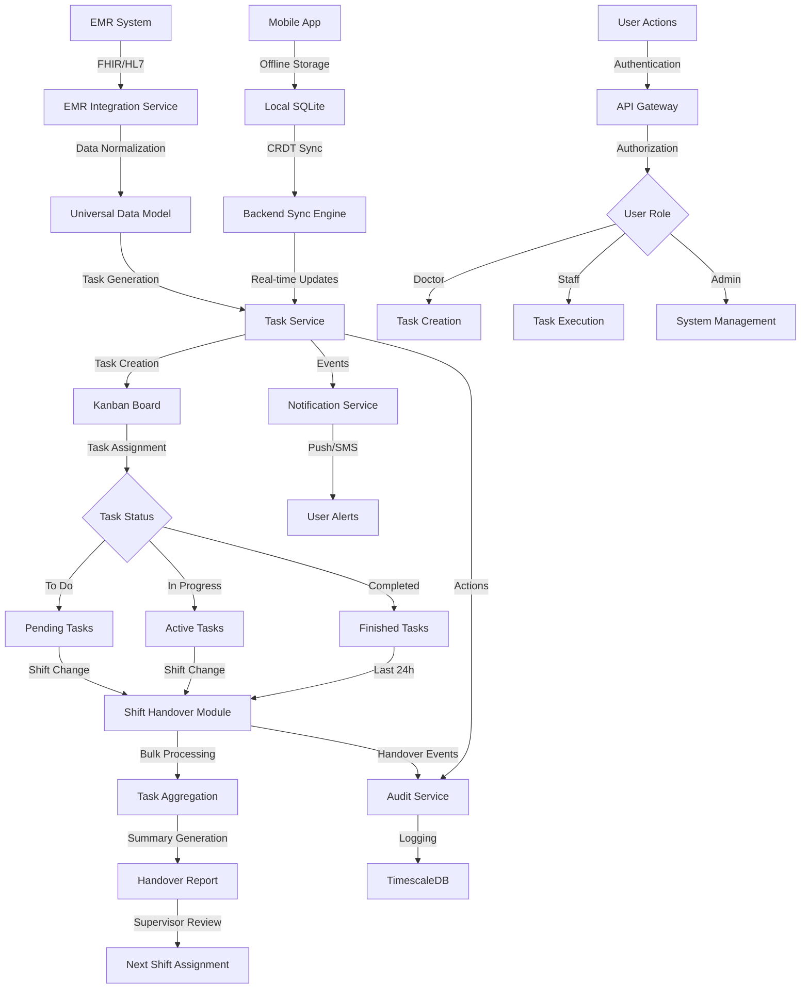
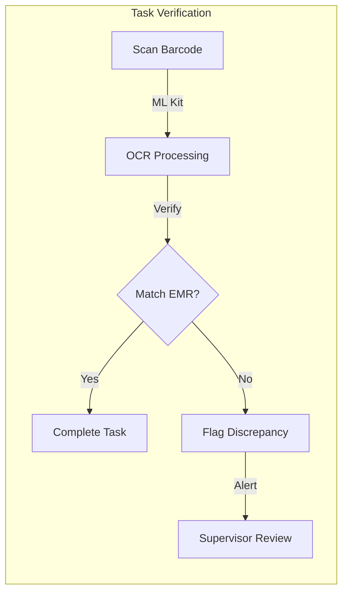
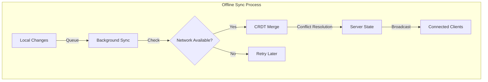
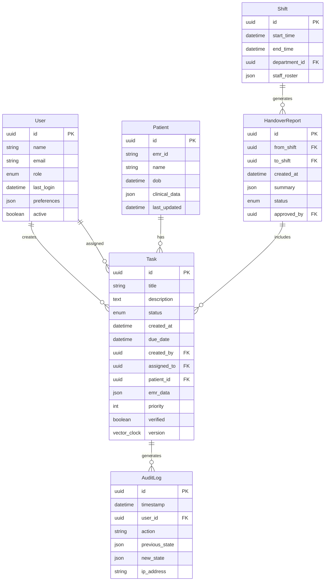
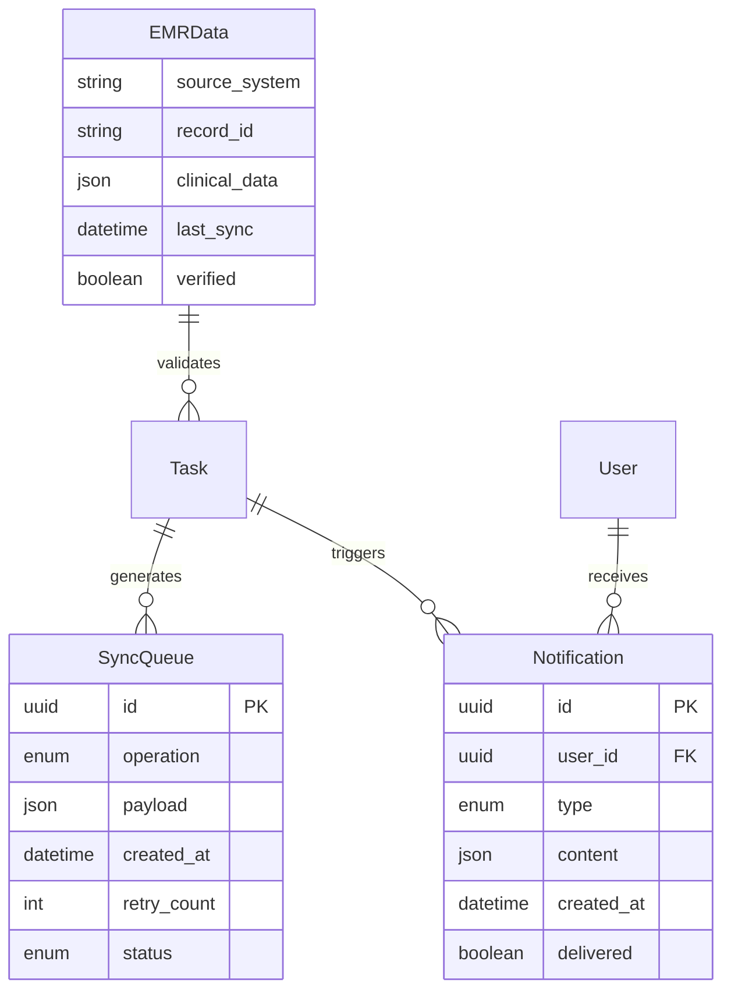
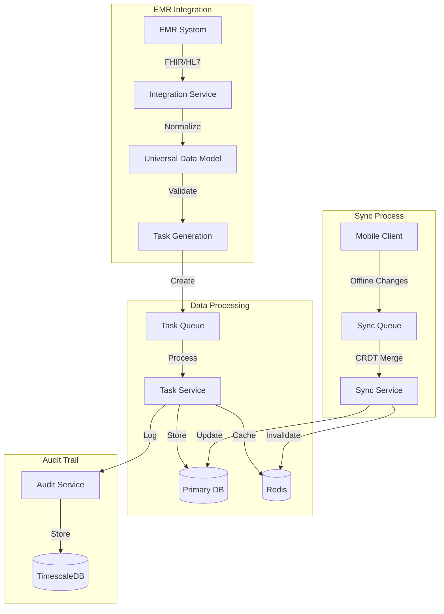
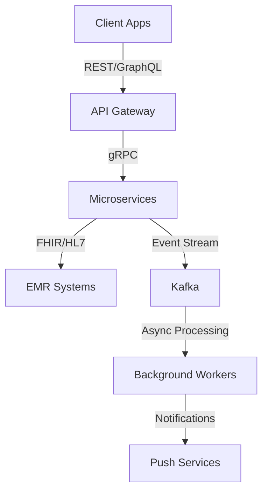
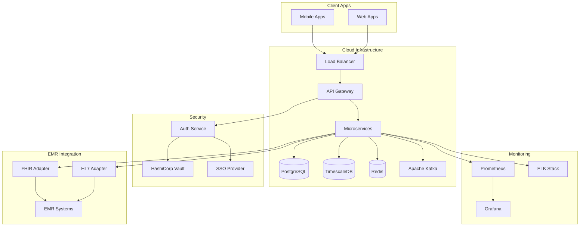

# Product Requirements Document (PRD)

# 1. INTRODUCTION

## 1.1 PURPOSE

This Software Requirements Specification (SRS) document provides a comprehensive description of the EMR-Integrated Task Management Platform. It serves as the primary reference for technical teams, stakeholders, and project managers involved in the development and implementation process. The document details functional and non-functional requirements, system architecture, and implementation priorities to ensure alignment across all development phases.

Target audience:
- Development teams implementing the system
- Quality assurance teams validating the requirements
- Project managers overseeing the implementation
- Healthcare administrators evaluating the solution
- Integration partners working with EMR systems

## 1.2 SCOPE

The EMR-Integrated Task Management Platform is a comprehensive healthcare workflow solution that bridges the gap between Electronic Medical Records (EMR) systems and daily task execution. The system encompasses:

Core Functionalities:
- EMR data integration using FHIR R4/HL7 v2 standards
- Trello-style Kanban board for task visualization and management
- Offline-first architecture with CRDT-based synchronization
- Automated shift handover system with bulk task management
- Real-time alerts and notifications
- Comprehensive audit logging and compliance tracking

Key Benefits:
- 40% reduction in task handover errors
- 100% EMR data verification accuracy
- Streamlined shift transitions
- Enhanced regulatory compliance
- Improved continuity of care

System Boundaries:
- Interfaces with major EMR systems (Epic, Cerner)
- Mobile applications (iOS, Android) using Flutter
- Web interface using Next.js
- Backend microservices architecture
- Cloud deployment on AWS/GCP with Kubernetes

Out of Scope:
- Direct EMR data modification
- Clinical decision support systems
- Patient-facing interfaces
- Billing and insurance processing
- Medical device integration

# 2. PRODUCT DESCRIPTION

## 2.1 PRODUCT PERSPECTIVE

The EMR-Integrated Task Management Platform operates as a middleware solution between existing EMR systems and healthcare staff workflows. The system:

- Integrates with EMR systems (Epic, Cerner) via FHIR R4/HL7 v2 standards
- Operates across web and mobile platforms using Flutter and Next.js
- Deploys on AWS/GCP infrastructure using Kubernetes
- Maintains HIPAA, GDPR, and LGPD compliance
- Functions in both online and offline modes with CRDT-based synchronization
- Interfaces with external notification systems (SMS, push notifications)

## 2.2 PRODUCT FUNCTIONS

Key functions include:

- EMR Data Integration
  - Real-time data extraction and verification
  - Universal Data Model (UDM) normalization
  - Automated task generation from EMR data

- Task Management
  - Kanban-style visual task board
  - Drag-and-drop task organization
  - Priority and dependency tracking
  - Barcode/OCR verification for task completion

- Shift Handover System
  - Automated task aggregation
  - Critical event summarization
  - Bulk task reassignment
  - Handover report generation

- Compliance and Audit
  - Immutable audit logging
  - Real-time compliance monitoring
  - Regulatory reporting capabilities

## 2.3 USER CHARACTERISTICS

Primary Users:

| User Type | Characteristics | Technical Expertise | Usage Pattern |
|-----------|----------------|---------------------|---------------|
| Non-Medical Staff | - Task executors - Mobile-first users - Shift-based workers | Basic to Intermediate | Daily, intensive use |
| Doctors | - Task creators - Occasional users - Time-constrained | Intermediate | Periodic, brief interactions |
| Administrators | - System overseers - Compliance focused - Analytics driven | Advanced | Regular monitoring |

## 2.4 CONSTRAINTS

Technical Constraints:
- Must maintain EMR system compatibility
- Offline functionality limited to 72 hours
- Mobile device storage limitations
- Network bandwidth in healthcare facilities

Regulatory Constraints:
- HIPAA compliance requirements
- GDPR data protection standards
- LGPD privacy regulations
- Healthcare industry security standards

Operational Constraints:
- 24/7 availability requirement
- Maximum 500ms response time
- 99.99% uptime SLA
- Zero data loss tolerance

## 2.5 ASSUMPTIONS AND DEPENDENCIES

Assumptions:
- EMR systems provide stable API access
- Healthcare facilities have minimum 4G connectivity
- Staff have access to modern mobile devices
- Facilities can provide necessary training time

Dependencies:
- EMR vendor API availability
- Cloud infrastructure services (AWS/GCP)
- Third-party services:
  - SMS gateway providers
  - Push notification services
  - Authentication providers (SSO)
- Mobile device OS compatibility (iOS 13+, Android 8+)

# 3. PROCESS FLOWCHART

# 4. FUNCTIONAL REQUIREMENTS

## 4.1 EMR INTEGRATION (F1)

### Description
Core integration service that connects with EMR systems to extract, verify, and normalize clinical data for task generation.

### Priority
P0 - Critical

### Requirements

| ID | Requirement | Acceptance Criteria |
|---|-------------|-------------------|
| F1.1 | FHIR R4/HL7 v2 Adapter Implementation | - Support Epic and Cerner integration - Handle real-time data streams - Maintain 99.99% uptime |
| F1.2 | Universal Data Model (UDM) | - Normalize data across EMR systems - Support all required clinical fields - Handle versioning |
| F1.3 | Data Verification | - Real-time validation of EMR data - Conflict detection - Automated reconciliation |
| F1.4 | Task Generation | - Automated task creation from EMR events - Template-based mapping - Priority assignment |

## 4.2 TASK MANAGEMENT (F2)

### Description
Kanban-style visual board for task organization, execution, and tracking.

### Priority
P0 - Critical

### Requirements

| ID | Requirement | Acceptance Criteria |
|---|-------------|-------------------|
| F2.1 | Kanban Board Interface | - Drag-and-drop functionality - Column customization - Real-time updates |
| F2.2 | Task Operations | - Create/Read/Update/Delete tasks - Bulk operations - Task dependencies |
| F2.3 | Task Verification | - Barcode/OCR scanning - Digital signatures - Photo/voice attachments |
| F2.4 | Priority Management | - Multiple priority levels - Visual indicators - Automated escalation |

## 4.3 OFFLINE FUNCTIONALITY (F3)

### Description
Offline-first architecture enabling continuous operation without network connectivity.

### Priority
P1 - High

### Requirements

| ID | Requirement | Acceptance Criteria |
|---|-------------|-------------------|
| F3.1 | Local Storage | - SQLite/Hive implementation - 72-hour data retention - Encryption at rest |
| F3.2 | CRDT Synchronization | - Conflict-free merging - Version vector tracking - Background sync |
| F3.3 | Queue Management | - Prioritized sync queue - Retry mechanisms - Error handling |
| F3.4 | State Management | - Consistent offline state - Progress tracking - Data integrity checks |

## 4.4 SHIFT HANDOVER (F4)

### Description
Automated system for managing task transitions between shifts.

### Priority
P0 - Critical

### Requirements

| ID | Requirement | Acceptance Criteria |
|---|-------------|-------------------|
| F4.1 | Task Aggregation | - Automatic collection of pending tasks - Critical event identification - Status summaries |
| F4.2 | Bulk Assignment | - Mass task reassignment - Role-based distribution - Workload balancing |
| F4.3 | Handover Reports | - PDF/CSV generation - Critical event highlighting - Supervisor review workflow |
| F4.4 | Continuity Tracking | - Handover verification - Gap analysis - Accountability tracking |

## 4.5 NOTIFICATIONS (F5)

### Description
Real-time alert system for task-related communications.

### Priority
P1 - High

### Requirements

| ID | Requirement | Acceptance Criteria |
|---|-------------|-------------------|
| F5.1 | Push Notifications | - Multi-platform support - Priority-based delivery - Delivery confirmation |
| F5.2 | SMS Integration | - Fallback messaging - Template management - Delivery tracking |
| F5.3 | In-App Alerts | - Real-time updates - Custom alert rules - Alert history |
| F5.4 | Alert Management | - Notification preferences - Do-not-disturb periods - Escalation rules |

## 4.6 AUDIT AND COMPLIANCE (F6)

### Description
Comprehensive logging and compliance monitoring system.

### Priority
P0 - Critical

### Requirements

| ID | Requirement | Acceptance Criteria |
|---|-------------|-------------------|
| F6.1 | Audit Logging | - Immutable audit trail - Action timestamps - User tracking |
| F6.2 | Compliance Monitoring | - HIPAA compliance - GDPR requirements - LGPD standards |
| F6.3 | Report Generation | - Custom report builder - Scheduled reports - Export options |
| F6.4 | Data Retention | - Configurable retention periods - Archival process - Data purging |

# 5. NON-FUNCTIONAL REQUIREMENTS

## 5.1 PERFORMANCE

| Category | Requirement | Target Metric |
|----------|-------------|---------------|
| Response Time | API endpoint latency | < 500ms for 95th percentile |
| | Task creation/update | < 1s for completion |
| | EMR data verification | < 2s for validation |
| Throughput | Concurrent users | 10,000 simultaneous users |
| | Task operations | 1,000 operations/second |
| | EMR integration | 500 requests/second |
| Resource Usage | Mobile app memory | < 100MB RAM |
| | Mobile storage | < 1GB local cache |
| | Backend CPU | < 70% utilization |

## 5.2 SAFETY

| Category | Requirement | Implementation |
|----------|-------------|----------------|
| Data Backup | Real-time replication | Multi-region database clusters |
| | Backup frequency | 15-minute incremental backups |
| | Retention period | 30 days of backups |
| Failure Recovery | Service redundancy | N+1 redundancy for all services |
| | Automatic failover | < 30 seconds failover time |
| | Data consistency | CRDT-based eventual consistency |
| Error Handling | Graceful degradation | Fallback to offline mode |
| | Error notification | Real-time alerts to admin |
| | Data validation | Pre/post condition checks |

## 5.3 SECURITY

| Category | Requirement | Implementation |
|----------|-------------|----------------|
| Authentication | Multi-factor auth | Biometric + SSO integration |
| | Session management | 30-minute token expiry |
| | Failed attempts | 5 attempts before lockout |
| Authorization | Role-based access | Granular RBAC permissions |
| | Least privilege | Default minimal access |
| | API security | OAuth2.0 + JWT tokens |
| Encryption | Data at rest | AES-256 encryption |
| | Data in transit | TLS 1.3 |
| | Key management | HashiCorp Vault |
| Audit | Access logging | All authentication attempts |
| | Data access | All read/write operations |
| | System changes | Configuration modifications |

## 5.4 QUALITY

| Category | Metric | Target |
|----------|--------|--------|
| Availability | Uptime | 99.99% |
| | Planned downtime | < 4 hours/year |
| | Recovery time | < 15 minutes |
| Maintainability | Code coverage | > 85% |
| | Documentation | Updated within 24h |
| | Technical debt | < 5% of codebase |
| Usability | Task completion | < 3 clicks |
| | Learning curve | < 2 hours training |
| | Error rate | < 0.1% |
| Scalability | Horizontal scaling | Linear up to 100 nodes |
| | Data growth | 500% yearly growth |
| | Load handling | 2x peak load capacity |
| Reliability | Mean time between failures | > 5000 hours |
| | Data durability | 99.999999999% |
| | Error recovery | 99.9% automatic |

## 5.5 COMPLIANCE

| Category | Requirement | Implementation |
|----------|-------------|----------------|
| Healthcare | HIPAA compliance | - PHI encryption - Access controls - Audit trails |
| | HITECH Act | - Breach notification - Security measures - Patient rights |
| Privacy | GDPR compliance | - Data minimization - Right to erasure - Privacy by design |
| | LGPD standards | - Consent management - Data processing records - Cross-border transfers |
| Technical | FHIR R4 | - Standard interfaces - Resource validation - Version compatibility |
| | HL7 v2 | - Message parsing - Acknowledgments - Error handling |
| Security | ISO 27001 | - Information security - Risk management - Control objectives |
| | SOC 2 Type II | - Security controls - Availability monitoring - Process integrity |

# 6. DATA REQUIREMENTS

## 6.1 DATA MODELS

### Core Entities

### Data Relationships

## 6.2 DATA STORAGE

### Primary Storage

| Data Type | Storage Solution | Retention Period | Backup Frequency |
|-----------|-----------------|------------------|------------------|
| Task Data | PostgreSQL | 7 years | Real-time replication |
| Audit Logs | TimescaleDB | 10 years | Hourly snapshots |
| EMR Cache | Redis | 24 hours | No backup required |
| User Data | PostgreSQL | Account lifetime | Daily backups |
| Media Files | S3/GCS | 7 years | Cross-region replication |
| Sync Queue | Apache Kafka | 72 hours | Log compaction |

### Local Storage

| Component | Storage Type | Size Limit | Sync Frequency |
|-----------|-------------|------------|----------------|
| Mobile Cache | SQLite | 1GB | Real-time |
| Offline Data | LiteFS | 2GB | Background sync |
| Media Cache | File System | 500MB | On connectivity |
| User Preferences | Secure Storage | 1MB | On change |

### Backup Strategy

- Real-time replication across multiple availability zones
- Cross-region backups every 6 hours
- Point-in-time recovery capability for last 30 days
- Monthly archive snapshots stored for 7 years
- Encrypted backups using AWS KMS/Google Cloud KMS

## 6.3 DATA PROCESSING

### Data Flow

### Security Measures

| Layer | Security Control | Implementation |
|-------|-----------------|----------------|
| Transport | TLS 1.3 | All API communications |
| Storage | AES-256 | Data at rest |
| Application | Field-level encryption | PHI/PII data |
| Access | Row-level security | PostgreSQL policies |
| Audit | Immutable logs | Write-once records |
| Keys | Key rotation | 90-day rotation cycle |

### Data Processing Rules

| Process | Rule | Implementation |
|---------|------|----------------|
| EMR Sync | Real-time validation | Compare against UDM |
| Task Creation | Data verification | Checksum validation |
| Offline Sync | CRDT merge | Version vector tracking |
| Audit Logging | Immutable records | Append-only logging |
| Data Purge | Retention policy | Automated archival |
| Encryption | Key management | HashiCorp Vault |

# 7. EXTERNAL INTERFACES

## 7.1 USER INTERFACES

### Mobile Application (Flutter)

| Interface | Description | Key Components |
|-----------|-------------|----------------|
| Task Board | Kanban-style board with drag-drop | - Column customization - Task cards with priority indicators - Swipe actions for quick updates |
| Task Details | Detailed task view with actions | - EMR data verification panel - Barcode/OCR scanner - Digital signature pad |
| Shift Handover | Summary and transfer interface | - Critical events timeline - Bulk task assignment - Handover report preview |
| Offline Mode | Status indicators and sync | - Network status indicator - Sync progress bar - Conflict resolution dialog |

### Web Application (Next.js)

| Interface | Description | Key Components |
|-----------|-------------|----------------|
| Dashboard | Administrative overview | - Real-time metrics - System health indicators - Compliance status |
| Task Management | Enhanced task board | - Multi-column layout - Advanced filtering - Batch operations |
| Reports | Analytics and exports | - Custom report builder - Export options (PDF/CSV) - Audit log viewer |
| Configuration | System settings | - EMR integration setup - User/Role management - Workflow configuration |

## 7.2 HARDWARE INTERFACES

### Mobile Devices

| Component | Specification | Integration |
|-----------|--------------|-------------|
| Camera | Min 8MP with autofocus | - ML Kit for barcode scanning - OCR processing - Photo documentation |
| Biometric | Fingerprint/FaceID | - Secure authentication - Task verification - Digital signatures |
| Storage | Min 2GB available | - SQLite database - Media cache - Offline data |
| Network | WiFi/4G LTE | - Background sync - Push notifications - Real-time updates |

### Medical Hardware

| Device Type | Interface | Protocol |
|------------|-----------|----------|
| Barcode Scanners | Bluetooth/USB | - HID protocol - Custom drivers - Error correction |
| Label Printers | Network/USB | - CUPS integration - ZPL/EPL support - Queue management |
| Signature Pads | USB/Bluetooth | - WinUSB protocol - Device discovery - Data encryption |

## 7.3 SOFTWARE INTERFACES

### EMR Systems

| System | Integration Method | Data Exchange |
|--------|-------------------|---------------|
| Epic | FHIR R4 API | - HL7 v2 messages - REST endpoints - WebSocket events |
| Cerner | Cerner Millennium | - CareAware API - HL7 interfaces - SMART on FHIR |
| Generic EMR | Universal Adapter | - Standard FHIR - Custom mappings - Batch processing |

### Third-Party Services

| Service | Purpose | Integration |
|---------|----------|------------|
| Auth0/Okta | Authentication | - OAuth2.0/OIDC - SAML 2.0 - JWT tokens |
| Twilio | Notifications | - SMS gateway - Voice alerts - Delivery tracking |
| AWS/GCP | Cloud Services | - S3/GCS storage - SQS/Pub/Sub - KMS encryption |

## 7.4 COMMUNICATION INTERFACES

### Network Protocols

| Protocol | Usage | Implementation |
|----------|--------|----------------|
| HTTPS | API Communication | - TLS 1.3 - Certificate pinning - HSTS enforcement |
| WebSocket | Real-time Updates | - Socket.io - Heartbeat monitoring - Auto-reconnection |
| gRPC | Service Communication | - Protocol buffers - Bi-directional streaming - Load balancing |

### Data Formats

| Format | Purpose | Validation |
|--------|---------|------------|
| JSON | API Payloads | - Schema validation - Version control - Compression |
| HL7 FHIR | Clinical Data | - Resource validation - Profile conformance - Extension handling |
| CRDT | Sync Protocol | - Version vectors - Merkle trees - Conflict resolution |

### Integration Patterns

# 8. APPENDICES

## 8.1 GLOSSARY

| Term | Definition |
|------|------------|
| Universal Data Model (UDM) | A standardized data schema that normalizes information across different EMR systems into a consistent format |
| Conflict-free Replicated Data Type (CRDT) | A data structure that can be replicated across multiple computers in a network, where replicas can be updated independently and concurrently without coordination between them |
| Vector Clock | A software algorithm that generates partial ordering of events and detects causality violations in a distributed system |
| Shift Handover | The process of transferring responsibility and task information from one shift to another in a healthcare setting |
| Task Verification | The process of validating task completion against EMR data using methods like barcode scanning or OCR |
| Immutable Audit Log | A permanent, unchangeable record of all system actions and events for compliance purposes |

## 8.2 ACRONYMS

| Acronym | Expansion |
|---------|-----------|
| EMR | Electronic Medical Record |
| FHIR | Fast Healthcare Interoperability Resources |
| CRDT | Conflict-free Replicated Data Type |
| HIPAA | Health Insurance Portability and Accountability Act |
| GDPR | General Data Protection Regulation |
| LGPD | Lei Geral de Proteção de Dados (Brazilian General Data Protection Law) |
| OCR | Optical Character Recognition |
| API | Application Programming Interface |
| JWT | JSON Web Token |
| RBAC | Role-Based Access Control |
| SLA | Service Level Agreement |
| UDM | Universal Data Model |
| TEE | Trusted Execution Environment |
| SE | Secure Element |
| SSO | Single Sign-On |

## 8.3 ADDITIONAL REFERENCES

### Standards and Specifications

| Standard | Reference |
|----------|-----------|
| FHIR R4 | `https://hl7.org/fhir/R4/` |
| HL7 v2 | `https://www.hl7.org/implement/standards/product_brief.cfm?product_id=185` |
| HIPAA Security Rule | `https://www.hhs.gov/hipaa/for-professionals/security/` |
| OAuth 2.0 | `https://oauth.net/2/` |
| OpenID Connect | `https://openid.net/connect/` |

### Technical Documentation

| Technology | Documentation |
|------------|--------------|
| Flutter | `https://flutter.dev/docs` |
| Next.js | `https://nextjs.org/docs` |
| PostgreSQL | `https://www.postgresql.org/docs/` |
| TimescaleDB | `https://docs.timescale.com/` |
| Kubernetes | `https://kubernetes.io/docs/` |
| Apache Kafka | `https://kafka.apache.org/documentation/` |

### Research Papers

| Title | Description | Reference |
|-------|-------------|-----------|
| "CRDTs: Making δ-CRDTs Delta-Based" | Technical foundation for offline-first architecture | ACM 2015 |
| "The Impact of Computerized Provider Order Entry Systems on Medical-Error Prevention" | Healthcare workflow optimization study | JAMIA 2014 |
| "Implementing Electronic Handoff" | Best practices for digital shift handovers | BMJ Quality & Safety |

## 8.4 COMPLIANCE CHECKLIST

| Requirement | Standard | Implementation Status |
|-------------|----------|---------------------|
| PHI Protection | HIPAA § 164.312 | Required |
| Data Portability | GDPR Article 20 | Required |
| Consent Management | LGPD Article 7 | Required |
| Access Controls | ISO 27001 A.9 | Required |
| Audit Logging | SOC 2 CC6.2 | Required |
| Data Encryption | HIPAA § 164.312(a)(2)(iv) | Required |

## 8.5 INFRASTRUCTURE DIAGRAM

