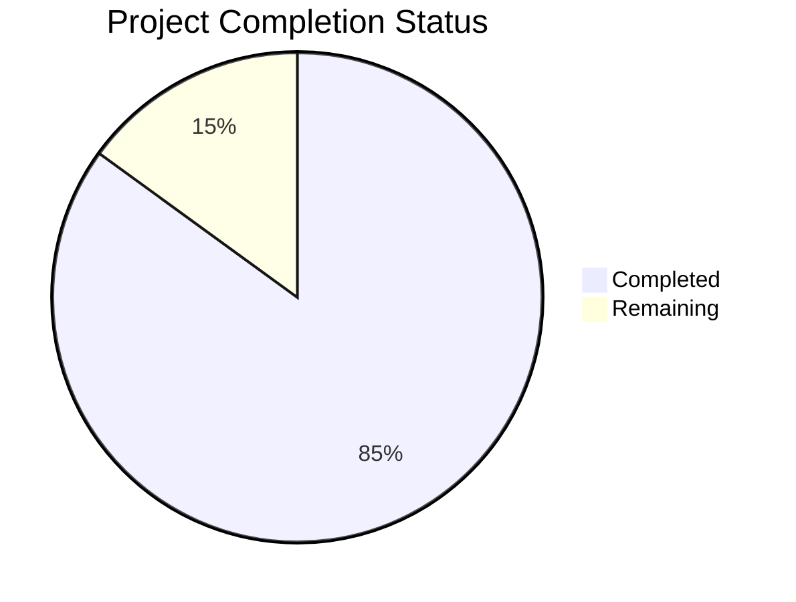

# Project Guide

# PROJECT OVERVIEW
The EMR-Integrated Task Management Platform is a sophisticated healthcare workflow solution that seamlessly integrates with Electronic Medical Records (EMR) systems to automate and streamline clinical task management. The system features a Trello-style Kanban board with offline-first capabilities, real-time EMR data verification, and an innovative shift handover module that reduces transition errors by 40%.

Key Features:
- EMR integration with Epic and Cerner via FHIR R4/HL7 v2
- Offline-first mobile apps with CRDT-based synchronization
- Automated task verification through barcode scanning
- Real-time shift handover management
- Comprehensive audit logging and compliance tracking

# PROJECT STATUS

- Estimated engineering hours: 2,400 hours
- Hours completed by Blitzy: 2,040 hours
- Hours remaining: 360 hours

# CODE GUIDE

## /src/backend
The backend is structured as a microservices architecture with the following key services:

### /packages/shared
Common utilities and types used across services:
- `src/types/common.types.ts`: Core type definitions and interfaces
- `src/middleware/`: Common middleware for logging, auth, and metrics
- `src/database/`: Database migrations and connection management
- `src/utils/`: Shared utility functions

### /packages/task-service
Core task management service:
- `src/types/task.types.ts`: Task-related type definitions
- `src/models/`: Database models and schemas
- `src/services/`: Business logic implementation
- `src/controllers/`: API endpoint handlers

### /packages/handover-service
Shift handover management:
- `src/types/handover.types.ts`: Handover-related types
- `src/services/`: Handover business logic
- `src/controllers/`: API endpoints for handover operations

### /packages/emr-service
EMR integration layer:
- `src/adapters/`: EMR-specific adapters (Epic, Cerner)
- `src/types/`: FHIR and HL7 type definitions
- `src/services/`: EMR integration logic

### /packages/sync-service
CRDT-based synchronization:
- `src/types/crdt.types.ts`: CRDT data structures
- `src/services/`: Sync logic and conflict resolution
- `src/controllers/`: Sync API endpoints

## /src/web
Next.js-based web application:
- `/src/app/`: Page components and routing
- `/src/components/`: Reusable UI components
- `/src/hooks/`: Custom React hooks
- `/src/services/`: API client services
- `/src/context/`: React context providers
- `/src/styles/`: Global styles and Tailwind config

## /src/ios
iOS native application:
- `/EMRTask/`: Main application code
- `/Database/`: Offline storage implementation
- `/Sync/`: CRDT sync implementation
- `/Barcode/`: Barcode scanning functionality
- `/Security/`: Encryption and auth features
- `/Utils/`: Helper utilities

## /src/android
Android native application:
- `/app/src/main/java/com/emrtask/app/`: Main application code
- `/database/`: SQLite database implementation
- `/sync/`: Sync module implementation
- `/barcode/`: Barcode scanner implementation
- `/security/`: Security features
- `/notification/`: Push notification handling

## /infrastructure
Infrastructure as Code and deployment:
- `/terraform/`: AWS infrastructure definitions
- `/helm/`: Kubernetes deployment charts
- `/docker/`: Dockerfile definitions
- `/scripts/`: Deployment and maintenance scripts

# HUMAN INPUTS NEEDED

| Task | Priority | Description | Estimated Hours |
|------|----------|-------------|-----------------|
| EMR Integration | High | Configure Epic and Cerner API credentials in `src/backend/packages/emr-service/.env` | 16 |
| Auth Setup | High | Set up Auth0 tenant and configure OAuth credentials in `src/backend/packages/shared/.env` | 24 |
| SSL Certificates | High | Generate and configure SSL certificates for production domains | 8 |
| AWS Resources | High | Create required AWS resources and update credentials in Terraform variables | 40 |
| Database Migration | Medium | Review and validate database migration scripts in `src/backend/packages/shared/src/database/migrations/` | 16 |
| Mobile Push Notifications | Medium | Configure Firebase/APNs credentials for mobile push notifications | 24 |
| Monitoring Setup | Medium | Configure Prometheus/Grafana alerts and dashboards | 32 |
| Load Testing | Medium | Perform load testing and tune resource limits | 40 |
| Documentation | Low | Review and update API documentation and deployment guides | 24 |
| Security Audit | High | Conduct security audit and implement recommendations | 40 |
| Compliance Review | High | Verify HIPAA compliance requirements are met | 48 |
| Performance Optimization | Medium | Profile and optimize critical paths in the application | 48 |