# Technical Specifications

# 1. INTRODUCTION

## 1.1 EXECUTIVE SUMMARY

The EMR-Integrated Task Management Platform addresses critical workflow inefficiencies in healthcare environments by bridging the gap between Electronic Medical Records (EMR) systems and daily task execution. The platform automates the interpretation of EMR data into actionable tasks, provides real-time verification, and introduces an innovative shift handover module that reduces transition errors by 40% while maintaining 100% data accuracy.

This solution serves three primary user groups: non-medical staff (nurses and aides) who execute tasks, doctors who create and validate tasks, and administrators who oversee compliance and workflow efficiency. By implementing a Trello-style Kanban board with offline-first capabilities and EMR integration, the platform significantly reduces manual interpretation errors, improves task tracking, and ensures regulatory compliance.

## 1.2 SYSTEM OVERVIEW

### Project Context

| Aspect | Description |
|--------|-------------|
| Market Position | First-to-market EMR-integrated task management solution with offline-first architecture |
| Current Limitations | Manual EMR interpretation, fragmented communication, error-prone shift handovers |
| Enterprise Integration | Seamless integration with major EMR systems (Epic, Cerner) via FHIR R4/HL7 v2 standards |

### High-Level Description

The system implements a microservices architecture deployed on Kubernetes, featuring:

- EMR integration layer using FHIR R4/HL7 v2 adapters
- Universal Data Model (UDM) for cross-EMR compatibility
- Flutter-based mobile applications with offline-first capabilities
- Next.js web interface for administrative functions
- CRDT-based synchronization for conflict-free updates
- Automated shift handover module with bulk task management

### Success Criteria

| Metric | Target |
|--------|--------|
| Task Handover Accuracy | 40% error reduction |
| EMR Data Verification | 100% accuracy |
| System Availability | 99.99% uptime |
| Sync Resolution Time | < 500ms for 95th percentile |
| User Adoption Rate | 90% within first month |

## 1.3 SCOPE

### In-Scope Elements

| Category | Components |
|----------|------------|
| Core Features | - EMR data integration and verification<br>- Kanban-style task management<br>- Offline-first mobile applications<br>- Automated shift handover system<br>- Real-time notifications<br>- Comprehensive audit logging |
| User Groups | - Non-medical staff (nurses, aides)<br>- Doctors and clinical staff<br>- Administrative personnel |
| Technical Scope | - Mobile apps (iOS, Android)<br>- Web interface<br>- Backend microservices<br>- EMR integration adapters<br>- Analytics dashboard |
| Data Domains | - Clinical tasks and workflows<br>- EMR-verified data<br>- Audit trails and compliance logs<br>- User activity and preferences |

### Out-of-Scope Elements

| Category | Exclusions |
|----------|------------|
| Features | - Direct EMR data modification<br>- Clinical decision support<br>- Billing/insurance processing<br>- Patient-facing interfaces |
| Technical | - Legacy system migration<br>- Custom hardware integration<br>- Medical device connectivity<br>- Third-party app marketplace |
| Implementation | - Historical data migration<br>- Custom EMR adapters beyond Epic/Cerner<br>- Specialized workflow templates<br>- Integration with non-healthcare systems |

# 2. SYSTEM ARCHITECTURE

## 2.1 HIGH-LEVEL ARCHITECTURE

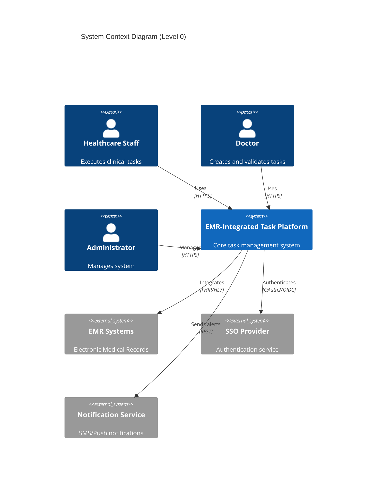

## 2.2 CONTAINER ARCHITECTURE

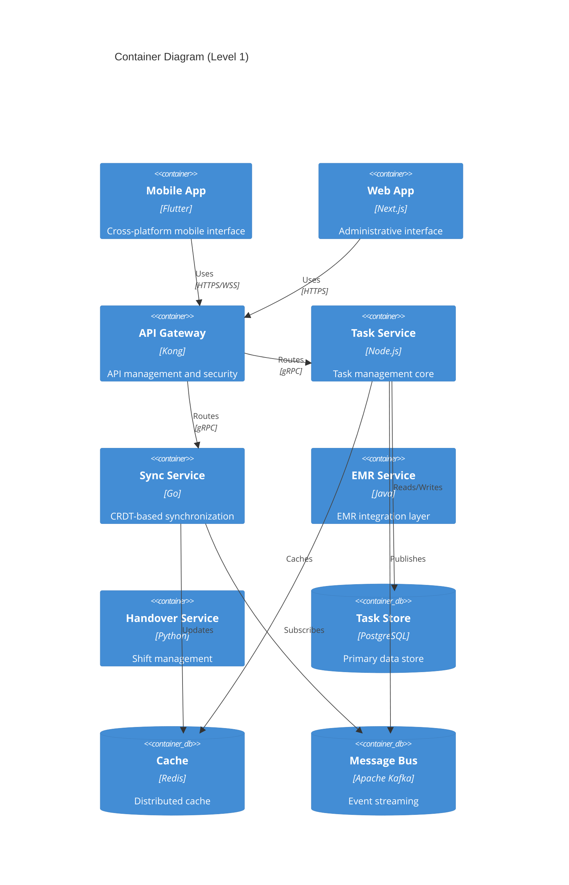

## 2.3 COMPONENT DETAILS

### Core Components

| Component | Purpose | Technology Stack | Scaling Strategy |
|-----------|---------|-----------------|------------------|
| API Gateway | Request routing, auth | Kong, OAuth2.0 | Horizontal, L7 LB |
| Task Service | Task management | Node.js, Express | Horizontal, stateless |
| Sync Service | Offline sync | Go, CRDTs | Horizontal per region |
| EMR Service | Integration layer | Java Spring | Vertical, cached |
| Handover Service | Shift management | Python FastAPI | Horizontal, event-driven |

### Data Stores

| Store | Purpose | Technology | Scaling Approach |
|-------|---------|------------|-----------------|
| Primary DB | Task data | PostgreSQL 14 | Primary-replica |
| Cache | Hot data | Redis Cluster | Sharded |
| Message Bus | Events | Kafka | Partitioned topics |
| Time Series | Metrics | TimescaleDB | Automated partitioning |

## 2.4 TECHNICAL DECISIONS

### Architecture Patterns

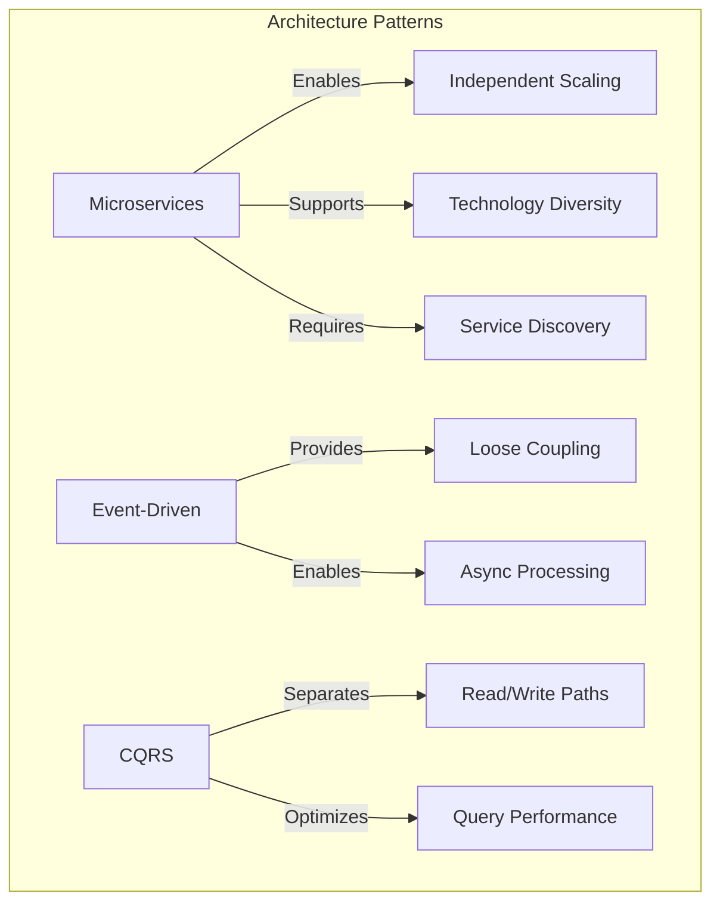

### Communication Patterns

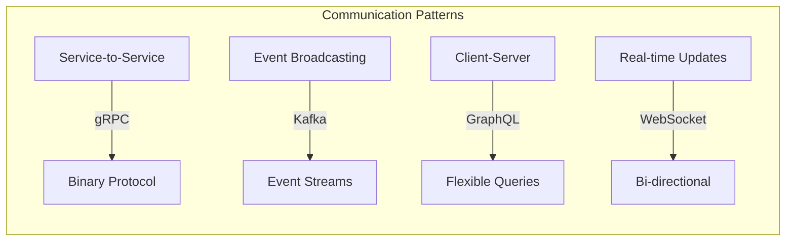

## 2.5 CROSS-CUTTING CONCERNS

### Observability Stack

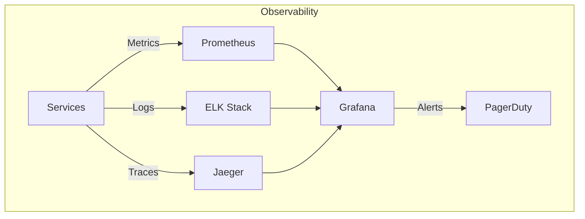

### Security Architecture

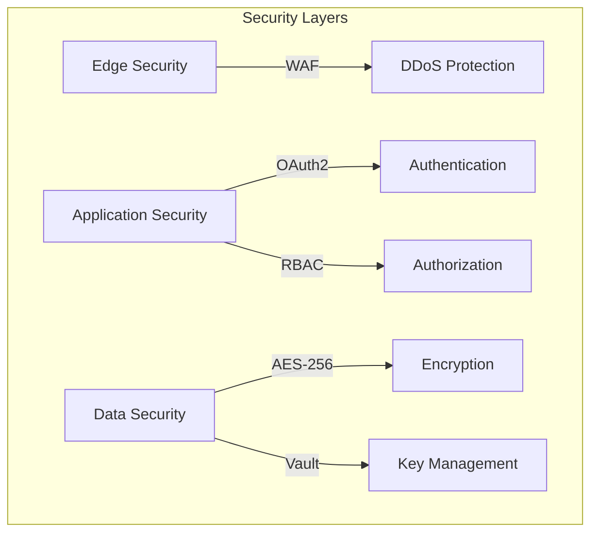

## 2.6 DEPLOYMENT ARCHITECTURE

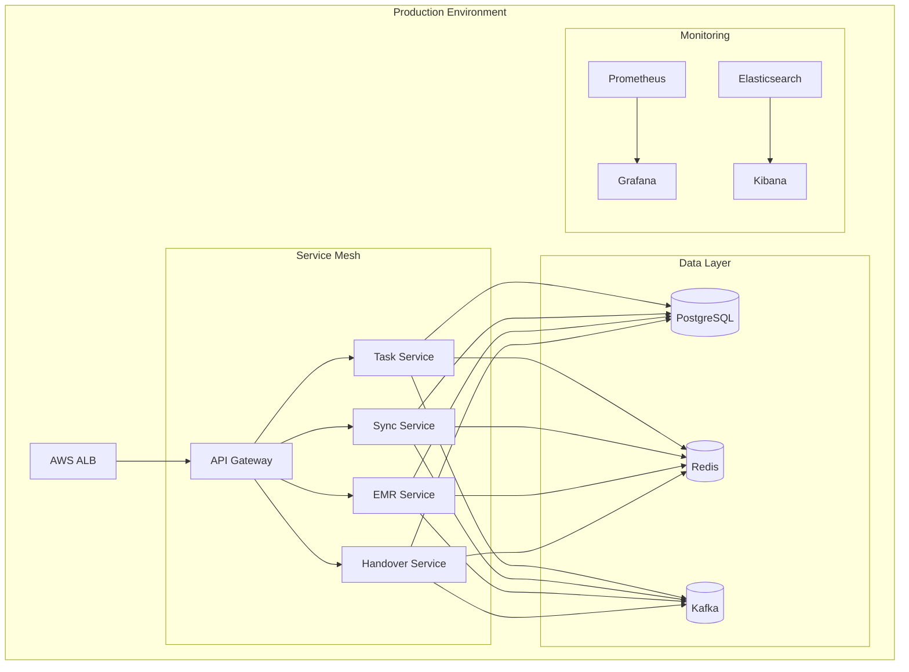

## 2.7 DISASTER RECOVERY

| Component | Recovery Strategy | RPO | RTO |
|-----------|------------------|-----|-----|
| Task Data | Multi-AZ replication | < 1s | < 30s |
| Cache | Cross-region Redis | < 5s | < 15s |
| Message Bus | Mirrored brokers | < 1s | < 45s |
| File Storage | S3 cross-region | < 1s | < 60s |

### Recovery Flow

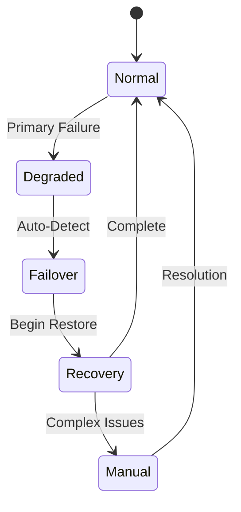

# 3. SYSTEM COMPONENTS ARCHITECTURE

## 3.1 USER INTERFACE DESIGN

### Design System Specifications

| Component | Specification | Implementation Details |
|-----------|--------------|----------------------|
| Typography | System Font Stack | - Primary: SF Pro (iOS), Roboto (Android)<br>- Fallback: -apple-system, system-ui |
| Color Scheme | Healthcare-Optimized | - Primary: #0066CC (Accessible Blue)<br>- Critical: #D64045 (Alert Red)<br>- Success: #2D8B75 (Medical Green) |
| Spacing System | 8px Base Grid | - Increments: 8px, 16px, 24px, 32px, 48px<br>- Component padding: 16px standard |
| Iconography | Custom Medical Set | - SVG-based system<br>- Variable stroke width<br>- WCAG 2.1 AA compliant |
| Dark Mode | System Preference | - Auto-switching based on OS<br>- Contrast ratio ≥ 4.5:1 |
| Accessibility | WCAG 2.1 AA | - Screen reader support<br>- Keyboard navigation<br>- Touch targets ≥ 44px |

### Mobile Interface Layout

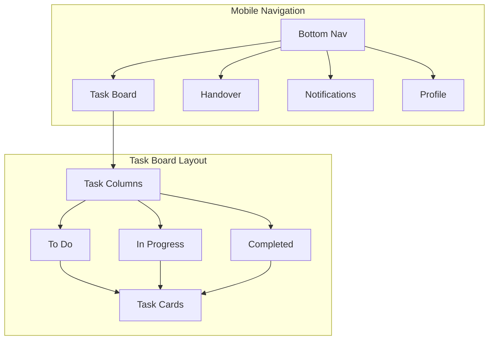

### Web Dashboard Layout

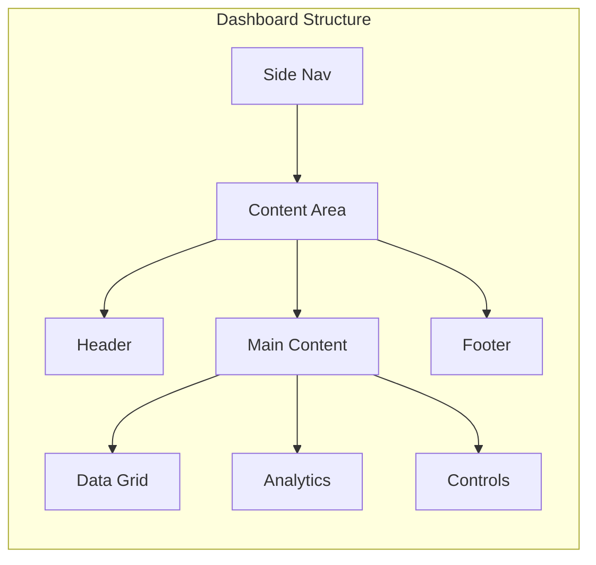

### Critical User Flows

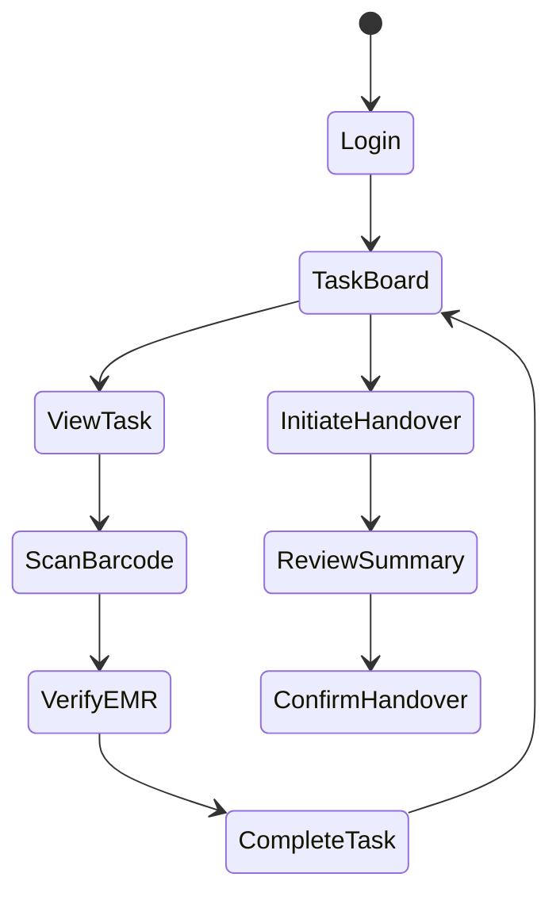

## 3.2 DATABASE DESIGN

### Schema Design

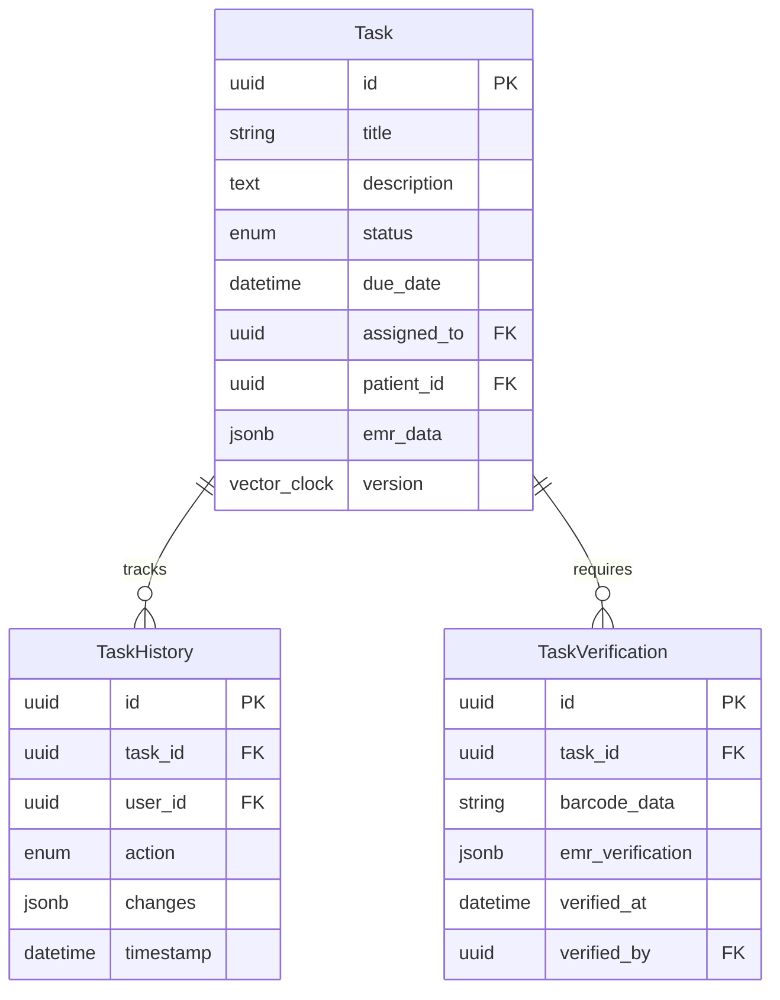

### Data Management Strategy

| Aspect | Strategy | Implementation |
|--------|----------|----------------|
| Partitioning | Time-based | - Monthly partitions for tasks<br>- Quarterly partitions for history |
| Indexing | Selective | - B-tree for IDs and foreign keys<br>- GiST for JSON search<br>- BRIN for timestamps |
| Archival | Policy-based | - 30-day active retention<br>- 1-year in warm storage<br>- 7-year cold storage |
| Encryption | Field-level | - AES-256 for PHI<br>- TDE for at-rest<br>- Client-side for sensitive fields |

### Performance Optimization

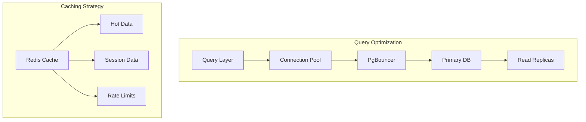

## 3.3 API DESIGN

### API Architecture

| Component | Specification | Details |
|-----------|--------------|----------|
| Protocol | REST & GraphQL | - REST for CRUD<br>- GraphQL for complex queries |
| Authentication | OAuth 2.0 + JWT | - Token-based auth<br>- 1-hour access tokens<br>- 30-day refresh tokens |
| Rate Limiting | Token Bucket | - 1000 req/min per user<br>- 5000 req/min per service |
| Versioning | URI-based | - /v1/, /v2/ prefixes<br>- Deprecation headers |

### API Flow

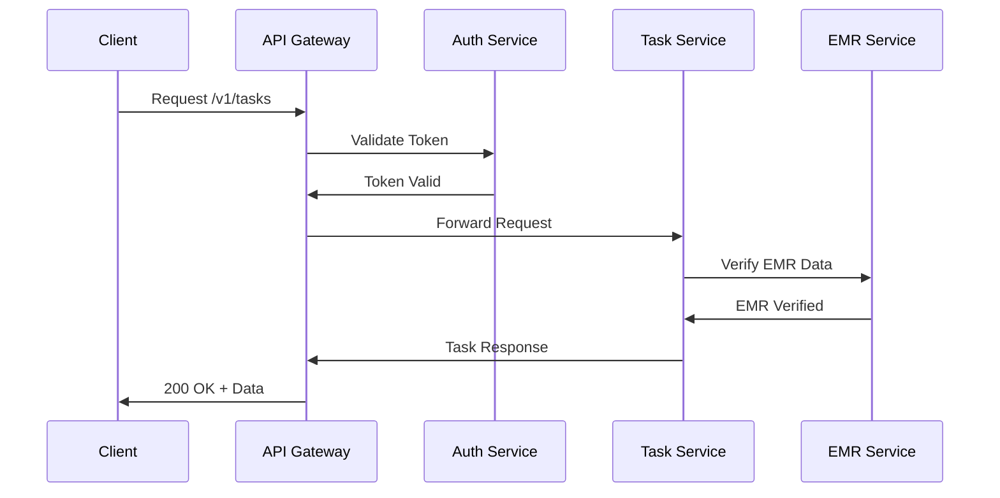

### Integration Patterns

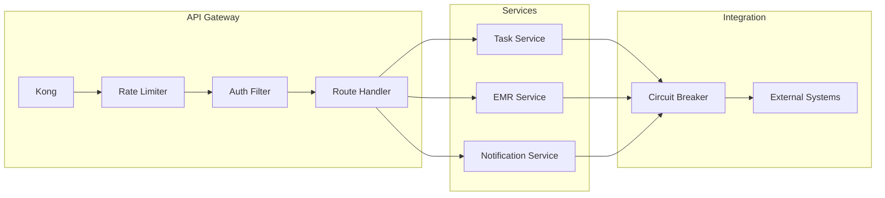

### Error Handling

| Status Code | Scenario | Response Format |
|-------------|----------|-----------------|
| 400 | Invalid Request | `{"error": "validation_failed", "details": [...]}` |
| 401 | Unauthorized | `{"error": "invalid_token", "message": "..."}` |
| 403 | Forbidden | `{"error": "insufficient_permissions", "required": [...]}` |
| 404 | Not Found | `{"error": "resource_not_found", "resource": "..."}` |
| 429 | Rate Limited | `{"error": "rate_limit_exceeded", "retry_after": 30}` |
| 500 | Server Error | `{"error": "internal_error", "trace_id": "..."}` |

# 4. TECHNOLOGY STACK

## 4.1 PROGRAMMING LANGUAGES

| Platform/Component | Language | Version | Justification |
|-------------------|----------|---------|---------------|
| Mobile Apps | Dart | 3.0+ | - Flutter cross-platform support<br>- Strong typing for healthcare data<br>- Efficient memory management |
| Web Frontend | TypeScript | 5.0+ | - Type safety for EMR data handling<br>- Enhanced IDE support<br>- Better maintainability |
| Task Service | Node.js | 18 LTS | - Async I/O for real-time updates<br>- Large ecosystem for healthcare libraries<br>- Efficient JSON handling |
| Sync Service | Go | 1.20+ | - High-performance CRDT operations<br>- Excellent concurrency support<br>- Low memory footprint |
| EMR Service | Java | 17 LTS | - Enterprise EMR system compatibility<br>- Robust FHIR/HL7 libraries<br>- Strong type system |
| Handover Service | Python | 3.11+ | - Rich data processing libraries<br>- ML capabilities for task analysis<br>- Clear syntax for business logic |

## 4.2 FRAMEWORKS & LIBRARIES

### Core Frameworks

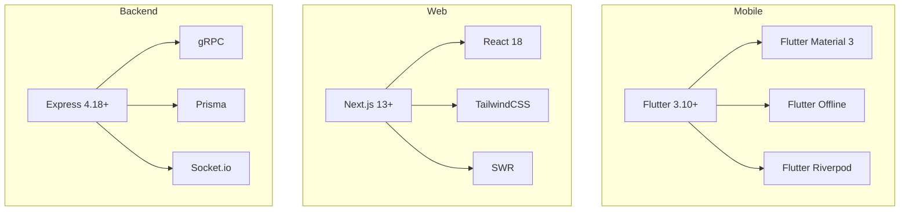

### Framework Selection Criteria

| Component | Framework | Version | Justification |
|-----------|-----------|---------|---------------|
| Mobile | Flutter | 3.10+ | - Cross-platform consistency<br>- Native performance<br>- Offline-first capabilities |
| Web | Next.js | 13+ | - Server-side rendering<br>- API routes<br>- Static optimization |
| Task Service | Express | 4.18+ | - Mature ecosystem<br>- Middleware support<br>- Easy scaling |
| Sync Service | Go Fiber | 2.4+ | - Fast HTTP routing<br>- Low latency<br>- WebSocket support |
| EMR Service | Spring Boot | 3.1+ | - FHIR server integration<br>- Enterprise security<br>- Transaction management |
| Handover Service | FastAPI | 0.100+ | - Async support<br>- OpenAPI documentation<br>- Type validation |

## 4.3 DATABASES & STORAGE

### Database Architecture

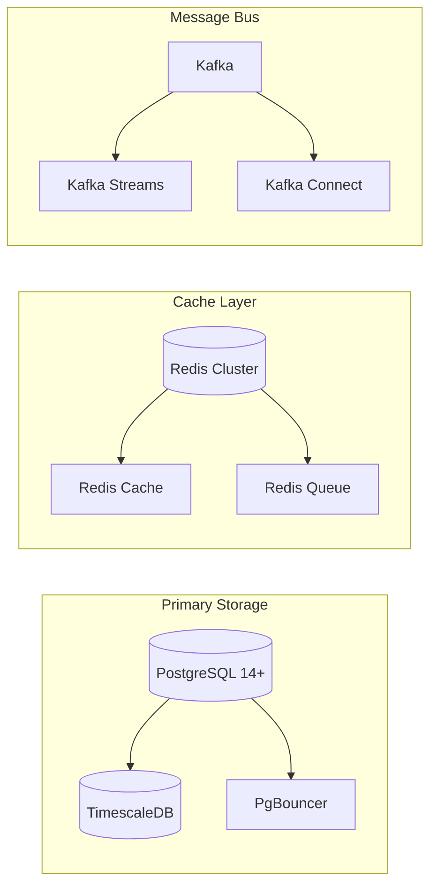

### Storage Solutions

| Type | Technology | Purpose | Scaling Strategy |
|------|------------|---------|------------------|
| Primary DB | PostgreSQL 14+ | Task and user data | Primary-replica with read replicas |
| Time Series | TimescaleDB | Audit logs and metrics | Automated partitioning |
| Cache | Redis Cluster 7+ | Session and hot data | Sharded clusters |
| Message Queue | Kafka 3.4+ | Event streaming | Multi-broker clusters |
| Object Storage | S3/MinIO | Media and documents | Cross-region replication |
| Local Storage | SQLite 3.40+ | Mobile offline data | Per-device with sync |

## 4.4 THIRD-PARTY SERVICES

### Service Integration Architecture

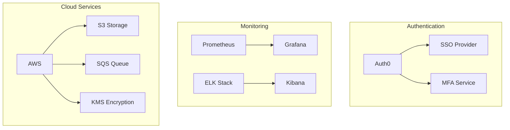

### Service Selection

| Category | Service | Purpose | Integration Method |
|----------|---------|---------|-------------------|
| Authentication | Auth0 | Identity management | OAuth2.0/OIDC |
| EMR Integration | Epic/Cerner | Clinical data | FHIR R4/HL7 v2 |
| Monitoring | Datadog | System monitoring | Agent-based |
| Logging | ELK Stack | Log aggregation | Filebeat/Logstash |
| Cloud Platform | AWS | Infrastructure | Terraform |
| CDN | CloudFront | Content delivery | Edge locations |

## 4.5 DEVELOPMENT & DEPLOYMENT

### Development Pipeline

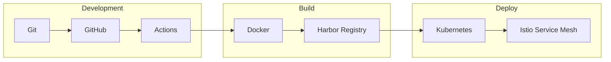

### Tools & Infrastructure

| Category | Tool | Version | Purpose |
|----------|------|---------|----------|
| Version Control | Git | 2.40+ | Source control |
| CI/CD | GitHub Actions | N/A | Automation pipeline |
| Containers | Docker | 24+ | Application packaging |
| Orchestration | Kubernetes | 1.26+ | Container orchestration |
| Service Mesh | Istio | 1.18+ | Traffic management |
| IaC | Terraform | 1.5+ | Infrastructure provisioning |
| Secrets | Vault | 1.13+ | Secrets management |
| Monitoring | Prometheus | 2.44+ | Metrics collection |

# 5. SYSTEM DESIGN

## 5.1 USER INTERFACE DESIGN

### Mobile Interface Components

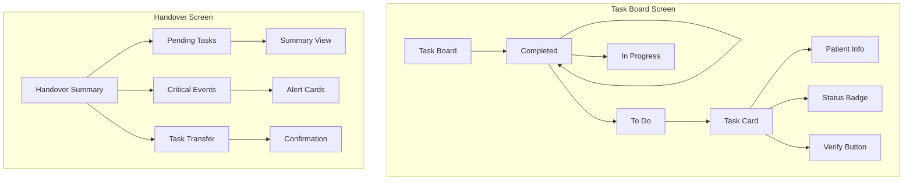

### Web Dashboard Layout

| Component | Description | Key Features |
|-----------|-------------|--------------|
| Navigation | Left sidebar | - Role-based menu items<br>- Collapsible sections<br>- Quick actions |
| Task Board | Main content area | - Multi-column Kanban<br>- Drag-drop interface<br>- Filter controls |
| Handover Panel | Right sidebar | - Shift summary<br>- Critical alerts<br>- Transfer controls |
| Header Bar | Top navigation | - Search<br>- Notifications<br>- User profile |

## 5.2 DATABASE DESIGN

### Core Schema

```mermaid
erDiagram
    Task ||--o{ TaskHistory : tracks
    Task ||--o{ TaskVerification : requires
    Task ||--o{ TaskAssignment : assigns
    Task {
        uuid id PK
        string title
        text description
        enum status
        datetime due_date
        uuid patient_id FK
        jsonb emr_data
        vector_clock version
    }
    
    TaskHistory {
        uuid id PK
        uuid task_id FK
        uuid user_id FK
        enum action
        jsonb changes
        datetime timestamp
    }
    
    TaskVerification {
        uuid id PK
        uuid task_id FK
        string barcode_data
        jsonb emr_verification
        datetime verified_at
    }
    
    TaskAssignment {
        uuid id PK
        uuid task_id FK
        uuid user_id FK
        uuid shift_id FK
        datetime assigned_at
    }
```

### Indexing Strategy

| Table | Index Type | Fields | Purpose |
|-------|------------|--------|---------|
| Task | B-tree | id, patient_id | Primary lookups |
| Task | GiST | emr_data | JSON search |
| TaskHistory | BRIN | timestamp | Time-based queries |
| TaskVerification | B-tree | task_id, verified_at | Verification lookups |
| TaskAssignment | B-tree | shift_id, user_id | Assignment queries |

## 5.3 API DESIGN

### Core Endpoints

```mermaid
flowchart LR
    subgraph API Gateway
        A[/tasks] --> B[GET List]
        A --> C[POST Create]
        A --> D[PUT Update]
        
        E[/handovers] --> F[GET Summary]
        E --> G[POST Transfer]
        
        H[/verifications] --> I[POST Verify]
        H --> J[GET Status]
    end
```

### API Specifications

| Endpoint | Method | Request Format | Response Format |
|----------|--------|----------------|-----------------|
| /tasks | GET | `{ filters: {}, pagination: {} }` | `{ tasks: [], meta: {} }` |
| /tasks | POST | `{ task: {}, emr_data: {} }` | `{ task: {}, verification: {} }` |
| /handovers | POST | `{ shift_id: "", tasks: [] }` | `{ summary: {}, status: "" }` |
| /verifications | POST | `{ task_id: "", barcode: "" }` | `{ verified: bool, emr_match: {} }` |

### Integration Patterns

```mermaid
sequenceDiagram
    participant C as Client
    participant G as Gateway
    participant T as Task Service
    participant E as EMR Service
    
    C->>G: POST /tasks
    G->>T: Create Task
    T->>E: Verify EMR Data
    E->>T: Verification Result
    T->>G: Task Response
    G->>C: 201 Created
```

# 6. USER INTERFACE DESIGN

## 6.1 DESIGN SYSTEM

### Component Key
```
Icons:
[?] - Help/Information tooltip
[$] - Payment/Financial indicator
[i] - Information marker
[+] - Add new item
[x] - Close/Delete action
[<][>] - Navigation controls
[^] - Upload function
[#] - Menu/Dashboard
[@] - User profile
[!] - Alert/Warning
[=] - Settings menu
[*] - Favorite/Important

Interactive Elements:
[ ] - Checkbox
( ) - Radio button
[Button] - Clickable button
[...] - Text input field
[====] - Progress indicator
[v] - Dropdown menu
```

## 6.2 MOBILE INTERFACE

### Task Board View
```
+------------------------------------------+
|[@] EMR Tasks                          [=] |
+------------------------------------------+
| [Search tasks...]                        |
|                                          |
| +----------------+ +----------------+     |
| |   TO DO (5)    | | IN PROGRESS(3)|     |
| +----------------+ +----------------+     |
| | [!]Critical    | | Regular       |     |
| | Patient #1234  | | Patient #5678 |     |
| | BP Check       | | Medication    |     |
| | Due: 15m [>]   | | Due: Now [>]  |     |
| +----------------+ +----------------+     |
| | [*]Important   | | [!]Critical   |     |
| | Patient #2345  | | Patient #6789 |     |
| | Temperature    | | Blood Draw    |     |
| | Due: 30m [>]   | | Due: 5m [>]   |     |
| +----------------+ +----------------+     |
|                                          |
| [+ New Task]                             |
+------------------------------------------+
| [#]Tasks  [@]Profile  [?]Help            |
+------------------------------------------+
```

### Task Detail View
```
+------------------------------------------+
| [<] Task Details                     [=]  |
+------------------------------------------+
| Patient: John Doe #1234                   |
| Room: 203A                               |
|                                          |
| Task: Blood Pressure Check               |
| Priority: [!] Critical                   |
| Due: 15 minutes                          |
|                                          |
| EMR Data:                                |
| +----------------------------------+     |
| | Last BP: 140/90 (2 hours ago)    |     |
| | Medication: Lisinopril 10mg      |     |
| | Alerts: Hypertension             |     |
| +----------------------------------+     |
|                                          |
| Verification Required:                   |
| [Scan Patient Barcode]                   |
| [Scan Medication Barcode]                |
|                                          |
| Notes: [..............................]  |
|                                          |
| [Complete Task]    [Report Issue]        |
+------------------------------------------+
```

## 6.3 WEB DASHBOARD

### Administrator View
```
+------------------------------------------------------------------+
| EMR Task Management                    [@Admin]    [?]Help    [=]   |
+------------------------------------------------------------------+
|                                                                    |
| [#] Dashboard   [Tasks]   [Reports]   [Settings]                   |
|                                                                    |
| Department: [All Departments v]        Date: [Today v]             |
+------------------------------------------------------------------+
|                        Task Overview                               |
| +------------------------+  +-------------------------+            |
| | Active Tasks          |  | Completion Rate         |            |
| | [====================]|  | [================>80%  ] |            |
| | 45/50 Complete        |  | Target: 85%             |            |
| +------------------------+  +-------------------------+            |
|                                                                    |
| Critical Events                                                    |
| +------------------------------------------------------------------+
| | Time  | Patient | Task           | Status    | Assigned To         |
| |-------|---------|----------------|-----------|---------------------|
| | 09:15 | #1234   | BP Check      | [!]Overdue| Sarah N.           |
| | 09:30 | #5678   | Medication    | [*]Active | John M.            |
| | 09:45 | #9012   | Blood Draw    | Pending   | Mary K.            |
| +------------------------------------------------------------------+
|                                                                    |
| [Export Report]   [Print View]   [+ Add Task]                      |
+------------------------------------------------------------------+
```

### Shift Handover Screen
```
+------------------------------------------------------------------+
| Shift Handover                         [@Nurse]    [?]Help    [=]  |
+------------------------------------------------------------------+
| From: Morning Shift (07:00-15:00)      To: Evening Shift          |
| Status: Handover in Progress           [=====>    ] 50%           |
+------------------------------------------------------------------+
| Outstanding Tasks                                                  |
| +----------------------------------------------------------------+
| | Priority | Patient | Task        | Status     | Notes            |
| |----------|---------|-------------|------------|------------------|
| | [!]High  | #1234   | Medication  | Pending    | Due in 30m      |
| | [*]Med   | #5678   | Vitals     | In Progress| Started 09:45    |
| | Low      | #9012   | Follow-up   | Scheduled  | After lunch     |
| +----------------------------------------------------------------+
|                                                                    |
| Critical Events Summary                                            |
| +----------------------------------------------------------------+
| | Time  | Event                    | Action Required               |
| |-------|--------------------------|------------------------------|
| | 08:30 | Patient #1234 BP Spike   | Monitor q15min              |
| | 09:15 | New Orders Received      | Review and acknowledge      |
| +----------------------------------------------------------------+
|                                                                    |
| [Reject Handover]   [Request Changes]   [Accept Handover]         |
+------------------------------------------------------------------+
```

## 6.4 RESPONSIVE DESIGN BREAKPOINTS

| Device | Width | Layout Adjustments |
|--------|-------|-------------------|
| Mobile | <768px | Single column, stacked cards |
| Tablet | 768-1024px | Two column, condensed header |
| Desktop | >1024px | Full three column, expanded view |

## 6.5 INTERACTION PATTERNS

### Task Card Interactions
```
Normal State:
+------------------+
| Patient #1234    |
| BP Check         |
| Due: 15m [>]     |
+------------------+

Selected State:
+==================+
| Patient #1234    |
| BP Check         |
| Due: 15m [>]     |
| [View] [Complete]|
+==================+

Error State:
+------------------+
| [!]Patient #1234 |
| BP Check         |
| OVERDUE: 5m [>]  |
+------------------+
```

### Navigation Flow
```
+-------------+     +-------------+     +----------------+
| Task Board  | --> | Task Detail | --> | Verification   |
+-------------+     +-------------+     +----------------+
       ^                  |                    |
       |                  v                    v
+-------------+     +-------------+     +----------------+
| Handover    | <-- | Complete    | <-- | EMR Update     |
+-------------+     +-------------+     +----------------+
```

# 7. SECURITY CONSIDERATIONS

## 7.1 AUTHENTICATION AND AUTHORIZATION

### Authentication Flow

```mermaid
sequenceDiagram
    participant User
    participant Client
    participant Gateway
    participant Auth0
    participant Services
    
    User->>Client: Login Request
    Client->>Gateway: Forward Auth
    Gateway->>Auth0: OAuth2 Flow
    Auth0->>Auth0: MFA Verification
    Auth0-->>Gateway: JWT Token
    Gateway-->>Client: Session Token
    Client->>Services: API Requests + JWT
    Services->>Services: Validate Token
```

### Authorization Matrix

| Role | Task Management | EMR Access | Admin Functions | Reports | System Config |
|------|----------------|------------|-----------------|---------|---------------|
| Nurse | Create, Read, Update | Read Only | None | Basic | None |
| Doctor | Full Access | Read, Limited Write | None | Department | None |
| Supervisor | Full Access | Read Only | Department Level | Full | Limited |
| Administrator | Full Access | Read Only | Full Access | Full | Full |
| System | Full Access | Full Access | Full Access | Full | Full |

### Access Control Implementation

| Component | Method | Details |
|-----------|---------|---------|
| API Gateway | OAuth 2.0 + JWT | - Token-based authentication<br>- 1-hour access tokens<br>- 30-day refresh tokens |
| Service Mesh | mTLS | - Service-to-service authentication<br>- Certificate rotation every 24h |
| Database | RBAC + Row-Level Security | - Role-based permissions<br>- Data segregation by department |
| EMR Integration | SMART on FHIR | - OAuth 2.0 with PKCE<br>- Scoped access tokens |

## 7.2 DATA SECURITY

### Encryption Layers

```mermaid
flowchart TD
    subgraph Transport Layer
        A[TLS 1.3] --> B[Certificate Pinning]
        B --> C[HSTS Enforcement]
    end
    
    subgraph Application Layer
        D[Field-Level Encryption] --> E[AES-256-GCM]
        E --> F[Key Rotation]
    end
    
    subgraph Storage Layer
        G[TDE] --> H[Hardware Security Module]
        H --> I[Backup Encryption]
    end
```

### Data Classification

| Data Type | Classification | Security Measures |
|-----------|---------------|-------------------|
| PHI/PII | Highly Sensitive | - Field-level encryption<br>- Access logging<br>- Automatic purging |
| Clinical Tasks | Sensitive | - Row-level encryption<br>- Department isolation<br>- Audit trails |
| System Logs | Internal | - Encrypted storage<br>- Limited access<br>- Retention policies |
| Public Data | Public | - Integrity checks<br>- Version control<br>- Cache control |

### Key Management

| Component | Implementation | Rotation Policy |
|-----------|---------------|-----------------|
| API Keys | HashiCorp Vault | 90 days |
| Database Keys | AWS KMS | 180 days |
| TLS Certificates | Let's Encrypt | 90 days |
| Encryption Keys | Hardware Security Module | 365 days |

## 7.3 SECURITY PROTOCOLS

### Network Security

```mermaid
flowchart LR
    subgraph Edge Security
        A[WAF] --> B[DDoS Protection]
        B --> C[Rate Limiting]
    end
    
    subgraph Internal Security
        D[Service Mesh] --> E[Network Policies]
        E --> F[Pod Security]
    end
    
    subgraph Data Security
        G[Encryption] --> H[Access Control]
        H --> I[Audit Logging]
    end
```

### Security Controls

| Layer | Control | Implementation |
|-------|---------|----------------|
| Network | Firewall Rules | - Allowlist-based access<br>- Port restrictions<br>- Traffic monitoring |
| Application | Input Validation | - Schema validation<br>- Sanitization<br>- CSRF protection |
| Database | Query Protection | - Prepared statements<br>- Connection pooling<br>- SQL injection prevention |
| Infrastructure | Container Security | - Image scanning<br>- Runtime protection<br>- Resource isolation |

### Compliance Protocols

| Requirement | Implementation | Monitoring |
|-------------|----------------|------------|
| HIPAA | - PHI encryption<br>- Access controls<br>- Audit logs | Daily compliance checks |
| GDPR | - Data minimization<br>- Right to erasure<br>- Privacy controls | Weekly audits |
| LGPD | - Consent management<br>- Data processing records<br>- Cross-border controls | Monthly reviews |

### Incident Response

```mermaid
stateDiagram-v2
    [*] --> Normal
    Normal --> Detection: Security Event
    Detection --> Analysis: Trigger Alert
    Analysis --> Containment: Confirm Threat
    Containment --> Eradication: Isolate
    Eradication --> Recovery: Remove Threat
    Recovery --> Normal: Restore Service
    Analysis --> Normal: False Positive
```

### Security Monitoring

| Component | Tool | Metrics |
|-----------|------|---------|
| SIEM | ELK Stack | - Login attempts<br>- Access patterns<br>- System anomalies |
| Threat Detection | Falco | - Container behavior<br>- System calls<br>- Network activity |
| Vulnerability Scanning | Trivy | - Container images<br>- Dependencies<br>- Configuration |
| Performance Monitoring | Prometheus | - Resource usage<br>- Error rates<br>- Latency patterns |

# 8. INFRASTRUCTURE

## 8.1 DEPLOYMENT ENVIRONMENT

```mermaid
flowchart TD
    subgraph Production
        A[Primary Region] --> B[Multi-AZ Deployment]
        B --> C[Kubernetes Cluster]
        A --> D[DR Region]
        D --> E[Standby Cluster]
    end
    
    subgraph Staging
        F[Staging Environment] --> G[Single-AZ Cluster]
    end
    
    subgraph Development
        H[Dev Environment] --> I[Local K3s]
    end
```

### Environment Specifications

| Environment | Infrastructure | Purpose | Scaling |
|-------------|---------------|----------|----------|
| Production | Multi-Region AWS | Live system operation | Auto-scaling, Multi-AZ |
| Staging | Single Region AWS | Pre-release testing | Fixed capacity |
| Development | Local/AWS | Development work | On-demand |
| DR | Secondary Region | Business continuity | Warm standby |

## 8.2 CLOUD SERVICES

### Core Services Matrix

| Service Type | AWS Service | Purpose | Configuration |
|-------------|-------------|----------|---------------|
| Compute | EKS | Container orchestration | 1.26+, managed node groups |
| Database | Aurora PostgreSQL | Primary data store | Multi-AZ, 14.x |
| Cache | ElastiCache | Redis cluster | Multi-AZ, Redis 7.x |
| Storage | S3 | Object storage | Cross-region replication |
| Messaging | MSK | Kafka service | Multi-AZ, Kafka 3.4 |
| CDN | CloudFront | Content delivery | Global edge locations |

### Network Architecture

```mermaid
flowchart TB
    subgraph VPC[Production VPC]
        subgraph Public[Public Subnets]
            ALB[Application Load Balancer]
            NAT[NAT Gateway]
        end
        
        subgraph Private[Private Subnets]
            EKS[EKS Cluster]
            DB[Aurora DB]
            CACHE[ElastiCache]
            MSK[MSK Cluster]
        end
    end
    
    Internet --> ALB
    ALB --> EKS
    EKS --> DB
    EKS --> CACHE
    EKS --> MSK
    Private --> NAT
    NAT --> Internet
```

## 8.3 CONTAINERIZATION

### Container Strategy

| Component | Base Image | Size Limit | Security Measures |
|-----------|------------|------------|-------------------|
| API Gateway | nginx:alpine | < 100MB | Non-root user, read-only FS |
| Task Service | node:18-alpine | < 200MB | Multi-stage builds, security scanning |
| EMR Service | eclipse-temurin:17-jre | < 300MB | Vulnerability scanning, minimal deps |
| Sync Service | golang:1.20-alpine | < 50MB | Distroless, minimal attack surface |

### Docker Configuration

```mermaid
flowchart LR
    subgraph Container Build
        A[Source Code] --> B[Multi-stage Build]
        B --> C[Security Scan]
        C --> D[Push to Registry]
    end
    
    subgraph Registry
        D --> E[Harbor Registry]
        E --> F[Vulnerability Scanning]
        F --> G[Signed Images]
    end
```

## 8.4 ORCHESTRATION

### Kubernetes Architecture

```mermaid
flowchart TD
    subgraph Cluster[EKS Cluster]
        subgraph Control[Control Plane]
            API[API Server]
            ETCD[etcd]
            SCHED[Scheduler]
        end
        
        subgraph Workers[Worker Nodes]
            POD1[Application Pods]
            POD2[Service Pods]
            POD3[Monitoring Pods]
        end
        
        subgraph Services[Platform Services]
            ISTIO[Service Mesh]
            PROM[Prometheus]
            ELASTIC[Elasticsearch]
        end
    end
```

### Kubernetes Resources

| Resource Type | Purpose | Configuration |
|--------------|---------|---------------|
| Deployments | Application workloads | Rolling updates, auto-scaling |
| StatefulSets | Stateful services | Persistent storage, ordered updates |
| DaemonSets | Cluster services | Monitoring, logging agents |
| Services | Internal networking | ClusterIP, LoadBalancer types |
| Ingress | External access | SSL termination, routing rules |

## 8.5 CI/CD PIPELINE

### Pipeline Architecture

```mermaid
flowchart LR
    subgraph Source
        A[GitHub] --> B[Actions]
    end
    
    subgraph Build
        B --> C[Test]
        C --> D[Build]
        D --> E[Scan]
    end
    
    subgraph Deploy
        E --> F[ArgoCD]
        F --> G[Staging]
        G --> H[Production]
    end
    
    subgraph Monitor
        H --> I[Prometheus]
        I --> J[Alerting]
    end
```

### Pipeline Stages

| Stage | Tools | Purpose | SLA |
|-------|-------|---------|-----|
| Source Control | GitHub | Code versioning | < 1min trigger |
| Build | GitHub Actions | Compilation, testing | < 10min |
| Security Scan | Snyk, Trivy | Vulnerability detection | < 5min |
| Artifact Storage | Harbor | Image registry | < 2min push/pull |
| Deployment | ArgoCD | GitOps deployment | < 15min |
| Validation | Smoke tests | Deployment verification | < 5min |

### Deployment Strategy

| Environment | Strategy | Rollback Time | Validation |
|-------------|----------|---------------|------------|
| Staging | Blue/Green | < 1min | Automated tests |
| Production | Canary | < 5min | Progressive traffic |
| DR | Active-Passive | < 30min | Regular failover tests |

# 8. APPENDICES

## 8.1 ADDITIONAL TECHNICAL INFORMATION

### Development Environment Setup

| Component | Tool | Version | Purpose |
|-----------|------|---------|----------|
| IDE | VS Code | 1.80+ | Primary development environment |
| Mobile Testing | Flutter DevTools | 2.23+ | Mobile app debugging and profiling |
| API Testing | Postman | 10.0+ | API endpoint testing and documentation |
| Database Tools | DBeaver | 23.0+ | Database management and querying |
| Git Tools | GitKraken | 9.0+ | Git visualization and management |

### Error Code Reference

| Code Range | Category | Example |
|------------|----------|---------|
| 1000-1999 | EMR Integration | 1001: FHIR Connection Failed |
| 2000-2999 | Task Management | 2001: Invalid Task State Transition |
| 3000-3999 | Sync Errors | 3001: CRDT Merge Conflict |
| 4000-4999 | Authentication | 4001: Invalid Token |
| 5000-5999 | Handover | 5001: Incomplete Handover Package |

### System Health Metrics

```mermaid
flowchart TD
    subgraph Metrics Collection
        A[Application Metrics] --> P[Prometheus]
        B[System Metrics] --> P
        C[Custom Metrics] --> P
        P --> G[Grafana]
    end

    subgraph Alert Rules
        G --> D[Warning Thresholds]
        G --> E[Critical Thresholds]
        G --> F[SLA Breaches]
    end

    subgraph Response
        D --> H[Email Notification]
        E --> I[PagerDuty Alert]
        F --> J[Incident Creation]
    end
```

## 8.2 GLOSSARY

| Term | Definition |
|------|------------|
| Barcode Verification | Process of scanning medication or patient barcodes to verify task accuracy against EMR data |
| CRDT | Data structure that enables conflict-free merging of concurrent updates in distributed systems |
| Edge Computing | Processing of data near the source of data generation (mobile devices) rather than in a centralized location |
| FHIR Resource | Standardized healthcare data format used for exchanging clinical information |
| Handover Package | Collection of tasks, critical events, and patient information transferred between shifts |
| Universal Data Model | Standardized schema for normalizing data across different EMR systems |
| Vector Clock | Algorithm for tracking causality and ordering of events in distributed systems |

## 8.3 ACRONYMS

| Acronym | Full Form |
|---------|-----------|
| API | Application Programming Interface |
| CRDT | Conflict-free Replicated Data Type |
| EMR | Electronic Medical Record |
| FHIR | Fast Healthcare Interoperability Resources |
| GDPR | General Data Protection Regulation |
| HIPAA | Health Insurance Portability and Accountability Act |
| HL7 | Health Level Seven |
| JWT | JSON Web Token |
| LGPD | Lei Geral de Proteção de Dados |
| OCR | Optical Character Recognition |
| RBAC | Role-Based Access Control |
| REST | Representational State Transfer |
| SLA | Service Level Agreement |
| SSO | Single Sign-On |
| UDM | Universal Data Model |

## 8.4 SYSTEM DEPENDENCIES

```mermaid
flowchart LR
    subgraph External Services
        A[Auth0] --> SSO[SSO Integration]
        B[AWS] --> S3[Storage]
        B --> SQS[Message Queue]
        C[Twilio] --> SMS[Notifications]
    end

    subgraph Core Services
        D[EMR Systems] --> FHIR[FHIR Adapter]
        D --> HL7[HL7 Adapter]
        E[Mobile Devices] --> SYNC[Sync Engine]
    end

    subgraph Infrastructure
        F[Kubernetes] --> PODS[Application Pods]
        G[Istio] --> MESH[Service Mesh]
        H[Prometheus] --> MON[Monitoring]
    end
```

## 8.5 CONFIGURATION PARAMETERS

| Category | Parameter | Default | Description |
|----------|-----------|---------|-------------|
| API Gateway | `MAX_REQUESTS_PER_MIN` | 1000 | Rate limiting threshold |
| Task Service | `TASK_LOCK_TIMEOUT` | 300s | Task lock expiration time |
| Sync Engine | `SYNC_RETRY_ATTEMPTS` | 3 | Number of sync retries |
| EMR Integration | `EMR_TIMEOUT` | 30s | EMR request timeout |
| Mobile App | `OFFLINE_STORAGE_LIMIT` | 1GB | Local storage limit |
| Handover | `HANDOVER_WINDOW` | 30m | Handover preparation window |

## 8.6 MIGRATION GUIDELINES

```mermaid
flowchart TD
    subgraph Migration Process
        A[Data Export] --> B[Data Transformation]
        B --> C[Data Validation]
        C --> D[Incremental Import]
        D --> E[Verification]
    end

    subgraph Rollback Plan
        F[Snapshot Creation] --> G[System Backup]
        G --> H[Recovery Point]
        H --> I[Restore Process]
    end
```