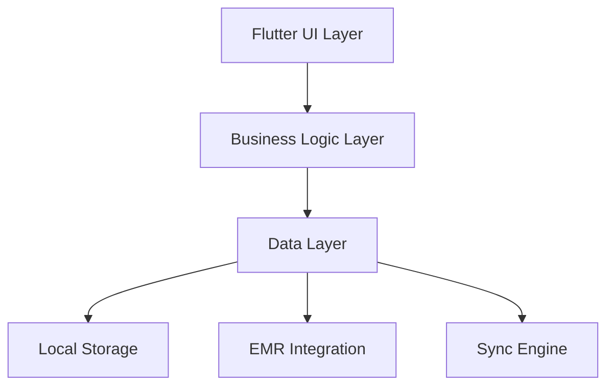

# EMR-Integrated Task Management Platform - Android Application

## Project Overview

The EMR-Integrated Task Management Platform's Android application is a Flutter-based mobile solution providing healthcare professionals with seamless task management capabilities. The application features:

- Offline-first architecture with CRDT-based synchronization
- EMR system integration (Epic, Cerner) via FHIR R4/HL7 v2
- Real-time task management and verification
- Secure PHI/PII handling
- High-performance Flutter implementation

## Prerequisites

### Development Environment
- Flutter SDK 3.10.0 or higher
- Android Studio Arctic Fox (2021.3.1) or higher
- Java Development Kit (JDK) 11 or higher
- Android SDK 31 (Android 12) or higher
- Gradle 7.5.0 or higher

### Access Requirements
- EMR system development credentials
- FHIR/HL7 API access tokens
- SSL certificates for secure communication
- Firebase project configuration

### System Requirements
- Android 6.0 (API level 23) or higher
- Minimum 2GB RAM
- 500MB storage space
- Internet connectivity for synchronization

## Architecture

### Core Components


### Key Features
1. **Offline-First Implementation**
   - CRDT-based data synchronization
   - SQLite local storage
   - Conflict resolution strategies
   - Background sync service

2. **EMR Integration**
   - FHIR R4 client implementation
   - HL7 v2 message handling
   - Real-time data verification
   - Secure PHI transmission

3. **Performance Optimization**
   - Lazy loading
   - Image caching
   - Background processing
   - Memory optimization

## Setup Instructions

### 1. Flutter Environment Setup
```bash
# Install Flutter SDK
flutter doctor --android-licenses
flutter pub get
flutter pub run build_runner build

# Configure environment variables
flutter pub run environment_config:generate
```

### 2. Android Configuration
```gradle
// In android/app/build.gradle
android {
    compileSdkVersion 33
    
    defaultConfig {
        minSdkVersion 23
        targetSdkVersion 33
        multiDexEnabled true
    }
}
```

### 3. EMR Integration Setup
1. Configure EMR credentials in `assets/config/emr_config.yaml`
2. Set up SSL certificates in `android/app/src/main/res/raw/`
3. Initialize FHIR client configuration

### 4. Offline Storage Setup
1. Configure SQLite database schema
2. Set up CRDT synchronization parameters
3. Initialize background sync service

## Build Configuration

### Debug Build
```bash
flutter build apk --debug --flavor development
```

### Release Build
```bash
flutter build apk --release --flavor production
flutter build appbundle --release --flavor production
```

### Build Variants
- Development: EMR sandbox environment
- Staging: Test EMR integration
- Production: Live EMR systems

## Testing

### Unit Tests
```bash
flutter test test/unit/
```

### Integration Tests
```bash
flutter drive --target=test_driver/app.dart
```

### Performance Testing
1. Memory usage monitoring
2. Network bandwidth optimization
3. Offline sync performance
4. EMR integration response times

## Deployment

### Release Process
1. Version bump in `pubspec.yaml`
2. Update changelog
3. Run full test suite
4. Generate release build
5. Deploy to Play Store

### Play Store Deployment
1. Sign APK with release keys
2. Update store listing
3. Submit for review
4. Monitor rollout

### Monitoring Setup
1. Firebase Crashlytics integration
2. Performance monitoring
3. User analytics
4. Error tracking

## Security

### Data Protection
- AES-256 encryption for local storage
- Secure key storage using Android Keystore
- Network security configuration
- SSL pinning implementation

### Authentication
- OAuth 2.0 implementation
- Biometric authentication
- Session management
- Token refresh mechanism

### Compliance
- HIPAA compliance measures
- GDPR data handling
- Audit logging
- Data retention policies

## Maintenance

### Regular Updates
- Monthly Flutter dependency updates
- Quarterly security patches
- EMR API compatibility checks
- Performance optimization

### Monitoring
- Daily performance metrics
- Error rate tracking
- Sync success rate
- API response times

### Troubleshooting
1. Offline sync issues
2. EMR connection problems
3. Performance degradation
4. Security alerts

## Support

### Documentation
- API documentation
- Architecture diagrams
- Integration guides
- Troubleshooting guides

### Contact
- Technical Support: support@emrtask.com
- EMR Integration: emr-support@emrtask.com
- Security Issues: security@emrtask.com

## Version History

### Current Version: 1.0.0
- Initial release with core functionality
- EMR integration support
- Offline-first capabilities
- CRDT synchronization

### Upcoming Features
1. Enhanced EMR integration
2. Improved offline capabilities
3. Performance optimizations
4. Additional security features

## License

Copyright © 2023 EMR Task Management Platform

All rights reserved. This software is confidential and proprietary.