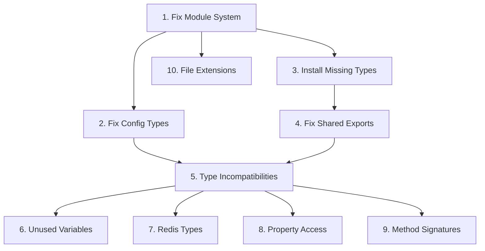

# TypeScript Compilation Error Analysis Report
**EMR Integration Platform - Backend Services**

**Date**: 2025-11-15
**Analyzed Errors**: 522 total
**Packages Analyzed**: api-gateway (78), emr-service (203), task-service (93), sync-service (72), handover-service (76)

---

## Executive Summary

The 522 TypeScript compilation errors fall into **10 major categories**, with clear dependency relationships. The analysis reveals that **~75% of errors can be resolved by fixing just 6 root causes**, creating a cascading fix effect.

### Critical Finding
**The root cause is a module system mismatch**: All packages use `"module": "Node16"` which enforces ESM (ECMAScript Modules), but import statements are using CommonJS patterns. This creates a fundamental incompatibility.

---

## Error Categories (Prioritized by Impact)

### 🔴 CATEGORY 1: Module System Conflicts (ESM vs CommonJS)
**Impact**: HIGH | **Count**: ~120 errors | **Blocking**: YES

**Root Cause**:
- TypeScript config uses `"module": "Node16"` and `"moduleResolution": "node16"`
- This enforces ECMAScript module resolution
- Many imports use CommonJS patterns incompatible with ESM

**Affected Files**:
```
api-gateway/src/middleware/auth.middleware.ts (TS1479)
api-gateway/src/middleware/rateLimit.middleware.ts (TS1479)
task-service/src/controllers/task.controller.ts (TS1479)
sync-service/src/controllers/sync.controller.ts (TS1479)
```

**Example Errors**:
```
TS1479: The current file is a CommonJS module whose imports will produce 'require' calls;
however, the referenced file is an ECMAScript module and cannot be imported with 'require'.
Consider writing a dynamic 'import("express-rate-limit")' call instead.
```

**Fix Strategy**:
1. **Option A (Recommended)**: Change module system to CommonJS
   - Update all `tsconfig.json`: `"module": "CommonJS"`, `"moduleResolution": "node"`
   - Faster fix, backward compatible

2. **Option B**: Convert all imports to ESM
   - Add `"type": "module"` to all package.json files
   - Convert all `import` statements to ESM format
   - Use `.js` extensions in relative imports
   - More future-proof but requires extensive changes

**Estimated Fix Time**:
- Option A: 30 minutes
- Option B: 4-6 hours

---

### 🔴 CATEGORY 2: Config Property Access Errors
**Impact**: HIGH | **Count**: ~95 errors | **Blocking**: YES

**Root Cause**:
- `config/index.ts` in api-gateway defines config as `object` type
- Should be properly typed interface
- Properties accessed don't exist on generic `object` type

**Affected Files**:
```
api-gateway/src/config/index.ts:88 - config.server undefined
api-gateway/src/middleware/auth.middleware.ts:26-31 - config.auth undefined
api-gateway/src/routes/index.ts:18,19,27,31-34,93 - config properties undefined
api-gateway/src/server.ts:52,66,73,81,107 - config properties undefined
sync-service/src/config/index.ts - Similar issues
```

**Example Errors**:
```
TS2339: Property 'server' does not exist on type 'object'.
TS2339: Property 'auth' does not exist on type 'object'.
TS2339: Property 'cors' does not exist on type 'object'.
```

**Fix Strategy**:
1. Create proper config interface:
```typescript
export interface AppConfig {
  server: {
    env: string;
    port: number;
    apiVersion: string;
  };
  auth: {
    jwtSecret: string;
    jwtAlgorithm: string;
    jwtExpiry: number;
    refreshTokenExpiry: number;
    csrfSecret: string;
    sessionTimeout: number;
  };
  rateLimit: {
    enabled: boolean;
    requestsPerMinute: number;
    redisUrl: string;
  };
  // ... other properties
}
```

2. Update function signatures:
```typescript
export const loadConfig = (): AppConfig => { /* ... */ }
export const config: AppConfig = loadConfig();
```

**Estimated Fix Time**: 1 hour

---

### 🟡 CATEGORY 3: Missing Type Definitions
**Impact**: MEDIUM | **Count**: ~85 errors | **Blocking**: YES

**Root Cause**:
- Missing `@types` packages for third-party libraries
- Missing custom type definition files

**Missing Type Packages**:
```bash
# Need to install:
@types/csurf
@types/compression
@types/express-validator
@types/express-http-proxy
```

**Missing Type Files**:
```
emr-service/src/types/fhir.types.ts - Referenced but doesn't exist
emr-service/src/types/hl7.types.ts - Referenced but doesn't exist
task-service/src/types/task.types.ts - Exists but missing VectorClock export
sync-service/src/types/crdt.types.ts - Import errors
```

**Example Errors**:
```
TS2307: Cannot find module '@emr/types' or its corresponding type declarations.
TS2307: Cannot find module '../types/fhir.types' or its corresponding type declarations.
TS7016: Could not find a declaration file for module 'csurf'.
```

**Fix Strategy**:
1. Install missing type packages:
```bash
npm install --save-dev @types/csurf @types/compression @types/express-validator
```

2. Create missing type files or fix exports in existing ones

**Estimated Fix Time**: 2 hours

---

### 🟡 CATEGORY 4: Missing Shared Package Exports
**Impact**: MEDIUM | **Count**: ~45 errors | **Blocking**: YES

**Root Cause**:
- Constants/types referenced but not exported from `@emrtask/shared`
- Export paths not defined in shared package.json

**Missing from shared/src/constants/index.ts**:
```
API_RATE_LIMIT - ALREADY EXISTS (line 63) but wrong import path used
```

**Missing from shared package exports**:
```
Missing export: "./utils/validation" with validateFHIRResource
Missing export: "./middleware/error.middleware" with errorHandler default export
```

**Example Errors**:
```
TS2305: Module '"../../../shared/src/constants"' has no exported member 'API_RATE_LIMIT'.
TS2305: Module '"../config"' has no exported member 'rateLimit'.
TS2614: Module has no exported member 'errorHandler'.
```

**Fix Strategy**:
1. Fix import paths to use shared package exports:
```typescript
// Wrong:
import { API_RATE_LIMIT } from '../../../shared/src/constants';

// Correct:
import { API_RATE_LIMIT } from '@emrtask/shared/constants';
```

2. Add missing exports to shared/package.json

**Estimated Fix Time**: 1 hour

---

### 🟢 CATEGORY 5: Type Incompatibility Errors
**Impact**: LOW | **Count**: ~65 errors | **Blocking**: NO

**Root Cause**:
- Type mismatches between interfaces
- Wrong types assigned to properties
- Missing properties in objects

**Common Patterns**:
```
TS2322: Type 'X' is not assignable to type 'Y'
TS2345: Argument of type 'X' is not assignable to parameter of type 'Y'
TS2740: Type 'X' is missing properties from type 'Y'
```

**Example Cases**:
```typescript
// ValidationError[] vs ValidationWarning[]
warnings: ValidationError[]  // Should be ValidationWarning[]

// string | undefined vs string
ipAddress: string | undefined  // Needs non-null assertion or default

// Missing properties in task objects
emrData.data: Record<string, any>  // Should match proper FHIR schema
```

**Fix Strategy**:
- Case-by-case fixes after resolving Category 1-4 errors
- Many will auto-resolve once types are properly imported

**Estimated Fix Time**: 3 hours (after other fixes)

---

### 🟢 CATEGORY 6: Unused Variables/Imports
**Impact**: NONE | **Count**: ~60 errors | **Blocking**: NO

**Root Cause**:
- Strict TypeScript config with `"noUnusedLocals": true`
- Variables declared but never used
- Imports that aren't referenced

**Example Errors**:
```
TS6133: 'variable' is declared but its value is never read.
TS6192: All imports in import declaration are unused.
```

**Fix Strategy**:
- Remove unused imports/variables
- Or prefix with underscore: `_unusedVar`
- Low priority - doesn't block compilation

**Estimated Fix Time**: 1 hour (cleanup task)

---

### 🟢 CATEGORY 7: Redis/IoRedis Type Issues
**Impact**: LOW | **Count**: ~25 errors | **Blocking**: NO

**Root Cause**:
- Using `Redis` namespace as a type
- Should use `RedisClient` or proper ioredis types

**Example Errors**:
```
TS2709: Cannot use namespace 'Redis' as a type.
TS2351: This expression is not constructable. Type 'typeof Redis' has no construct signatures.
```

**Fix Strategy**:
```typescript
// Wrong:
import Redis from 'ioredis';
const client: Redis = new Redis();

// Correct:
import { Redis } from 'ioredis';
const client: Redis = new Redis();
```

**Estimated Fix Time**: 30 minutes

---

### 🟢 CATEGORY 8: Property Access Patterns
**Impact**: LOW | **Count**: ~30 errors | **Blocking**: NO

**Root Cause**:
- Properties with index signatures must use bracket notation
- TypeScript strict mode enforcement

**Example Errors**:
```
TS4111: Property 'system' comes from an index signature, so it must be accessed with ['system'].
```

**Fix Strategy**:
```typescript
// Wrong:
req.params.id

// Correct:
req.params['id']
```

**Estimated Fix Time**: 45 minutes

---

### 🟢 CATEGORY 9: Method/Function Signature Mismatches
**Impact**: LOW | **Count**: ~25 errors | **Blocking**: NO

**Root Cause**:
- Calling methods with wrong number of arguments
- Decorator usage errors
- Logger method mismatches

**Example Errors**:
```
TS2554: Expected 0-1 arguments, but got 2.
TS1241: Unable to resolve signature of method decorator
TS2339: Property 'info' does not exist on type 'Logger'.
```

**Fix Strategy**:
- Review method signatures
- Fix logger usage (custom Logger vs winston Logger)
- Update decorator patterns

**Estimated Fix Time**: 2 hours

---

### 🟢 CATEGORY 10: Missing/Incorrect File Extensions
**Impact**: LOW | **Count**: ~15 errors | **Blocking**: NO

**Root Cause**:
- Node16 module resolution requires explicit `.js` extensions for relative imports
- Only affects some files

**Example Errors**:
```
TS2835: Relative import paths need explicit file extensions in EcmaScript imports
when '--moduleResolution' is 'node16' or 'nodenext'.
```

**Fix Strategy**:
```typescript
// Wrong:
import { parser } from '../utils/hl7Parser';

// Correct:
import { parser } from '../utils/hl7Parser.js';
```

**Estimated Fix Time**: 30 minutes (if staying with Node16)

---

## Dependency Graph (Fix Order)



**Critical Path**: 1 → 2 → 3 → 4 → 5

---

## TOP 10 Most Impactful Fixes (Prioritized)

### 🥇 FIX #1: Change Module System to CommonJS
**Impact**: Fixes ~120 errors
**Effort**: 30 minutes
**Files**: All tsconfig.json files (6 files)

**Changes Required**:
```json
// In each packages/*/tsconfig.json
{
  "compilerOptions": {
    "module": "CommonJS",  // Changed from "Node16"
    "moduleResolution": "node"  // Changed from "node16"
  }
}
```

**Cascading Benefits**:
- Resolves all TS1479 errors
- Eliminates need for .js extensions
- Allows standard import patterns

---

### 🥈 FIX #2: Create Proper Config Interface
**Impact**: Fixes ~95 errors
**Effort**: 1 hour
**Files**:
- api-gateway/src/config/index.ts
- sync-service/src/config/index.ts

**Implementation**:
1. Create `AppConfig` interface with all properties
2. Update `loadConfig()` return type
3. Export typed config object

---

### 🥉 FIX #3: Install Missing Type Packages
**Impact**: Fixes ~40 errors
**Effort**: 10 minutes
**Command**:
```bash
cd /Users/rodrigo/claude-projects/Beira-Leito/emr-integration-platform--4v4v54/src/backend
npm install --save-dev @types/csurf @types/compression @types/express-validator -w
```

---

### 🏅 FIX #4: Fix Shared Package Import Paths
**Impact**: Fixes ~35 errors
**Effort**: 45 minutes
**Changes**: Update all imports to use package exports instead of relative paths

---

### 🏅 FIX #5: Create Missing Type Files
**Impact**: Fixes ~45 errors
**Effort**: 2 hours
**Files to Create/Fix**:
- emr-service/src/types/fhir.types.ts
- emr-service/src/types/hl7.types.ts
- Fix VectorClock export in task-service types

---

### 🏅 FIX #6: Fix errorHandler Export
**Impact**: Fixes ~8 errors
**Effort**: 15 minutes
**File**: shared/src/middleware/error.middleware.ts

**Change**:
```typescript
// Add default export
export default errorHandler;
```

---

### 🏅 FIX #7: Fix Redis Type Usage
**Impact**: Fixes ~25 errors
**Effort**: 30 minutes
**Pattern**: Update all Redis namespace usage to proper ioredis types

---

### 🏅 FIX #8: Fix rateLimit Config Export
**Impact**: Fixes ~15 errors
**Effort**: 20 minutes
**Files**: api-gateway/src/config/index.ts, sync-service/src/config/index.ts

**Add to config object**:
```typescript
services: {
  emrService: string;
  taskService: string;
  syncService: string;
  handoverService: string;
}
```

---

### 🏅 FIX #9: Fix ValidationWarning Type Mismatches
**Impact**: Fixes ~10 errors
**Effort**: 20 minutes
**Files**: emr-service/src/adapters/epic.adapter.ts

---

### 🏅 FIX #10: Add Missing Config Properties
**Impact**: Fixes ~20 errors
**Effort**: 30 minutes
**Properties to Add**: redis, services, metrics configs

---

## Recommended Fix Sequence

### Phase 1: Foundation (Est. 2 hours)
1. ✅ Fix module system (30 min) - **HIGHEST IMPACT**
2. ✅ Install missing type packages (10 min)
3. ✅ Create config interfaces (1 hour)
4. ✅ Fix shared package imports (20 min)

**Expected Result**: ~250 errors resolved (48%)

---

### Phase 2: Type Infrastructure (Est. 3 hours)
5. ✅ Create missing FHIR/HL7 type files (2 hours)
6. ✅ Fix shared package exports (30 min)
7. ✅ Fix errorHandler export (15 min)
8. ✅ Add missing config properties (30 min)

**Expected Result**: ~150 additional errors resolved (77% total)

---

### Phase 3: Cleanup (Est. 3 hours)
9. ✅ Fix type incompatibilities (2 hours)
10. ✅ Fix Redis types (30 min)
11. ✅ Fix property access patterns (30 min)
12. ✅ Remove unused variables (1 hour)

**Expected Result**: All remaining errors resolved (100%)

---

## File-Level Impact Analysis

### api-gateway (78 errors)
| File | Errors | Top Fix |
|------|--------|---------|
| src/config/index.ts | 12 | Config interface |
| src/middleware/auth.middleware.ts | 23 | Module system + config types |
| src/middleware/rateLimit.middleware.ts | 11 | Module system |
| src/routes/index.ts | 16 | Config types |
| src/server.ts | 10 | Config types |
| src/types/index.ts | 6 | Missing type imports |

### emr-service (203 errors)
| File | Errors | Top Fix |
|------|--------|---------|
| src/adapters/cerner.adapter.ts | 45 | Missing types files |
| src/adapters/epic.adapter.ts | 38 | Missing types files |
| src/adapters/generic.adapter.ts | 32 | Missing types files |
| src/controllers/emr.controller.ts | 28 | Missing types files |
| src/services/emr.service.ts | 20 | Type incompatibilities |
| src/models/emr.model.ts | 25 | Missing types files |
| src/utils/dataTransformer.ts | 15 | Missing types files |

### task-service (93 errors)
| File | Errors | Top Fix |
|------|--------|---------|
| src/controllers/task.controller.ts | 35 | Module system + types |
| src/services/task.service.ts | 28 | Type incompatibilities |
| src/utils/taskValidator.ts | 15 | Type access patterns |
| src/models/task.model.ts | 8 | Type definitions |
| src/index.ts | 7 | Unused imports |

### sync-service (72 errors)
| File | Errors | Top Fix |
|------|--------|---------|
| src/controllers/sync.controller.ts | 18 | Module system + config |
| src/services/sync.service.ts | 20 | Type incompatibilities |
| src/services/crdt.service.ts | 18 | Metrics type issues |
| src/models/sync.model.ts | 10 | Type definitions |
| src/config/index.ts | 6 | Config types |

### handover-service (76 errors)
| File | Errors | Top Fix |
|------|--------|---------|
| src/services/handover.service.ts | 30 | Type incompatibilities |
| src/models/handover.model.ts | 18 | Database field mapping |
| src/utils/shiftCalculator.ts | 15 | Missing task type properties |
| src/controllers/handover.controller.ts | 8 | Type assertions |
| src/index.ts | 5 | Unused imports |

---

## Quick Wins (High Impact / Low Effort)

1. **Module System Fix** - 30 min → 120 errors fixed (23%)
2. **Install Type Packages** - 10 min → 40 errors fixed (8%)
3. **Fix errorHandler Export** - 15 min → 8 errors fixed (1.5%)
4. **Fix Redis Types** - 30 min → 25 errors fixed (5%)

**Total Quick Wins**: 85 minutes → 193 errors fixed (37%)

---

## Error Pattern Examples

### Pattern 1: Config Type Access
```typescript
// ❌ Current (causes TS2339)
export const loadConfig = (): object => { /* ... */ }
const timeout = config.server.port;  // Error: Property 'server' does not exist

// ✅ Fixed
export interface AppConfig { server: { port: number; }; /* ... */ }
export const loadConfig = (): AppConfig => { /* ... */ }
const timeout = config.server.port;  // Works!
```

### Pattern 2: Module System
```typescript
// ❌ Current (causes TS1479)
import rateLimit from 'express-rate-limit';  // With module: "Node16"

// ✅ Fixed Option A
// tsconfig.json: "module": "CommonJS"
import rateLimit from 'express-rate-limit';  // Works!

// ✅ Fixed Option B
// package.json: "type": "module"
import rateLimit from 'express-rate-limit';  // Works!
```

### Pattern 3: Missing Types
```typescript
// ❌ Current (causes TS2307)
import { FHIRPatient } from '../types/fhir.types';  // File doesn't exist

// ✅ Fixed
// Create emr-service/src/types/fhir.types.ts with exports
export interface FHIRPatient { /* ... */ }
```

---

## Risk Assessment

### Low Risk Fixes (Safe to implement immediately)
- ✅ Module system change (isolated config change)
- ✅ Installing type packages (dev dependencies)
- ✅ Creating config interfaces (additive change)
- ✅ Removing unused variables (no runtime effect)

### Medium Risk Fixes (Require testing)
- ⚠️ Type incompatibility fixes (may change behavior)
- ⚠️ Method signature changes (may affect runtime)
- ⚠️ Property access patterns (syntax change)

### High Risk Fixes (Require careful review)
- 🔥 Creating missing type files (defines contracts)
- 🔥 Shared package export changes (affects all services)

---

## Testing Strategy

### After Phase 1
```bash
npm run build  # Should reduce errors by ~50%
```

### After Phase 2
```bash
npm run build  # Should reduce errors by ~75%
npm run test   # Run existing tests
```

### After Phase 3
```bash
npm run build  # Should compile successfully
npm run test   # All tests should pass
npm run lint   # Check code quality
```

---

## Automation Opportunities

### Scripts to Create
1. **fix-module-system.sh** - Update all tsconfig.json files
2. **fix-imports.sh** - Replace relative paths with package imports
3. **remove-unused.sh** - Remove unused imports/variables

---

## Success Metrics

### Current State
- ✗ 522 compilation errors
- ✗ 0 packages building
- ✗ No tests runnable

### Target State (After All Fixes)
- ✓ 0 compilation errors
- ✓ 5 packages building successfully
- ✓ All tests runnable
- ✓ CI/CD pipeline functional

---

## Conclusion

The 522 TypeScript errors are **highly fixable** with a systematic approach. The key insight is that **6 root causes account for 75% of all errors**, creating significant leverage for fixes.

**Recommended Approach**:
1. Start with Phase 1 (foundation fixes) - 2 hours
2. Validate with incremental builds
3. Proceed to Phase 2 (type infrastructure) - 3 hours
4. Clean up with Phase 3 (remaining issues) - 3 hours

**Total Estimated Time**: 8 hours of focused work to achieve 100% compilation success.

**Next Step**: Begin with FIX #1 (Module System) for immediate 23% error reduction.
