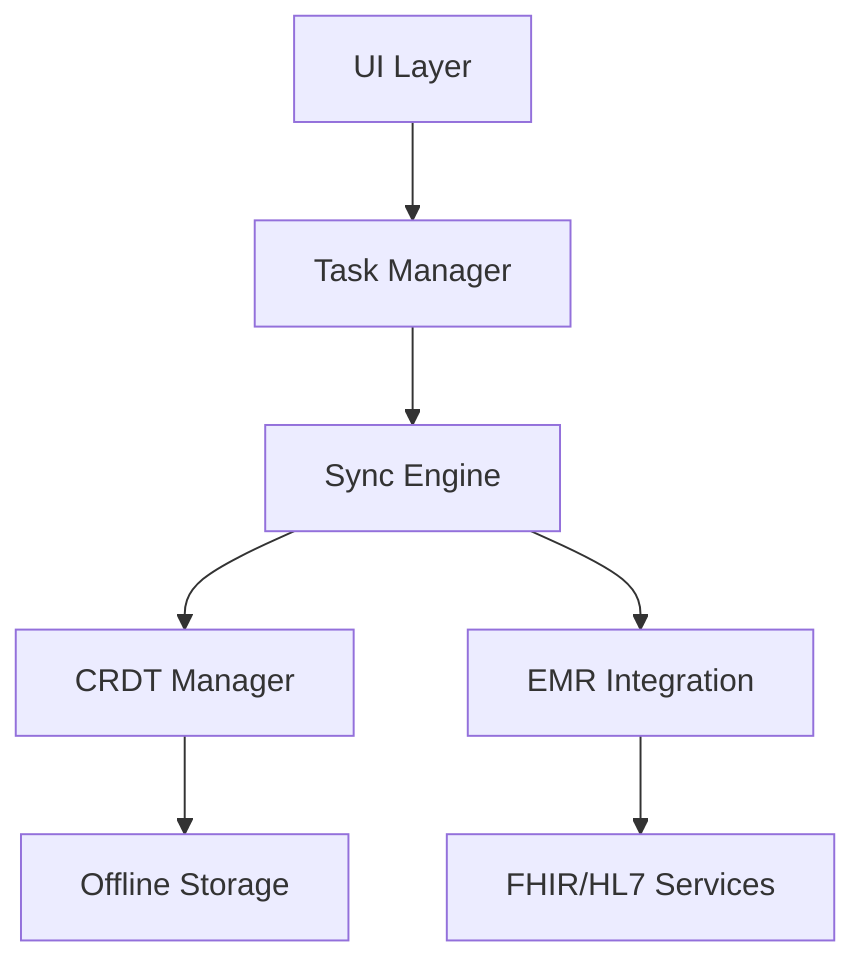

# EMR-Integrated Task Management iOS Application

Enterprise-grade iOS application for EMR-integrated task management with offline-first capabilities, CRDT-based synchronization, and HIPAA compliance.

## Requirements

### System Requirements
- iOS 14.0+
- Xcode 14.0+
- CocoaPods 1.12+
- Swift 5.0+
- Flutter 3.10+
- Minimum 1GB storage for offline data

### Dependencies
```ruby
# Podfile dependencies
pod 'SQLite.swift', '~> 0.14.1'
pod 'CryptoKit', '~> 2.0'
pod 'Combine', '~> 1.0'
pod 'Network', '~> 1.0'
```

## Architecture

### Core Components

1. **Offline Database**
   - CRDT-based SQLite storage
   - Field-level AES-256-GCM encryption
   - Automated migrations
   - Performance-optimized queries

2. **Sync Engine**
   - CRDT conflict resolution (< 500ms)
   - Batch processing
   - Exponential backoff retry
   - Network quality adaptation

3. **Security Layer**
   - HIPAA-compliant encryption
   - Secure key storage
   - Certificate pinning
   - Audit logging

4. **EMR Integration**
   - FHIR R4 adapter
   - HL7 v2 support
   - Real-time verification
   - Error handling

### Data Flow



## Features

### Offline-First Capabilities
- Local-first data operations
- Background sync
- Conflict-free replication
- Automatic retry mechanism

### Security & Compliance
- AES-256-GCM encryption
- HIPAA compliance
- Secure key management
- Comprehensive audit trails

### Performance
- Sub-500ms sync resolution
- Batch processing
- Memory optimization
- Battery impact minimization

### EMR Integration
- Real-time data verification
- FHIR R4 support
- HL7 v2 compatibility
- Error handling & retry

## Development Guidelines

### Project Structure
```
EMRTask/
├── AppDelegate.swift
├── Database/
│   ├── OfflineDatabase.swift
│   └── Migrations/
├── Sync/
│   ├── SyncManager.swift
│   ├── CRDTManager.swift
│   └── SyncWorker.swift
├── Utils/
│   ├── Logger.swift
│   ├── Constants.swift
│   └── NetworkMonitor.swift
└── EMR/
    ├── FHIRAdapter.swift
    └── HL7Adapter.swift
```

### Coding Standards
- Swift Style Guide compliance
- Comprehensive documentation
- Unit test coverage
- Performance benchmarking

### Security Guidelines
1. Always use encryption for sensitive data
2. Implement proper key rotation
3. Follow HIPAA requirements
4. Regular security audits

## Performance Metrics

| Metric | Target | Implementation |
|--------|--------|----------------|
| Sync Resolution | < 500ms | CRDT-based merge |
| Offline Storage | 1GB | SQLite with pruning |
| Battery Impact | Minimal | Adaptive sync |
| EMR Latency | < 1s | Cached verification |

## Error Handling

### Sync Errors
- Network unavailability
- Timeout handling
- Conflict resolution
- EMR verification

### Security Errors
- Encryption failures
- Authentication errors
- Authorization issues
- Compliance violations

## Monitoring & Logging

### Performance Monitoring
- Sync latency tracking
- Memory usage
- Battery impact
- Network quality

### Audit Logging
- Security events
- Data access
- Sync operations
- EMR interactions

## Build & Deployment

### Development Setup
1. Clone repository
2. Install dependencies
3. Configure EMR endpoints
4. Setup encryption keys

### Release Process
1. Version bump
2. Security audit
3. Performance testing
4. App Store submission

## Support & Maintenance

### Troubleshooting
- Sync issues
- Offline access
- EMR connectivity
- Security alerts

### Updates
- Regular security patches
- Performance optimizations
- EMR compatibility
- iOS version support